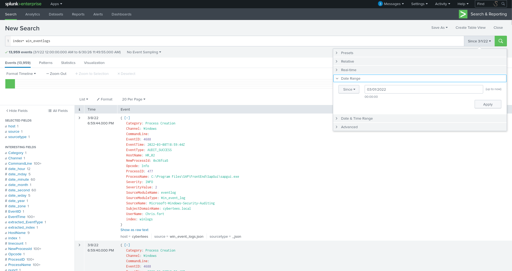
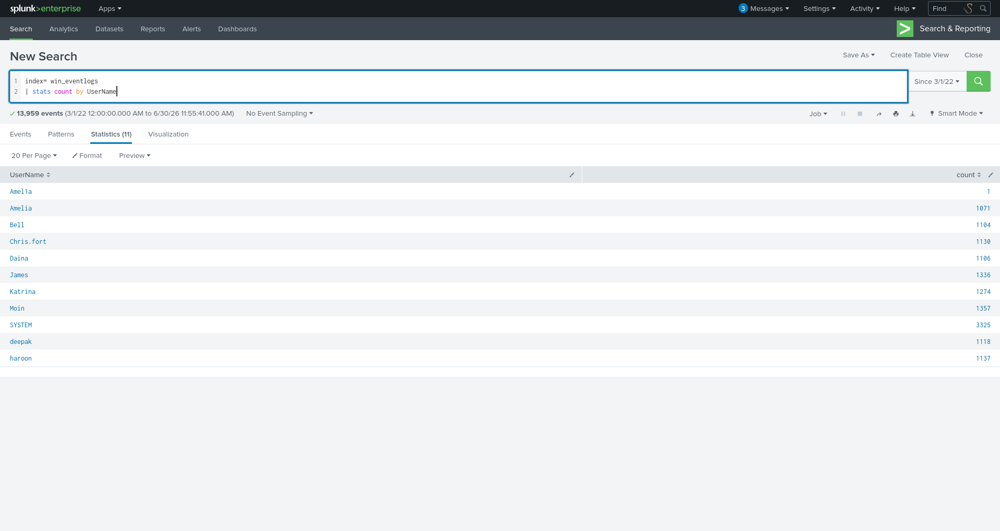
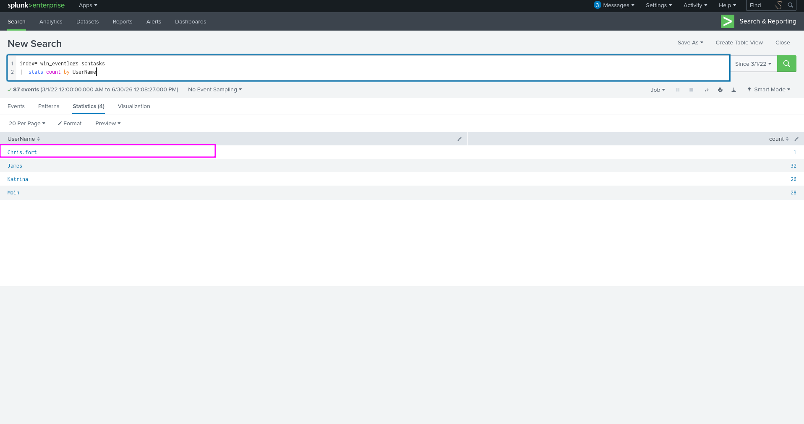
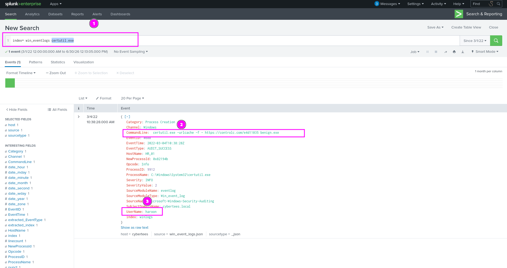
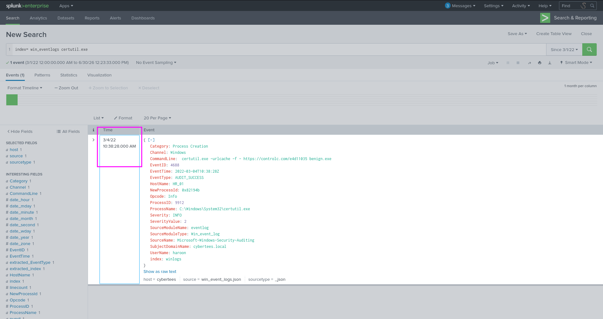
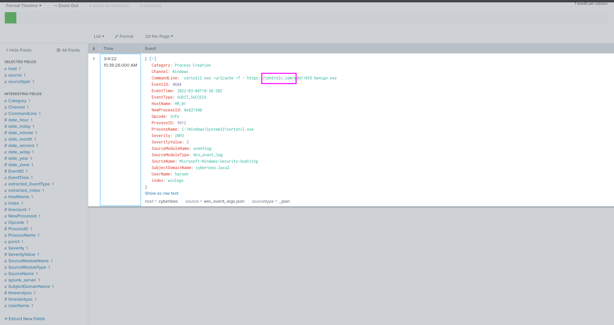
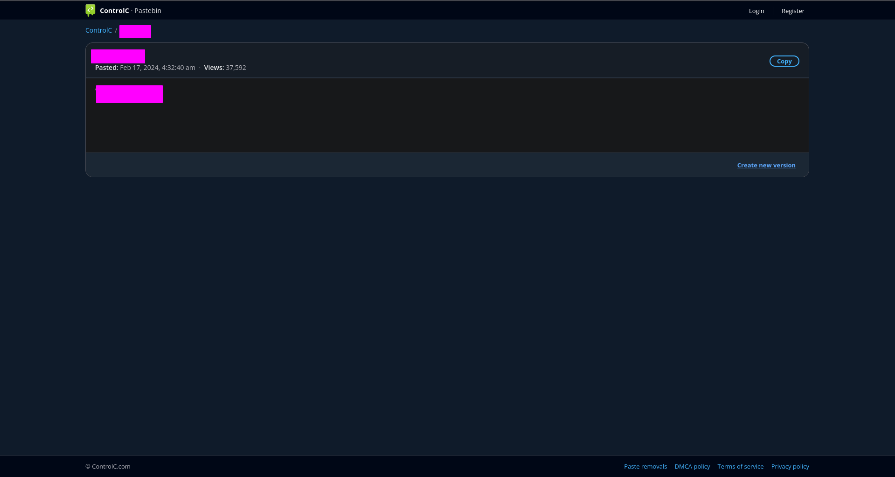
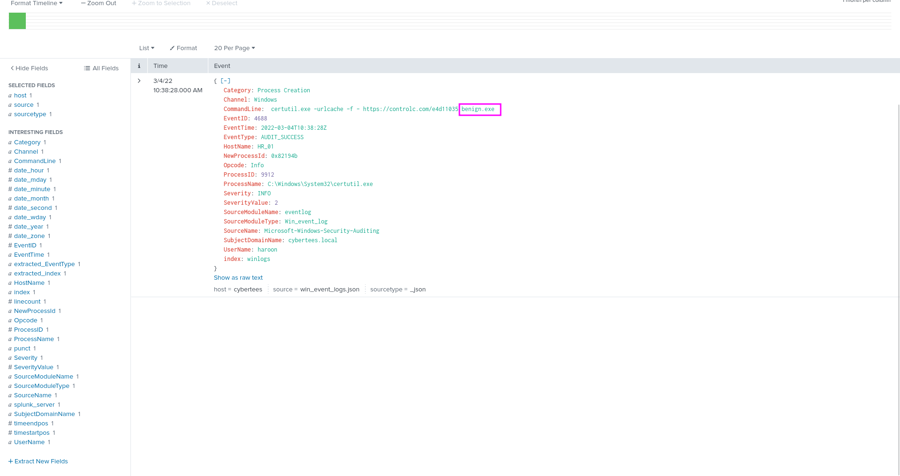
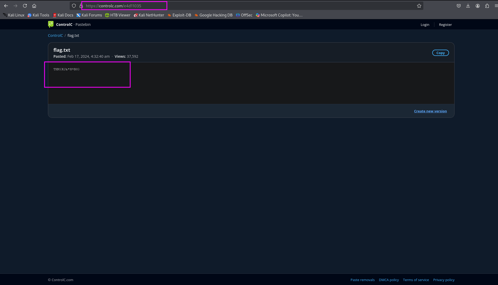

## Benign
One of the client’s IDS indicated a potentially suspicious process execution indicating one of the hosts from the HR department was compromised. Some tools related to network information gathering / scheduled tasks were executed which confirmed the suspicion. Due to limited resources, we could only pull the process execution logs with Event ID: 4688 and ingested them into SPLUNK with the index win_eventlogs for further investigation.

About the Network Information

The network is divided into three logical segments. It will help in the investigation.

IT Department

* James
* Moin
* Katrina

HR department

* Haroon
* Chris
* Diana

Marketing department

* Bell
* Amelia
* Deepak  
Answer the questions below  
Q1:How many logs are ingested from the month of March, 2022?
```bash
13959
```
Filter the time range.

Q2:Imposter Alert: There seems to be an imposter account observed in the logs, what is the name of that user?
```bash
Amel1a
```
we will use this query to see all the users 
```bash
index= win_eventlogs 
| stats count by UserName
```

Q3:Which user from the HR department executed a system process (LOLBIN) to download a payload from a file-sharing host. 
```bash
Chris.fort
```
I used the following query
```bash
index= win_eventlogs schtasks 
|  stats count by UserName
```
and than we can see Chris.fort is the only user for HR department.

Q4:Which user from the HR department executed a system process (LOLBIN) to download a payload from a file-sharing host. 
```bash
haroon
```
LOLBIN is living off land binary that is used by attackers to avoid the external tools.Some famous are cmd.exe,Powershell.exe,certtuil.exe,Bitsadmin.exe.  
I just casully search for certutil.exe and there was only one log and that was accessing paste link from the website controlc.com and user was haroon.


Q5:What was the date that this binary was executed by the infected host? format (YYYY-MM-DD)
```bash
2022-03-04
```
In the Same log we can see the date 

Q6:Which third-party site was accessed to download the malicious payload?
```bash
controlc.com
```
Again in the same log certutil is requsting controlc.com that is used to generate a url of text.


Q7:What is the name of the file that was saved on the host machine from the C2 server during the post-exploitation phase?
```bash
benign.exe
```
In that same log.


Q8:The suspicious file downloaded from the C2 server contained malicious content with the pattern THM{..........}; what is that pattern?
```bash
THM{KJ&*H^B0}
```
Ok for this we need to copy the url that certuil was accessing.

Q9:What is the URL that the infected host connected to?
```bash
https://controlc.com/e4d11035
```
