## Boogeyman 2
After having a severe attack from the Boogeyman, Quick Logistics LLC improved its security defences. However, the Boogeyman returns with new and improved tactics, techniques and procedures. 

In this room, you will be tasked to analyse the new tactics, techniques, and procedures (TTPs) of the threat group named Boogeyman. 
### Prerequisites
This room may require the combined knowledge gained from the SOC L1 Path. We recommend going through the following rooms before attempting this challenge.
* Phishing Analysis Fundamentals
* Phishing Analysis Tools
* Boogeyman 1
* Volatility
### Investigation Platform
Before we proceed, deploy the attached machine by clicking the Start Lab Machine button in the upper-right-hand corner of the task. It may take up to 3-5 minutes to initialise the services.
The machine will start in a split-screen view. If the VM is not visible, use the blue Show Split View button at the top-right of the page.
### Artefacts
For the investigation, you will be provided with the following artefacts:
* Copy of the phishing email.
* Memory dump of the victim's workstation.

You may find these files in the /home/ubuntu/Desktop/Artefacts directory.
### Tools
The provided VM contains the following tools at your disposal:

* Volatility - an open-source framework (opens in new tab) for extracting digital artefacts from volatile memory (RAM) samples.
```bash
ubuntu@tryhackme$ # Volatility usage:
ubuntu@tryhackme$ vol -f memorydump.raw <plugin>

# To list all available plugins
ubuntu@tryhackme$ vol -f memorydump.raw -h

```

Note: Volatility may take a few minutes to parse the memory dump and run the plugin. For plugin reference, check the Volatility 3 [documentation](https://volatility3.readthedocs.io/en/latest/volatility3.plugins.html).

* Olevba - a tool for analysing and extracting VBA macros from Microsoft Office documents. This tool is also a part of the Oletools [suite](https://github.com/decalage2/oletools).
```bash
ubuntu@tryhackme$ # Olevba usage:
ubuntu@tryhackme$ olevba document.doc
```
## TASK2)Spear Phishing Human Resource
## The Boogeyman is back!
Maxine, a Human Resource Specialist working for Quick Logistics LLC, received an application from one of the open positions in the company. Unbeknownst to her, the attached resume was malicious and compromised her workstation.
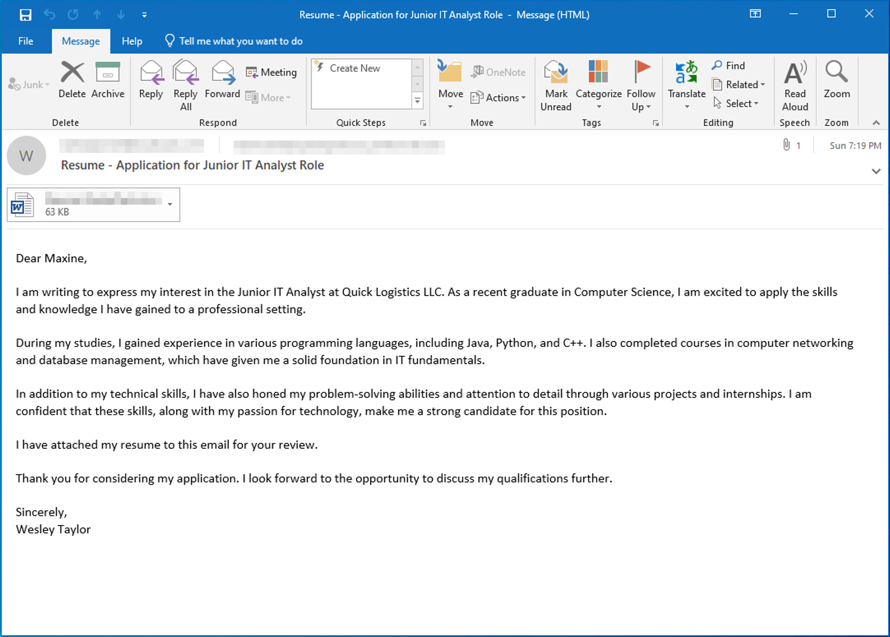
The security team was able to flag some suspicious commands executed on the workstation of Maxine, which prompted the investigation. Given this, you are tasked to analyse and assess the impact of the compromise
### Answer the questions below
What email was used to send the phishing email?
```bash
westaylor23@outlook.com
```
Open the email and we can see the sender email 
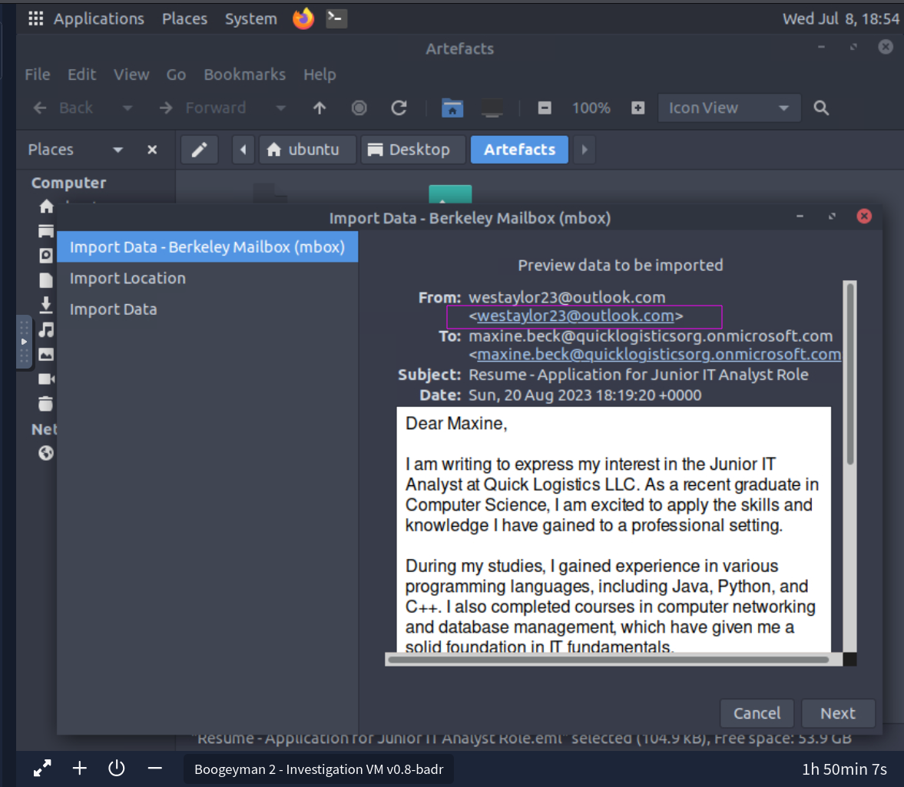
Q2:What is the email of the victim employee?
```bash
maxine.beck@quicklogisticsorg.onmicrosoft.com
```
Look the recepient email we will see out  victim email.
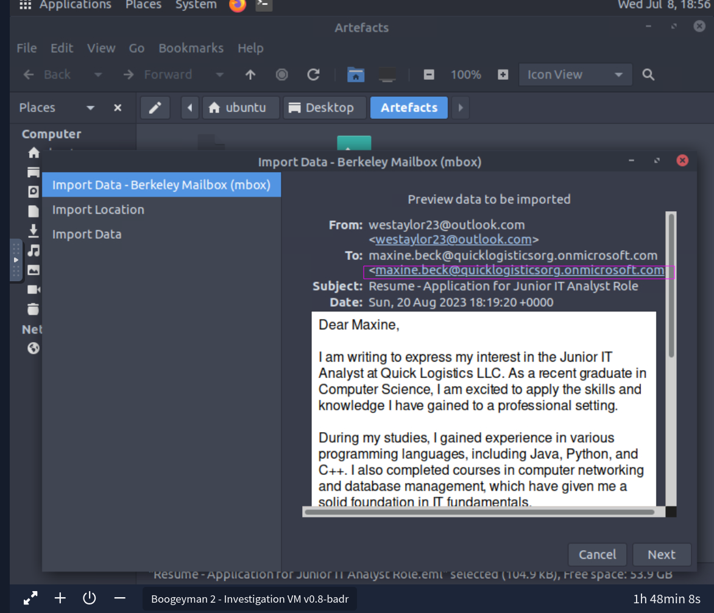
Q3:What is the name of the attached malicious document?
```bash
Resume_WesleyTaylor.doc
```
Scroll down and we will the name.
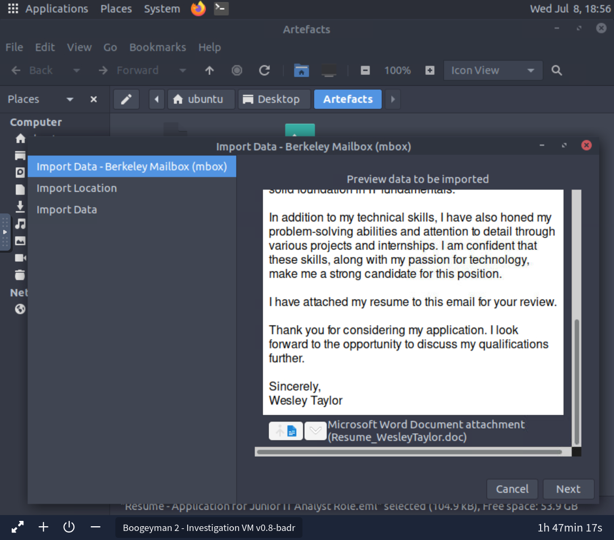
Q4:What is the MD5 hash of the malicious attachment?
```bash
52c4384a0b9e248b95804352ebec6c5b
```
Save the file in our desire destination I saved at desktop.I also changed the name to word.doc.
Run this command
```bash
md5sum <Resume_WesleyTaylor.doc>
```
Remeber I changed the name 
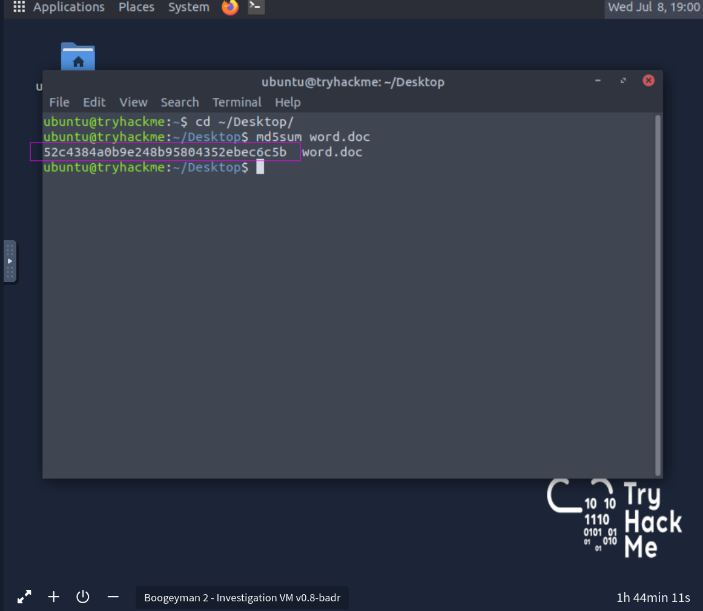
Q5:What URL is used to download the stage 2 payload based on the document's macro?
```bash
https://files.boogeymanisback.lol/aa2a9c53cbb80416d3b47d85538d9971/update.png
```
For this open the document go to tools tab and macros click on edit macros and click on word.doc or whatever your file name is.Click on Project -> modules and than on auto open and we got the url.
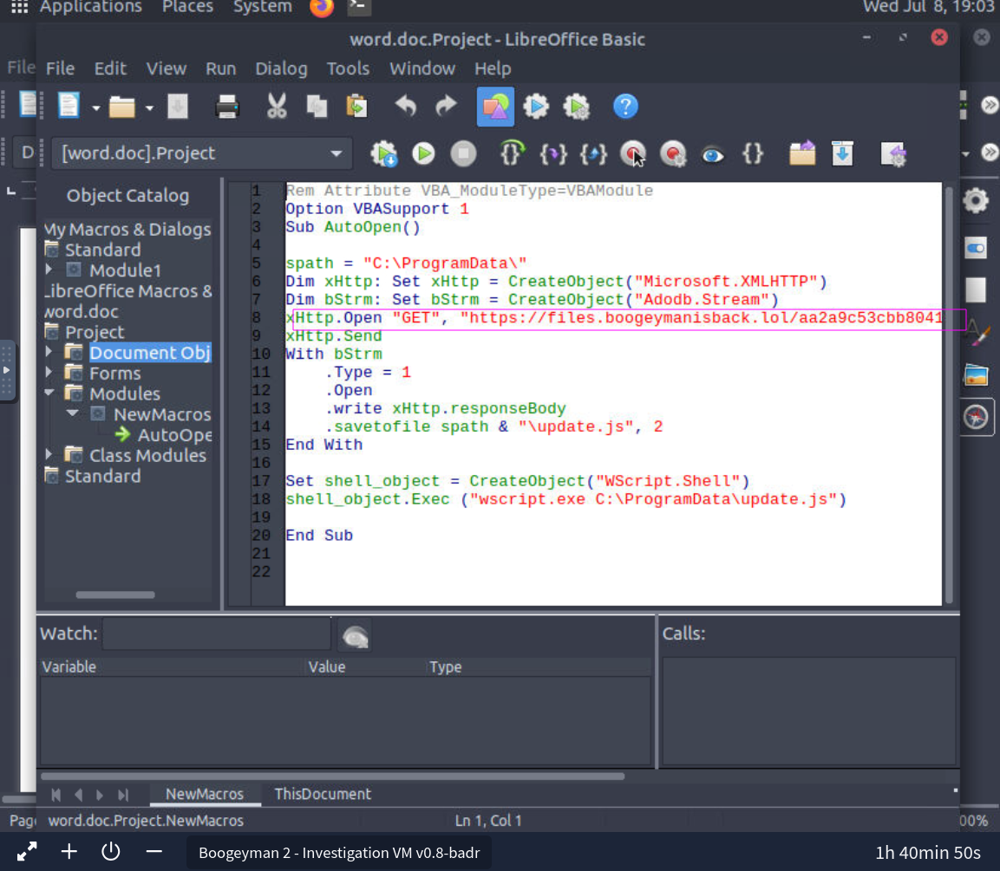
Q6:What is the name of the process that executed the newly downloaded stage 2 payload?
```bash
wscript.exe
```
For this i first get process tree of memory dump file by using the follwing command
```bash
 vol -f Artefacts/WKSTN-2961.raw windows.pstree > pstree.txt
```
I saved it in another file and than i greped for the 2 stage payload and than greped for its parent id and got the result
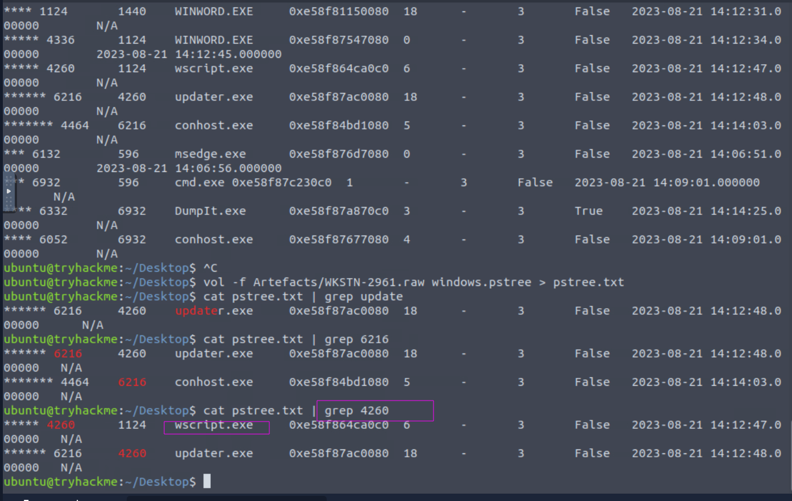
Q7:What is the full file path of the malicious stage 2 payload?
```bash
C:\ProgramData\update.js
```
In the same macros if we look at the code there is command for opeining of that donwloaded file.we can see its complete path.
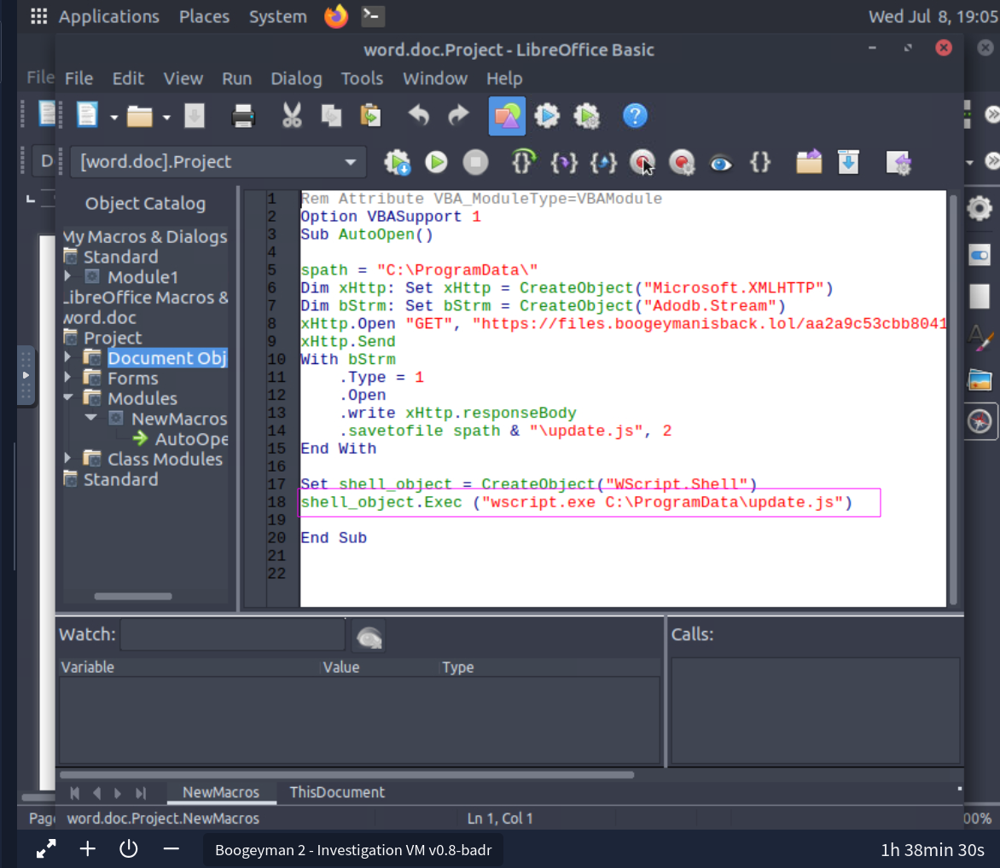
Q8:What is the PID of the process that executed the stage 2 payload?
```bash
4260
```
By looking at the result of our command we can acutlly get pid of the executer.
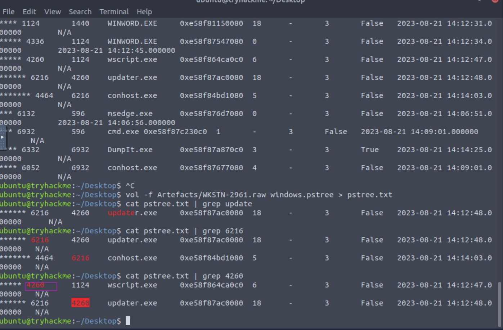
Q9:What is the parent PID of the process that executed the stage 2 payload?
```bash
1124
```
Again in the same result we can get that
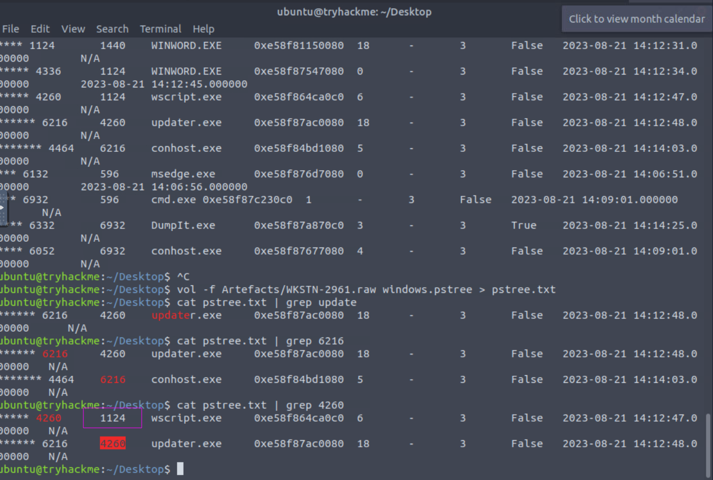
Q9:What URL is used to download the malicious binary executed by the stage 2 payload?
```bash
https://files.boogeymanisback.lol/aa2a9c53cbb80416d3b47d85538d9971/update.exe
```
Q10:What is the PID of the malicious process used to establish the C2 connection?
```bash
6216
```
we will use this command
```bash
vol -f WKSTN-2961.raw windows.netscan 
```
After that we will look at the result.
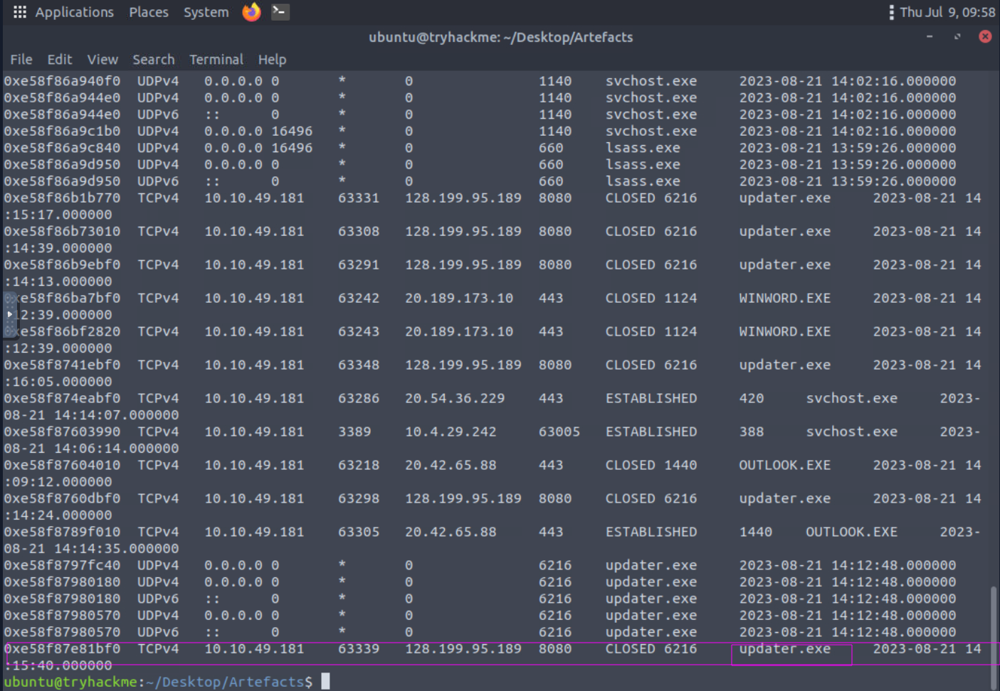
