## Boogeyman 3
Due to the previous attacks of Boogeyman, Quick Logistics LLC hired a managed security service provider to handle its Security Operations Center. Little did they know, the Boogeyman was still lurking and waiting for the right moment to return. 
In this room, you will be tasked to analyse the new tactics, techniques, and procedures (TTPs) of the threat group named Boogeyman. 
### Prerequisites
* Sysmon
* ItsyBitsy
* Investigating with ELK
* Boogeyman 1
* Boogeyman 2
### Investigation Platform
Before we proceed, deploy the attached machine by clicking the Start Lab Machine button in the upper-right-hand corner of the task. The provided lab machine runs an Elastic Stack (ELK), which contains the logs that will be used throughout the room.
Once the machine is up, access the Kibana console (via the AttackBox or VPN ) using the credentials below.
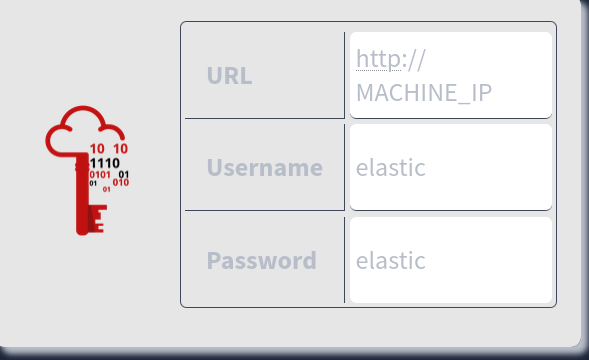
Note: The Kibana instance may take 3-5 minutes to initialise.
## The Chaos Inside.
## Lurking in the Dark
Without tripping any security defences of Quick Logistics LLC, the Boogeyman was able to compromise one of the employees and stayed in the dark, waiting for the right moment to continue the attack. Using this initial email access, the threat actors attempted to expand the impact by targeting the CEO, Evan Hutchinson. 
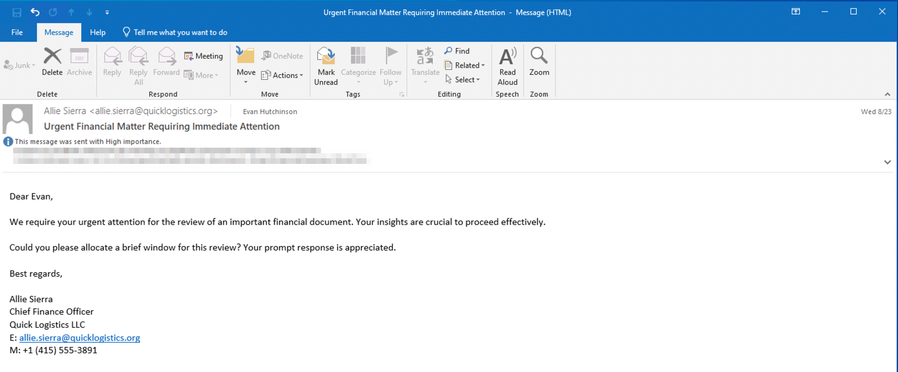
The email appeared questionable, but Evan still opened the attachment despite the scepticism. After opening the attached document and seeing that nothing happened, Evan reported the phisihing email to the security team.
### Initial Investigation
Upon receiving the phishing email report, the security team investigated the workstation of the CEO. During this activity, the team discovered the email attachment in the downloads folder of the victim.
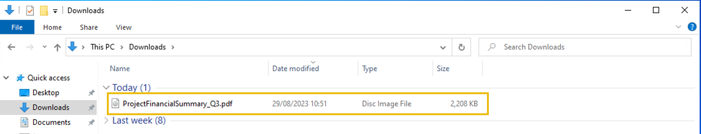
In addition, the security team also observed a file inside the ISO payload, as shown in the image below.
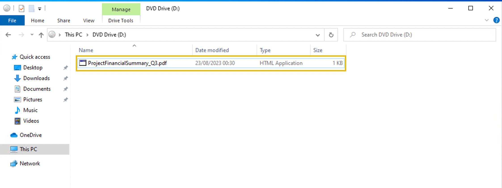
Lastly, it was presumed by the security team that the incident occurred between August 29 and August 30, 2023.
Given the initial findings, you are tasked to analyse and assess the impact of the compromise.
### Answer the questions below
Q1:What is the PID of the process that executed the initial stage 1 payload?
```bash
6392
```
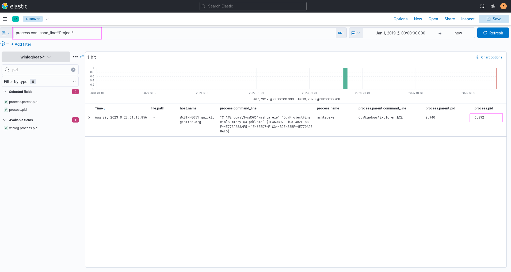
First i queried for all the commands that contain Project.So there was only one.And it showed it was using a binary mshta.exe binary to execute the stage 1 payload
Q2:The stage 1 payload attempted to implant a file to another location. What is the full command-line value of this execution?
```bash
"C:\Windows\System32\xcopy.exe" /s /i /e /h D:\review.dat C:\Users\EVAN~1.HUT\AppData\Local\Temp\review.dat
```
Q3:The implanted file was eventually used and executed by the stage 1 payload. What is the full command-line value of this execution?
```bash
C:\Windows\System32\rundll32.exe" D:\review.dat,DllRegisterServer
```
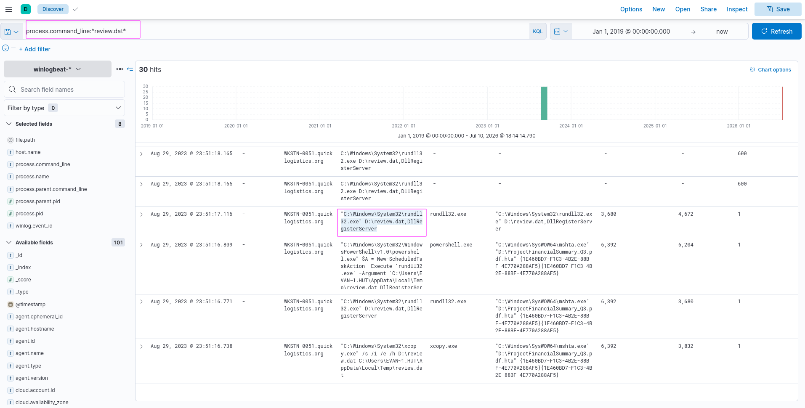
So i queried this process.command_line:*review.dat* So that i can see all the process that involve review.dat than i only look at the logs where parent process exist and than i see parent process where stage 1 payload was executed.
Q4:The stage 1 payload established a persistence mechanism. What is the name of the scheduled task created by the malicious script?
```bash
Review
```
Again i see all the logs whose parent process involve stage 1 payload and than i came to see a log where a task was scheduled 
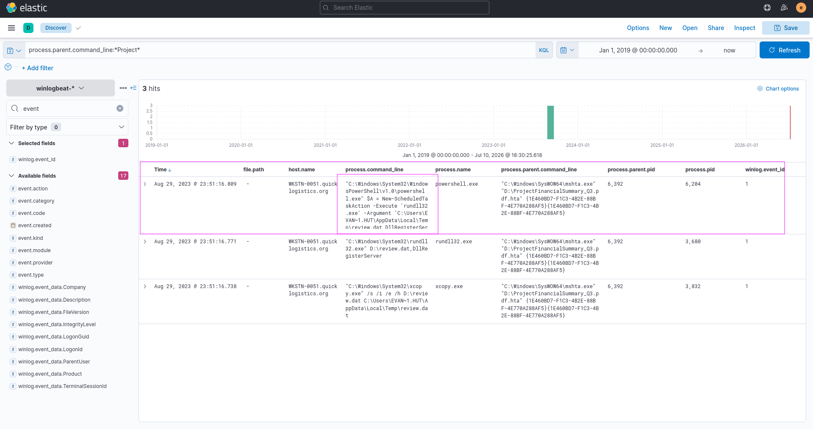
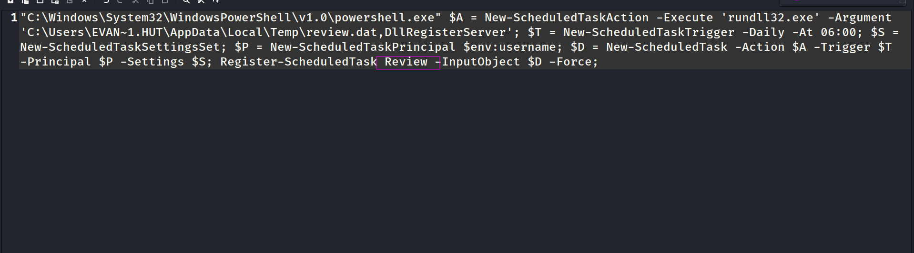
Q5:The execution of the implanted file inside the machine has initiated a potential C2 connection. What is the IP and port used by this connection? (format: IP:port)
```bash
165.232.170.151:80
```
For this i checked the parent process where review word exist after that the first log has wiredly long encoded command.
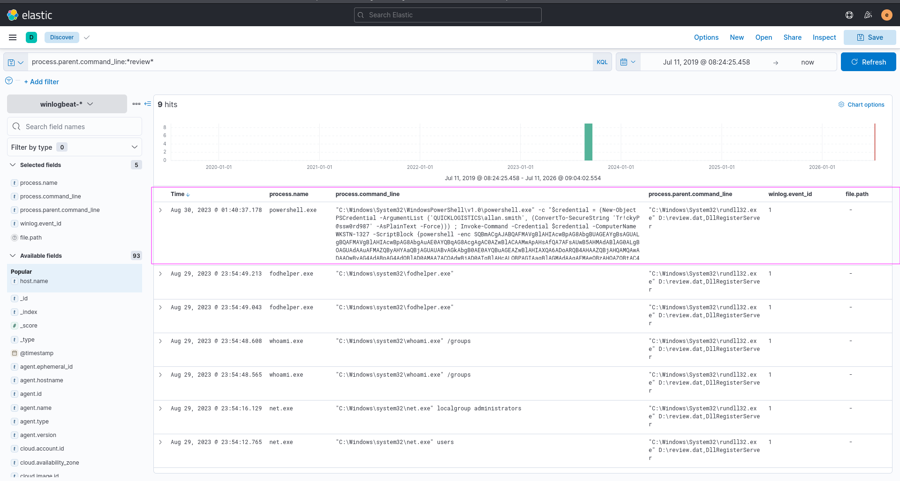.
So i decoded it .
After decoding by looking at it there was another encoded command in it.
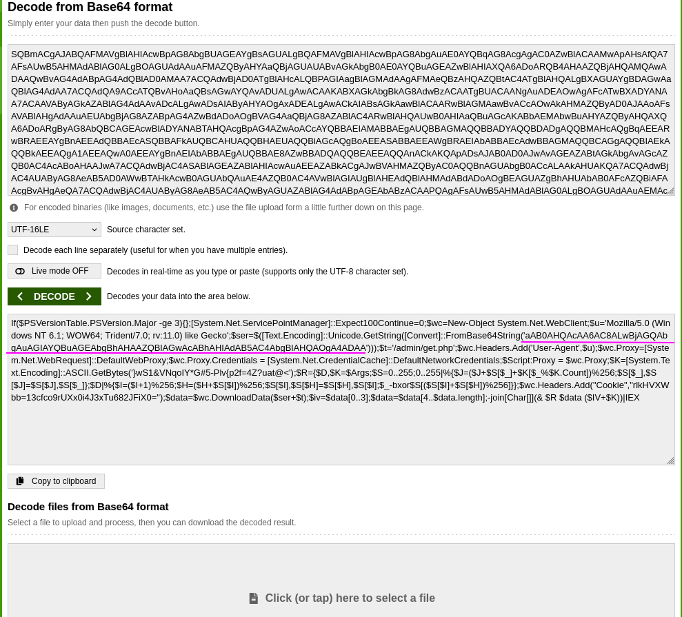.
So i decode that as well.
From this i got the domain name and port number.
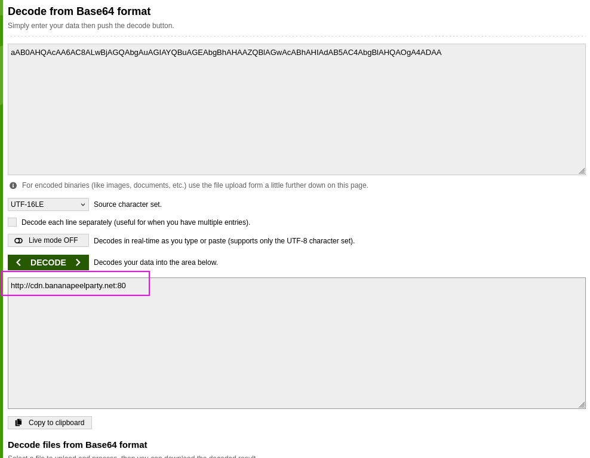.
Now we need to resolve the domain name.So went back to elastic and querid for event id 22 and for
*bananapeelparty* 
Opened the first log and we got the ip.
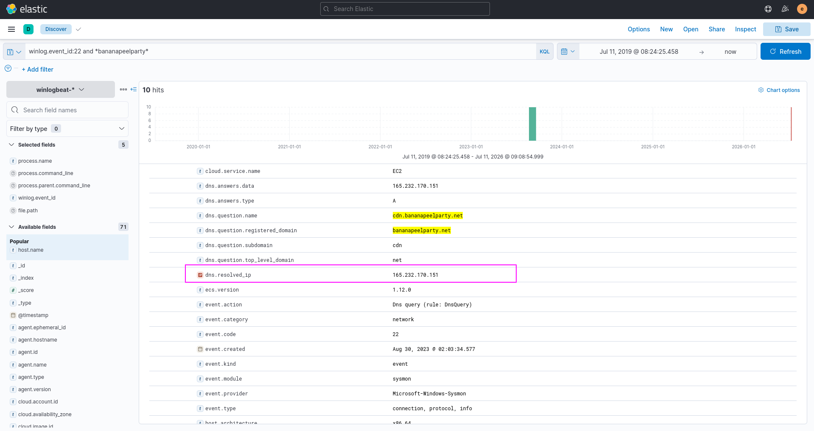.
Q6:The attacker has discovered that the current access is a local administrator. What is the name of the process used by the attacker to execute a UAC bypass?
```bash
fodhelper.exe
```
For this i was having trouble to find the process.So i went to gemini and ask which binaries could be exploited for UAC bypass.It gave fodhelper.exe so i copy and quried for it and than
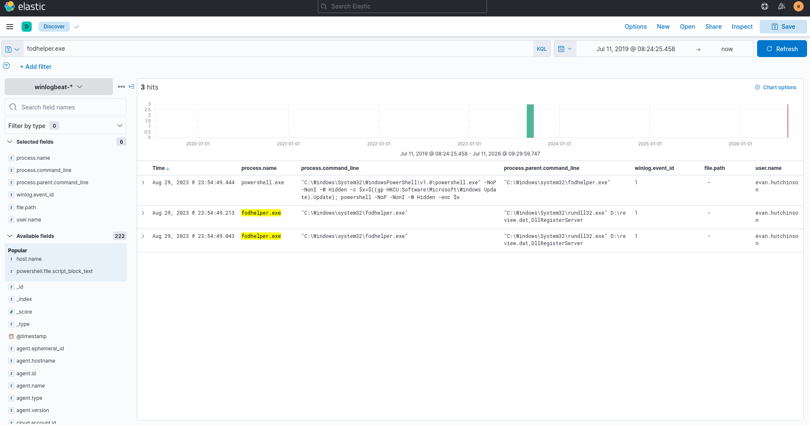
We can see from its parent command line that it was executed by malicious file that we discovered before.
Q7:Having a high privilege machine access, the attacker attempted to dump the credentials inside the machine. What is the GitHub link used by the attacker to download a tool for credential dumping?
```bash
https://github.com/gentilkiwi/mimikatz/releases/download/2.2.0-20220919/mimikatz_trunk.zip
```
So for this i queried *git* and filter for event id 1 and in the command line we can see the url from where the tools were downloaded.
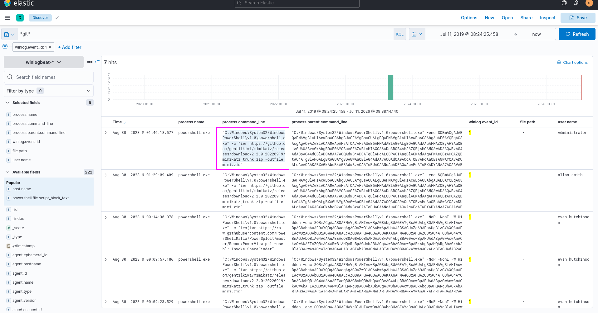
Q8:After successfully dumping the credentials inside the machine, the attacker used the credentials to gain access to another machine. What is the username and hash of the new credential pair? (format: username:hash)
```bash
itadmin:F84769D250EB95EB2D7D8B4A1C5613F2
```
For this i filter for events 1 and search for mimikatz and than after looking at the logs we see the pass the hash using mimikatz and got the user with its NTLM hash
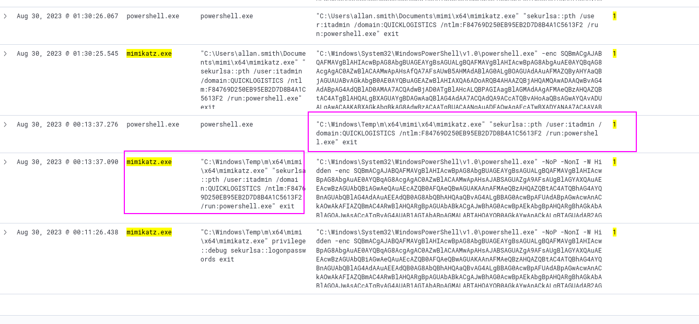
Q9:Using the new credentials, the attacker attempted to enumerate accessible file shares. What is the name of the file accessed by the attacker from a remote share?
```bash
IT_Automation.ps1
```
Ok so i filter for event id 1 and look for the powershell and cmd process.As there is only logs of the attack.By going down we can actully look at the look attack.
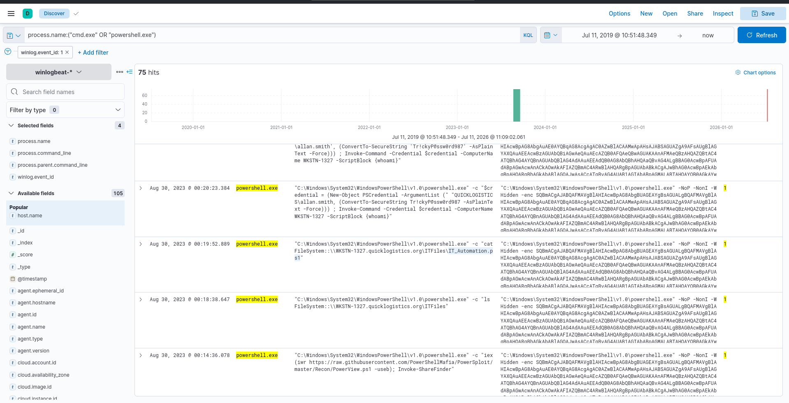
Q10:After getting the contents of the remote file, the attacker used the new credentials to move laterally. What is the new set of credentials discovered by the attacker? (format: username:password)
```bash
QUICKLOGISTICS\allan.smith:Tr!ckyP@ssw0rd987
```
Ok in those same logs if we look above the that log we disccussed before we can see the credentials.
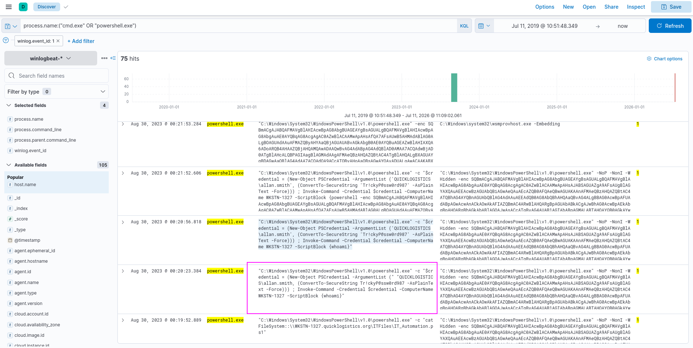
Q11:What is the hostname of the attacker's lab machine for its lateral movement attempt?
```bash
WKSTN-1327
```
Again on countinuing the logs from previous we can see a log where attacker tries lateral movement with credentials it got in that log computer name is written.
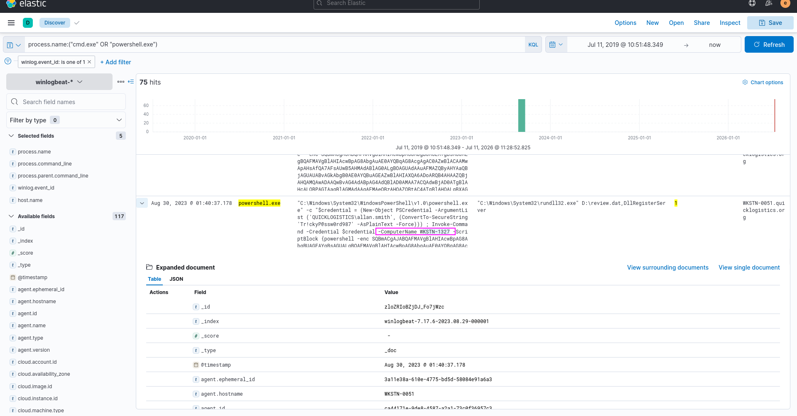
Q12:Using the malicious command executed by the attacker from the first machine to move laterally, what is the parent process name of the malicious command executed on the second compromised machine?
```bash
wsmprovhost.exe
```
we will see the first log in WKSTN-1327 and its parent address.
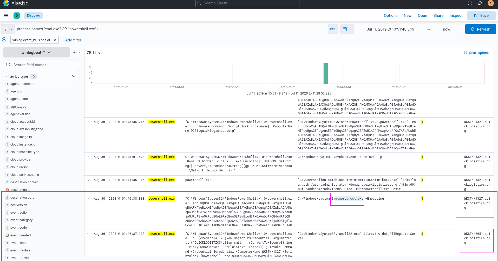
Q13:The attacker then dumped the hashes in this second machine. What is the username and hash of the newly dumped credentials? (format: username:hash)
```bash
administrator:00f80f2538dcb54e7adc715c0e7091ec
```
Fo this i filter for machine name WKSTN-1327 and search for mimikatz.exe process name and got the flag.
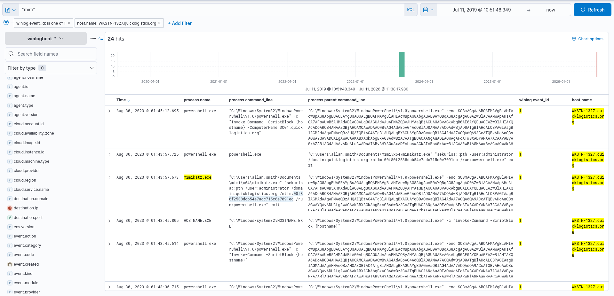
Q14:After gaining access to the domain controller, the attacker attempted to dump the hashes via a DCSync attack. Aside from the administrator account, what account did the attacker dump?
```bash
backupda
```
For this i removed the machine name filter and looked at the second log we got the flag.
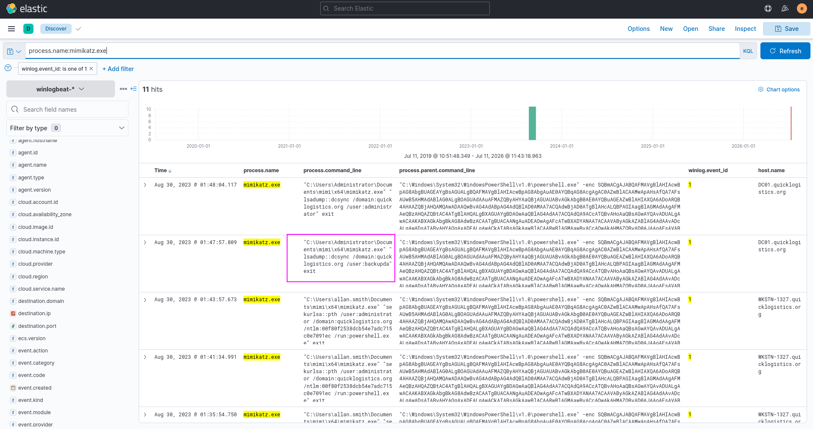
Q15:After dumping the hashes, the attacker attempted to download another remote file to execute ransomware. What is the link used by the attacker to download the ransomware binary?
```bash
http://ff.sillytechninja.io/ransomboogey.exe
```
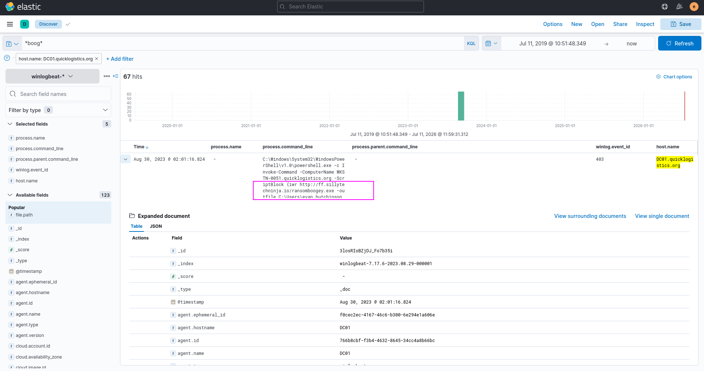
