## Conti
An Exchange server was compromised with ransomware. Use Splunk to investigate how the attackers compromised the server. 
Some employees from your company reported that they can’t log into Outlook. The Exchange system admin also reported that he can’t log in to the Exchange Admin Center. After initial triage, they discovered some weird readme files settled on the Exchange server.  

Below is a copy of the ransomware note
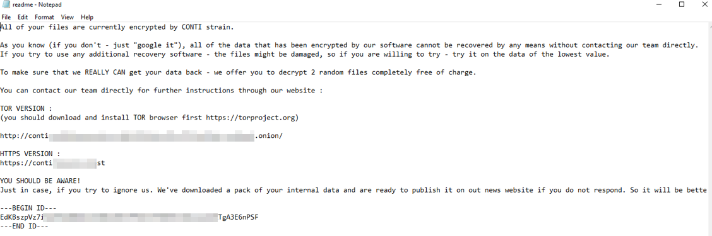
__Warning__: Do __NOT__ attempt to visit and/or interact with any URLs displayed in the ransom note. 
Read the latest on the Conti ransomware [here](https://www.bleepingcomputer.com/news/security/fbi-cisa-and-nsa-warn-of-escalating-conti-ransomware-attacks/).   

--- 
Connect to OpenVPN or use the AttackBox to access the attached Splunk instance. 
Splunk Interface Credentials:  
Username:``bellybear``  
Password:``password!!!``  
Splunk URL: ``http://MACHINE_IP:8000``

Below are the error messages that the Exchange admin and employees see when they try to access anything related to Exchange or Outlook.
##### Exchange Control Panel:
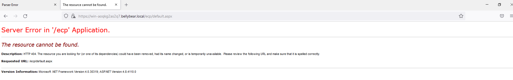
##### Outlook Web Access:
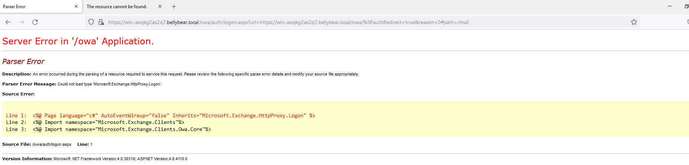
__Task__: You are assigned to investigate this situation. Use to answer the questions below regarding the Conti ransomware.
### Answer the questions below
#### Q1:Can you identify the location of the ransomware?
```bash 
C:\Users\Administrator\Documents\cmd.exe
```
For this i first searched for images and start looking at them and there was one binary in a very odd directory.So I tried it and it was the one.
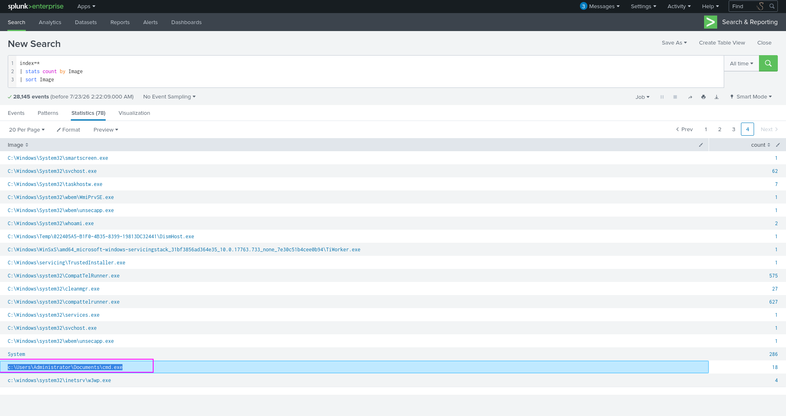
#### Q2:What is the Sysmon event ID for the related file creation event?
```bash
11
```
We can google for it.
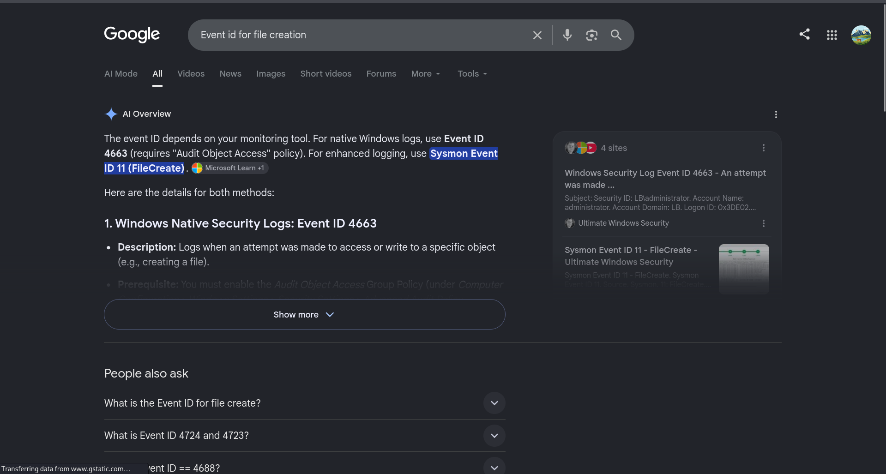
#### Q3:Can you find the MD5 hash of the ransomware?
```bash
290c7dfb01e50cea9e19da81a781af2c
```
For this i filter for event id 1 and search for the image of cmd file we found above.
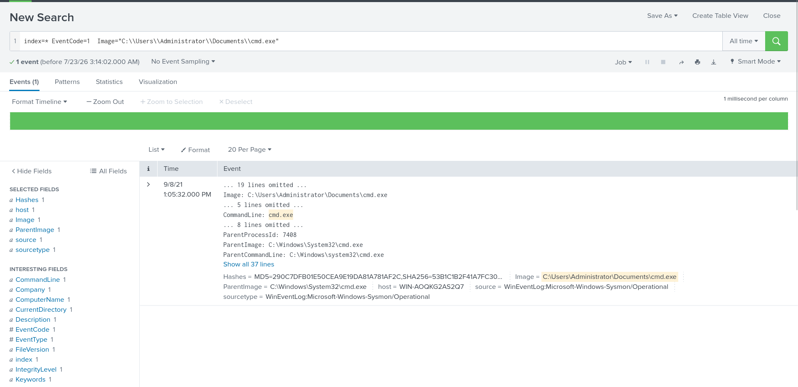
#### Q4:What file was saved to multiple folder locations?
```bash
readme.txt
```
I filtered for Event ID 11 logs and grouped them by count. Because analyzing the large volume of individual files manually was inefficient, I looked for patterns and identified a file that existed across several directories.
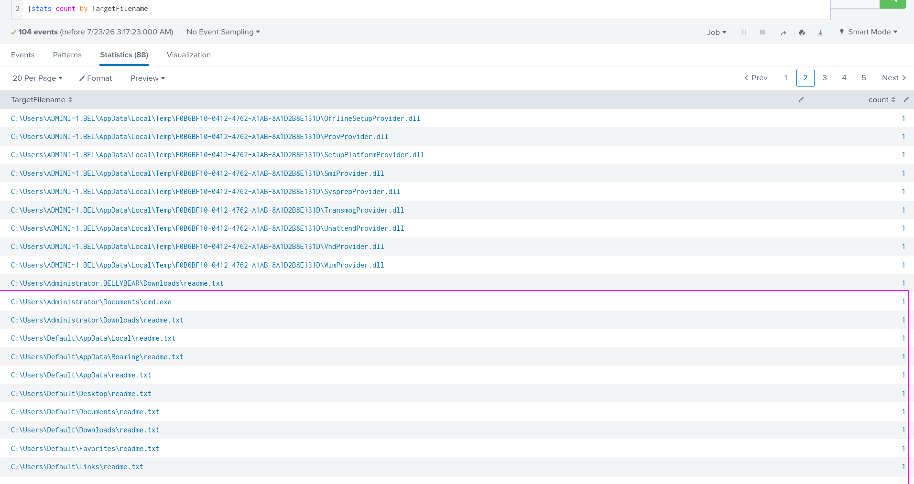
#### Q5:What was the command the attacker used to add a new user to the compromised system?
```bash
net user /add securityninja hardToHack123$ 
```
It was quite simple.As we just need to search for user creaction command.Most user creation commands involve the word ``user``.So u used the following filter.  
``index=* CommandLine="*user*"
| table CommandLine``
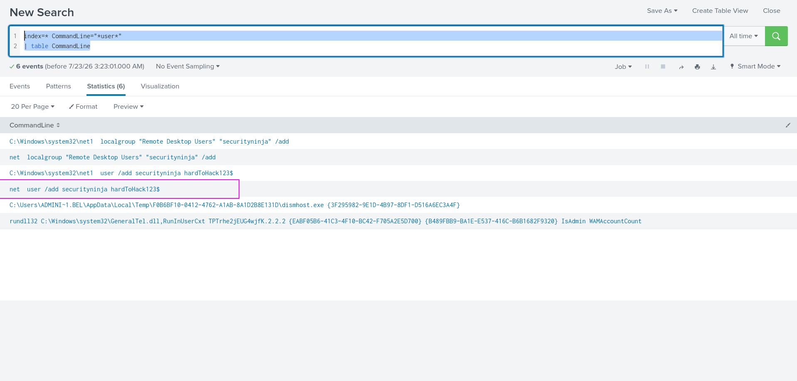
#### Q6:The attacker migrated the process for better persistence. What is the migrated process image (executable), and what is the original process image (executable) when the attacker got on the system?
```bash
C:\Windows\System32\WindowsPowerShell\v1.0\powershell.exe,C:\Windows\System32\wbem\unsecapp.exe
```
Filter for event id 8 which is for process migration.Look at the second log.
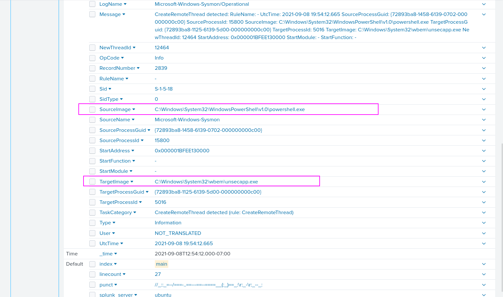
#### Q7:The attacker also retrieved the system hashes. What is the process image used for getting the system hashes?
```bash
C:\Windows\System32\lsass.exe
```
For this i searched on google which porcess is used so the result was ``lsass.exe``.We can validate that if we filter for event id 8 and look at the first log.
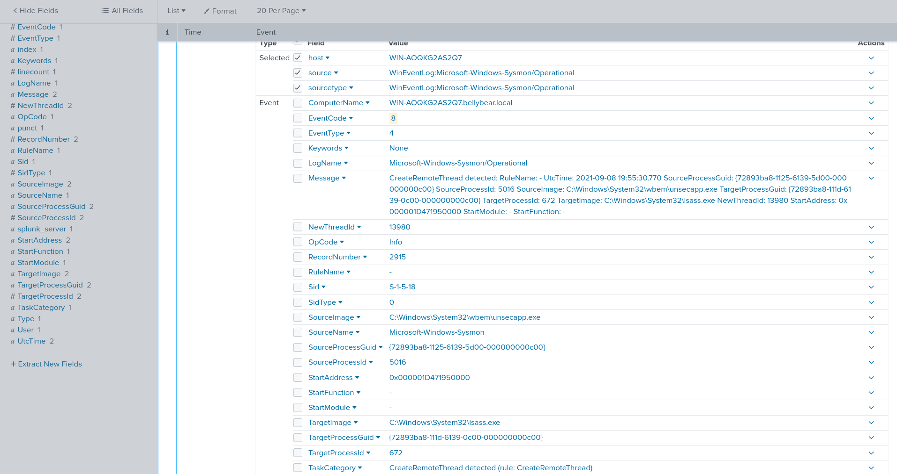
#### Q8:What is the web shell the exploit deployed to the system?
```bash
i3gfPctK1c2x.aspx
```
For this filter for the ``iis`` sourcetype and for ``POST`` request.And we looked at all uri steams.there was a supicious file with aspx extension that is commmonly used for web shells.
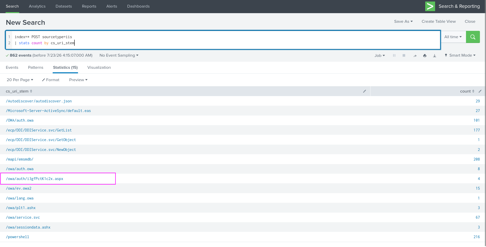
#### Q9:What is the command line that executed this web shell?
```bash
attrib.exe  -r \\\\win-aoqkg2as2q7.bellybear.local\C$\Program Files\Microsoft\Exchange Server\V15\FrontEnd\HttpProxy\owa\auth\i3gfPctK1c2x.aspx
```
Use the following filter.
``index=* CommandLine="*i3gfPctK1c2x.aspx*"``
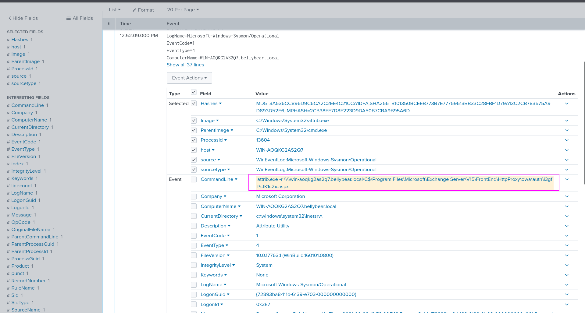
#### Q10: What three CVEs did this exploit leverage?
```bash
CVE-2020–0796,CVE-2018–13374,CVE-2018–13379
```
We get a hint where external research is required. This article contains a number of CVE’s related to Conti Ransomware. [This site](https://cybersecurityworks.com/blog/ransomware/is-conti-ransomware-on-a-roll.html)