## Fixit
Fix the log parsing issue and analyze the logs in Splunk.
--- 
Welcome to this hands-on Splunk challenge room. In this scenario, you've just completed your third screening interview for a SOC Level 2 role at MSSP Cybertees Ltd, and you're now faced with the final assessment to test your knowledge. You'll be given access to a Splunk instance receiving network logs from an unknown source. The data isn't arriving in a usable state, so before you can analyze what's happening on the network, you must Fixit!

### Objectives
This challenge is divided into three phases
1. __Fix event boundaries__ for the incoming logs
2. __Extract custom fields__ from the available events
3. __Analyze event data__ to uncover network activity 
### Prerequisites
This challenge is based on the knowledge covered in the following rooms
* Check out [Regular Expressions](https://tryhackme.com/room/catregex) to get familiar with pattern matching.
* Cover [Splunk : Exploring SPL](https://tryhackme.com/room/splunkexploringspl) for an overview of Splunk queries.
* Explore [Splunk : Data Manipulation](https://tryhackme.com/room/splunkdatamanipulation) to learn event parsing and field extraction.
### Lab Access
Click the Start Machine button below to start the lab. Please give Splunk five minutes to load and access the UI at ``http://MACHINE_IP:8000``. Splunk is installed in the default ``/opt`` directory, and you will be working with the Fixit app.
## The Fixit Challenge
### Phase 1: Fixing Event Boundaries
The first phase of your challenge is to fix the event boundaries for the incoming logs. As seen in the screenshot below and in your Splunk instance, the raw data is being ingested and Splunk cannot determine where one event ends and the next begins, making the data impossible to analyze. Go ahead and jump into the Fixit app's configuration files to get started!

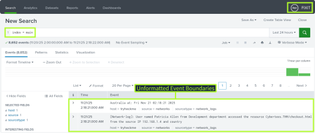

### Phase 2: Extracting Custom Fields
The next phase of your challenge requires the extraction of meaningful fields from your client's event data. You can accomplish this by updating the Fixit app’s configuration files or by creating field extractions directly through the Splunk UI.
Use the sample logs below to help extract the following fields

*  ``Username``
*  ``Department``
*  ``Domain``
*  ``URI``
*  ``SourceIP``
*  ``Country``
```bash
[Network-log]: User named Emily Clark from Finance department accessed the resource Cybertees.THM/contact.html from the source IP 192.168.1.4 and country 
Japan at: Mon Dec  1 10:13:38 2025
[Network-log]: User named Robert Wilson from HR department accessed the resource Cybertees.THM/signup.html from the source IP 10.0.0.2 and country 
Germany at: Mon Dec  1 10:13:42 2025
[Network-log]: User named Patricia Allen from Finance department accessed the resource Cybertees.THM/checkout.html from the source IP 172.16.0.1 and country 
Mexico at: Mon Dec  1 10:13:48 2025
```
### Phase 3: Analyzing Event Data
Once the log data is flowing in correctly and the fields have been extracted, it's time to begin your analysis. Using the available data, apply your skills to uncover what's happening on the network!

### Answer the questions below 
#### Q1:What is the full path to the Fixit app directory in your instance?
```bash
/opt/splunk/etc/apps/fixit
```
It was mentioned above that app is installed in the default path.
#### Q2:Investigate the ``inputs.conf`` configuration file of the Fixit app. What is the full path of the ``network-logs`` script?
```bash
/opt/splunk/etc/apps/fixit/bin/network-logs
```
For This first we need to go to the apps directory of Splunk which is ``/opt/splunk/etc/apps``
.And than in our app directory ``fixit``.It has few Folders where defualt and local are same as the splunks own default and local folders but for this specific app.So we go to the default folder and opened the ``inputs.conf`` file.
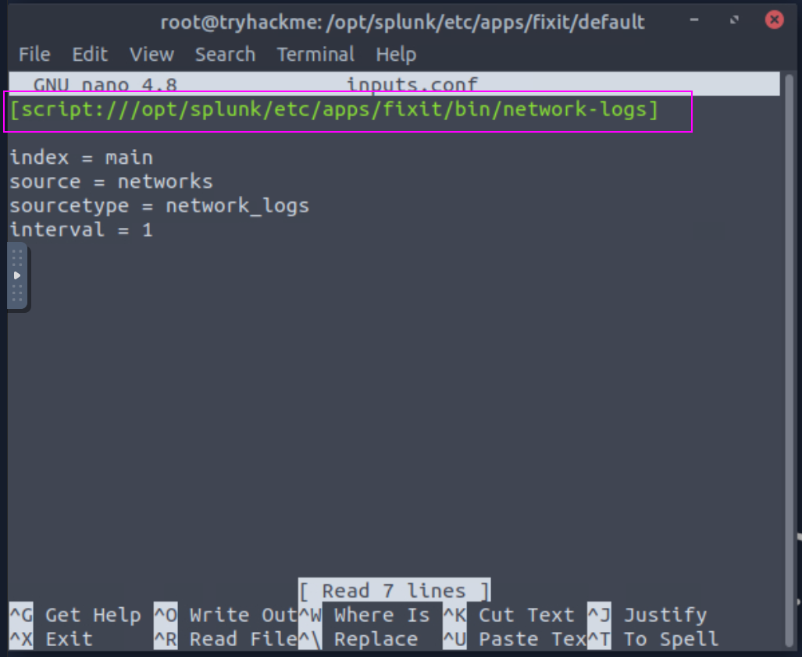
#### Q3:Which Splunk stanza setting will you use to define the event boundaries for the scenario logs?
```bash
BREAK_ONLY_BEFORE
```
Before answering this question First I fixed splunk issues of line merging and create a file
``props.conf`` in the fixit ``default`` directory and configure the following settings.
```bash
[network_logs]
SHOULD_LINEMERGE = true
BREAK_ONLY_BEFORE = ^\d{4}-\d{2}-\d{2} \d{2}:\d{2}:\d{2}
```
and than restart the splunk by ``/opt/splunk/bin/splunk restart`` 
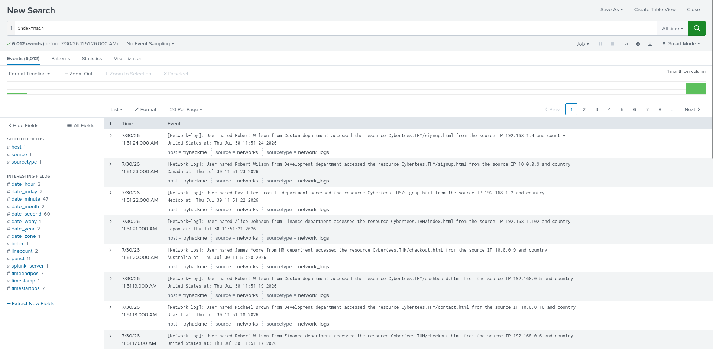
Now our logs are comming through as intended.
In our props.conf file we use the ``BREAK_ONLY_BEFORE`` which is our answer
#### Q4:Which regex pattern should be used to define the start of each event?
```bash
^\[Network-log\]:
```
To test we go to [regex101](https://regex101.com/) and would test a log.
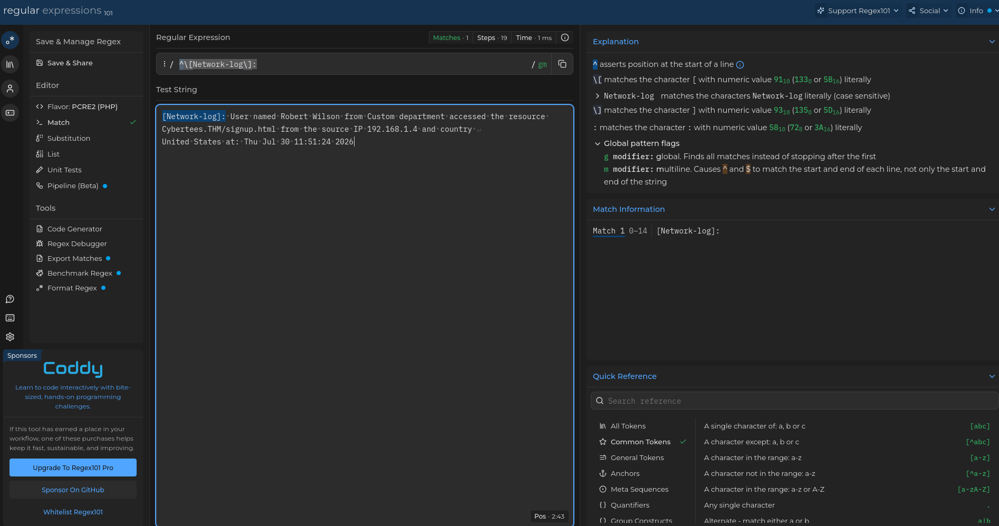
#### Extracting Fields 
So for this we need to make a new file in the default directory of our app ``transforms.conf``
and than we need to create our regex exprassion to extract the fields.I actually copied from chat gpt
```bash
[extract_all_fields]
REGEX = \[Network-log\]:\s+User\s+named\s+(?<Username>.+?)\s+from\s+(?<Department>.+?)\s+department\s+accessed\s+the\s+resource\s+(?<Domain>[^/]+)/(?<URI>\S+)\s+from\s+the\s+source\s+IP\s+(?<SourceIP>\S+)\s+and\s+country\s+(?<Country>.+?)\s+at:
FORMAT = Username::$1 Department::$2 Domain::$3 URI::$4 SourceIP::$5 Country::$6
WRITE_META = true
```
Now we have to add top banner in our ``props.conf`` file.Add the following line in the end of th e [network_logs]
```bash
REPORT-network_fields = extract_all_fields
```
transform.conf file
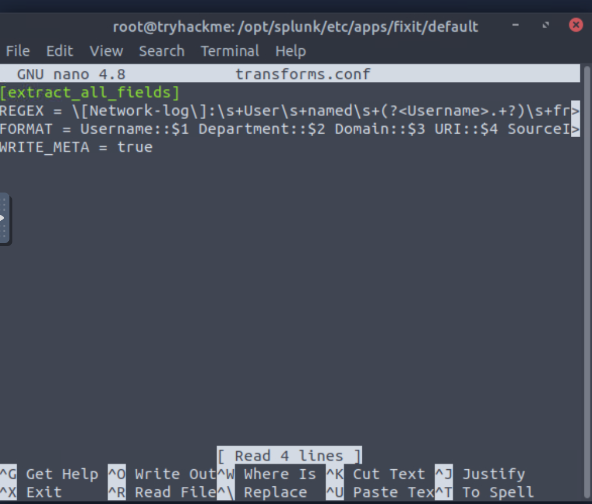
props.conf file
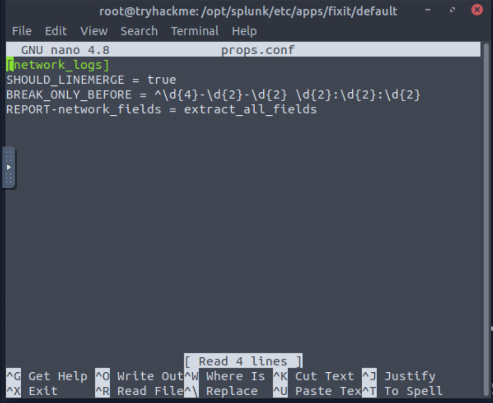

Now restart Splunk.
In splunk we can now see our extracted fields there.
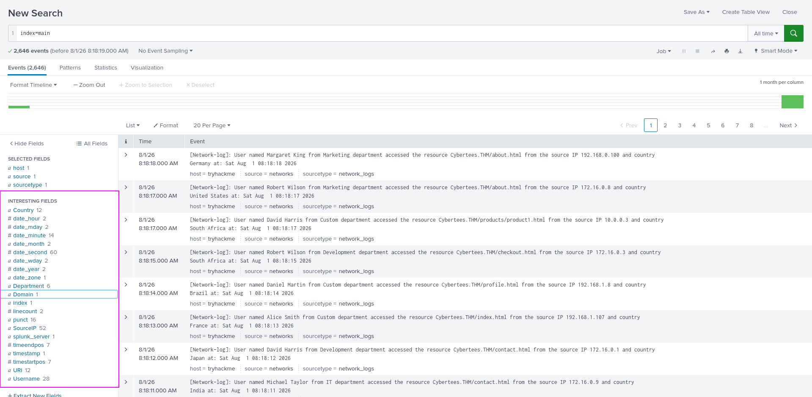
#### Q5:After you’ve extracted the relevant fields, what Domain appears in the log data?
```bash
Cybertees.THM
```
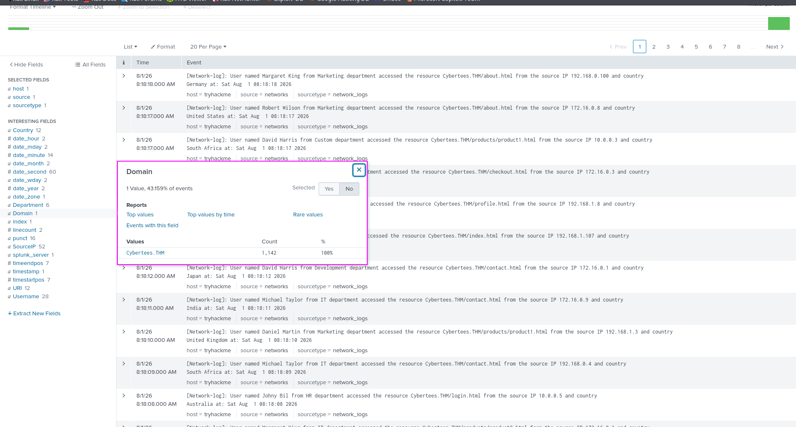
#### Q6:How many Username field values exist within the events generated?
```bash
28
```
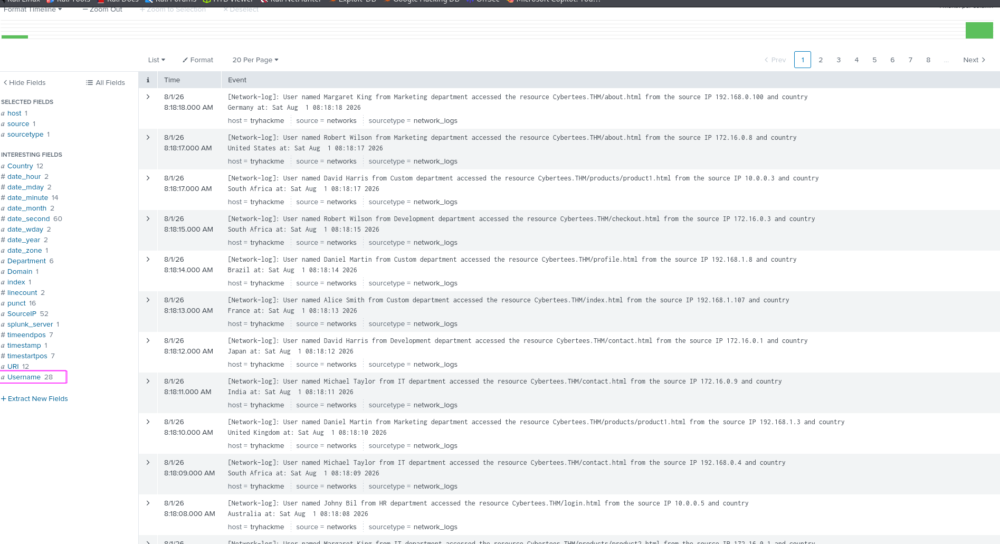
#### Q7:How many URI field values were you able to extract from the available logs?
```bash
12
```
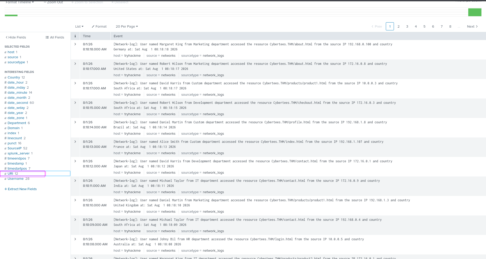
#### Q8:As you begin analyzing the network traffic, how many individual /products pages appear in the data?
```bash
2
```
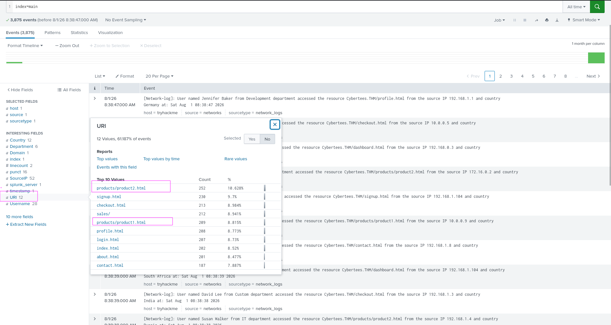
#### Q9:What is the only URI field value found in the event data without a file extension
```bash
/sales/
```
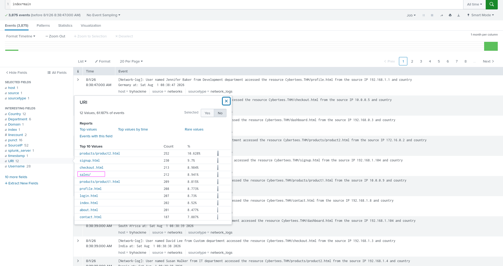
#### Q10:Who is the most active User on the network?
```bash
Robert Wilson
```
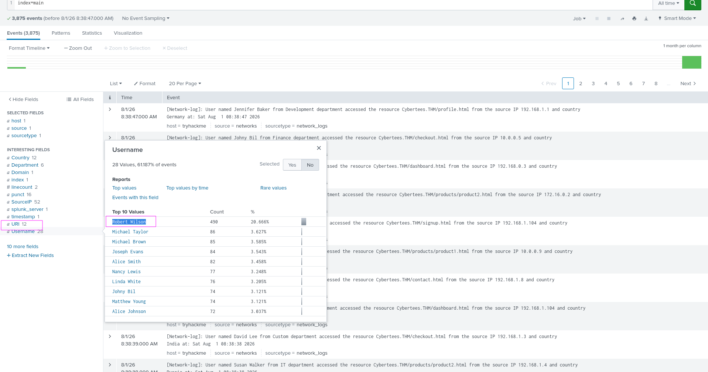
#### Q11:How many unique IP ranges are represented in the observed network traffic?
```bash
3
```
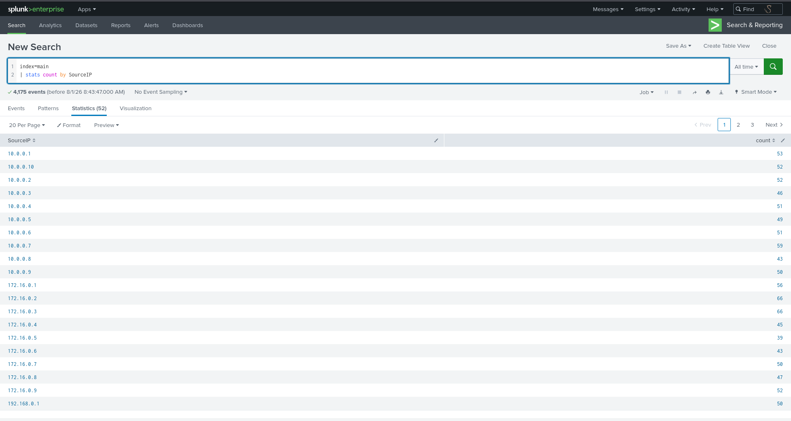
#### Q12:Which user accessed the secret-document.pdf on your client's server?
```bash
Sarah Hall
```
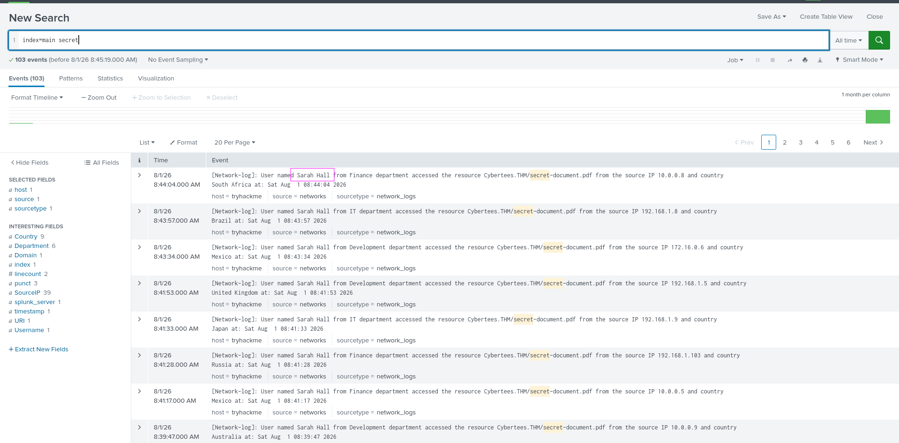