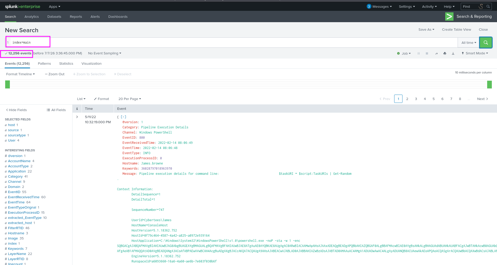
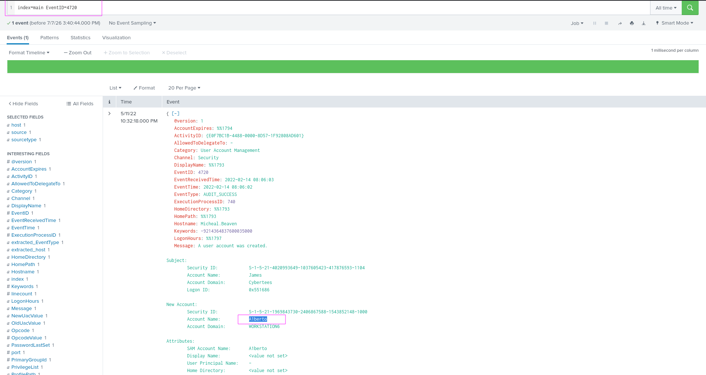
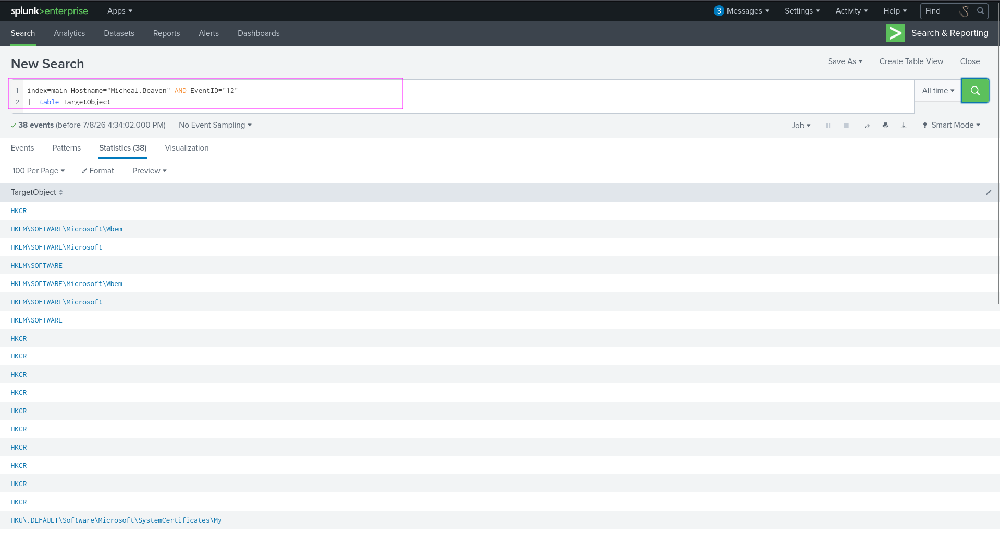
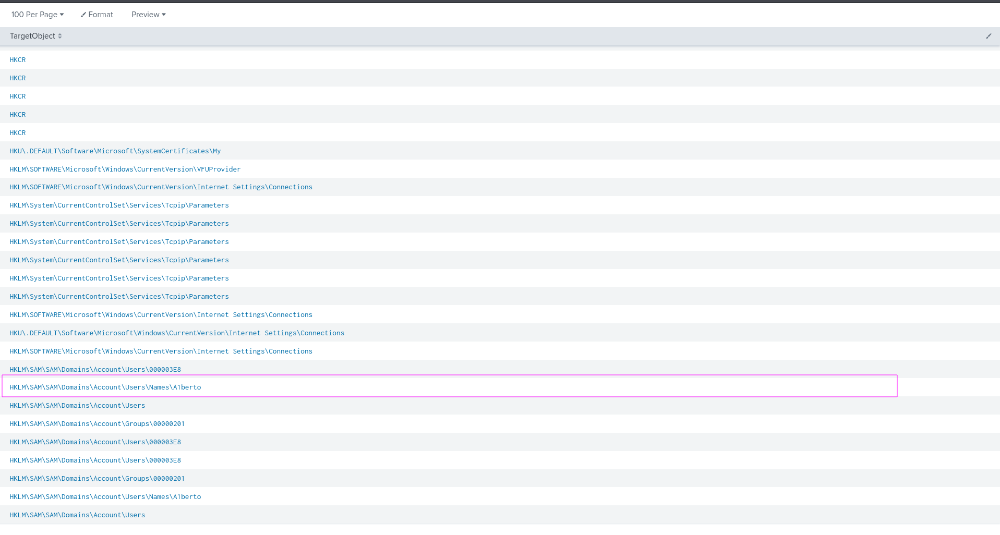
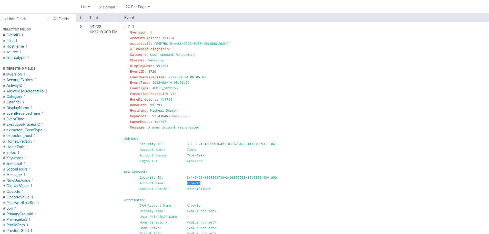
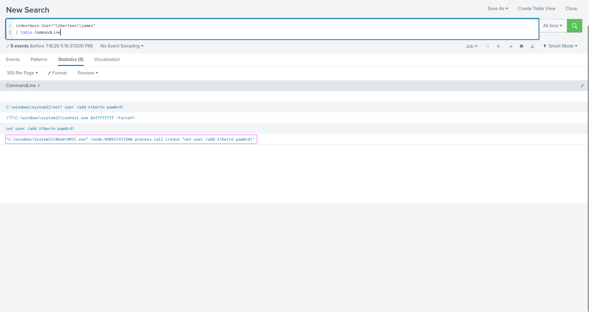
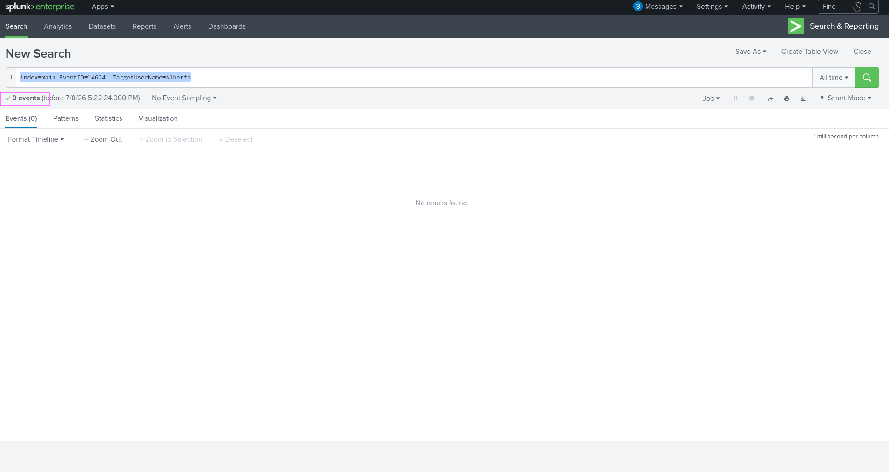
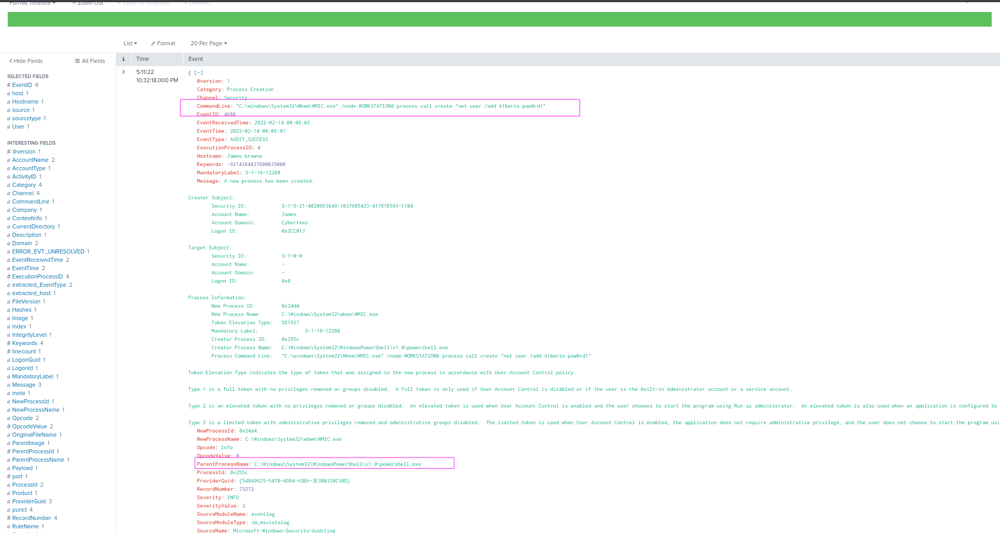
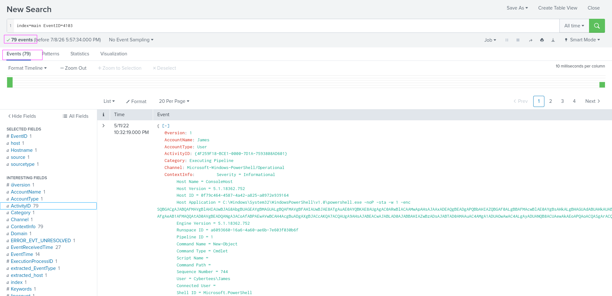

## Investigate with Splunk 
SOC Analyst Johny has observed some anomalous behaviours in the logs of a few windows machines. It looks like the adversary has access to some of these machines and successfully created some backdoor. His manager has asked him to pull those logs from suspected hosts and ingest them into for quick investigation. Our task as

Analyst is to examine the logs and identify the anomalies.

To learn more about Splunk and how to investigate the logs, look at the rooms splunk101 and splunk201.

Room Machine
Before moving forward, deploy the machine. When you deploy the machine, it will be assigned an IP Machine IP:  You can visit this IP from the or the Attackbox. The machine will take up to 3-5 minutes to start. All the required logs are ingested in the index main
### Answer the questions below
Q1:How many events were collected and Ingested in the index main?
```bash
12256
```
For this go to search tab and write this in this search field
```bash
index=main
```

Q2:On one of the infected hosts, the adversary was successful in creating a backdoor user. What is the new username?
```bash
A1berto
```
For this i seaerch for event id 4720 as this is for the user creation.And there was only one log and opened it

Q3:On the same host, a registry key was also updated regarding the new backdoor user. What is the full path of that registry key?
```bash
HKLM\SAM\SAM\Domains\Account\Users\Names\A1berto
```
I used this followinf query
index=main Hostname="Micheal.Beaven" AND EventID="12" 
|  table TargetObject
as from previous question we saw that Micheal.Beaven was the host on which new account was created and we alo used Event id 12 which is for registery key creation.
So after that we will look at the result

Scroll down

We see that on that host a new registery key was add for new account creation alberto
Q4:Examine the logs and identify the user that the adversary was trying to impersonate.
```bash
alberto
```

The adversay tried to created a user a1berto trying to impersonate alberto
Q5:What is the command used to add a backdoor user from a remote computer?
```bash
C:\windows\System32\Wbem\WMIC.exe" /node:WORKSTATION6 process call create "net user /add A1berto paw0rd1
```
I used this query to see which commands are executed by user james.There were only few commands and we can see the whole command executed by the user.

Q6:How many times was the login attempt from the backdoor user observed during the investigation?
```bash
0
```
First i used the following query to see if there any logs and there was no result
index=main EventID="4624" TargetUserName=A1berto

Q6:What is the name of the infected host on which suspicious Powershell commands were executed?
```bash
James.browne
```
For this i used to a following query 
index=main a1berto powershell
and got the Hostname for the this 

Q7:PowerShell logging is enabled on this device. How many events were logged for the malicious PowerShell execution?
```
79
```
There are two commonly used event id for powershell loging 4104,4103.There was no hit for 4103 but for 4104 there was
