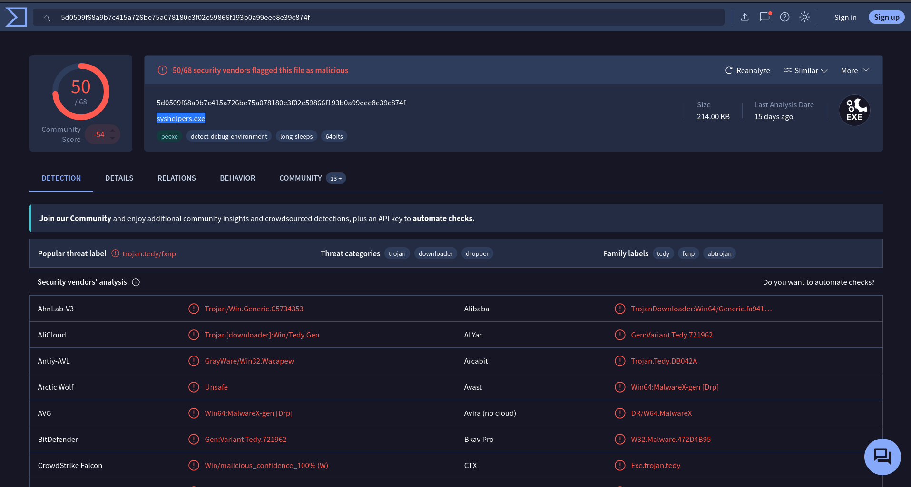
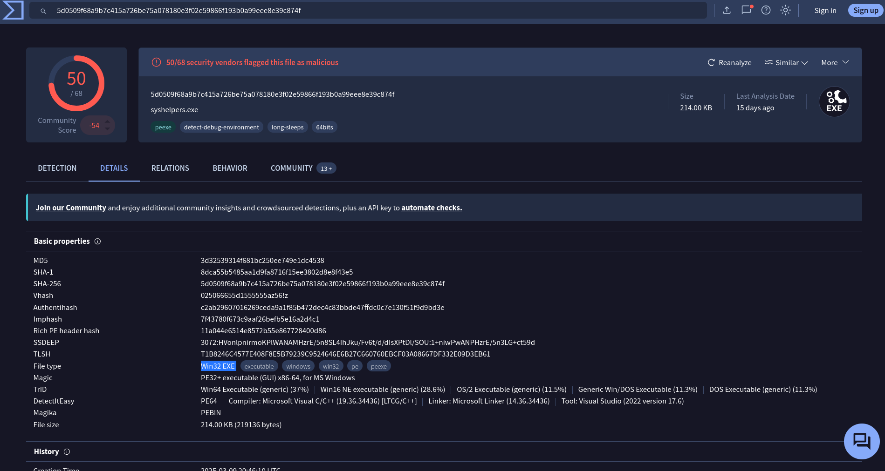
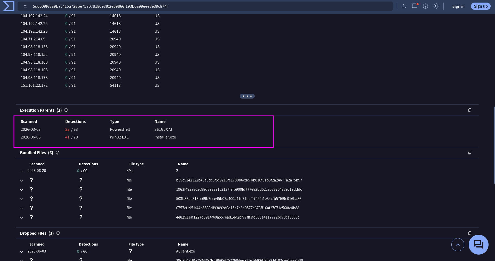
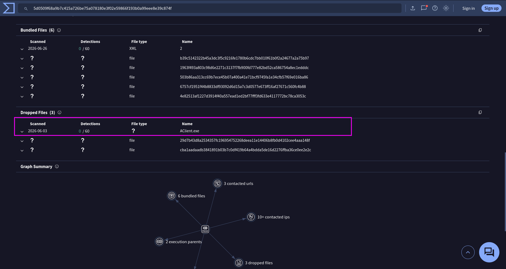
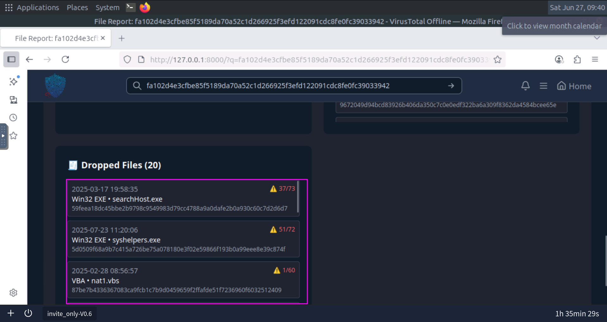
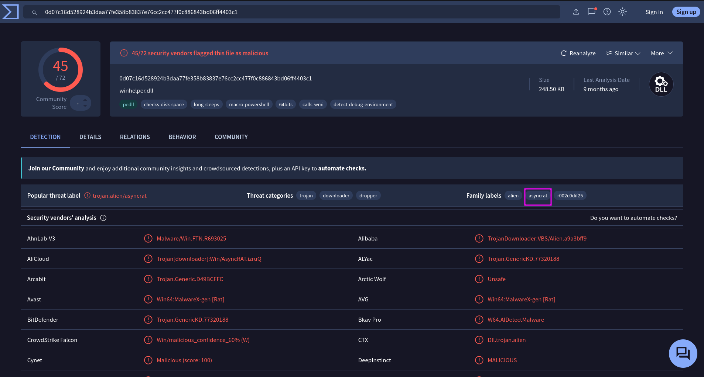
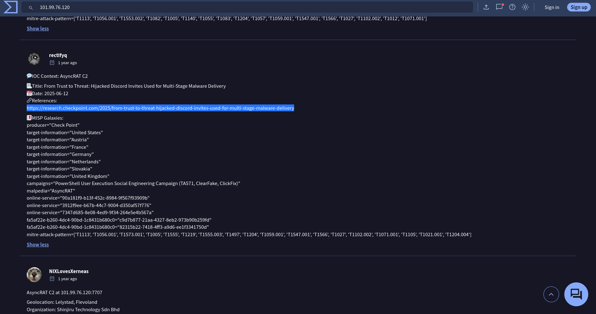
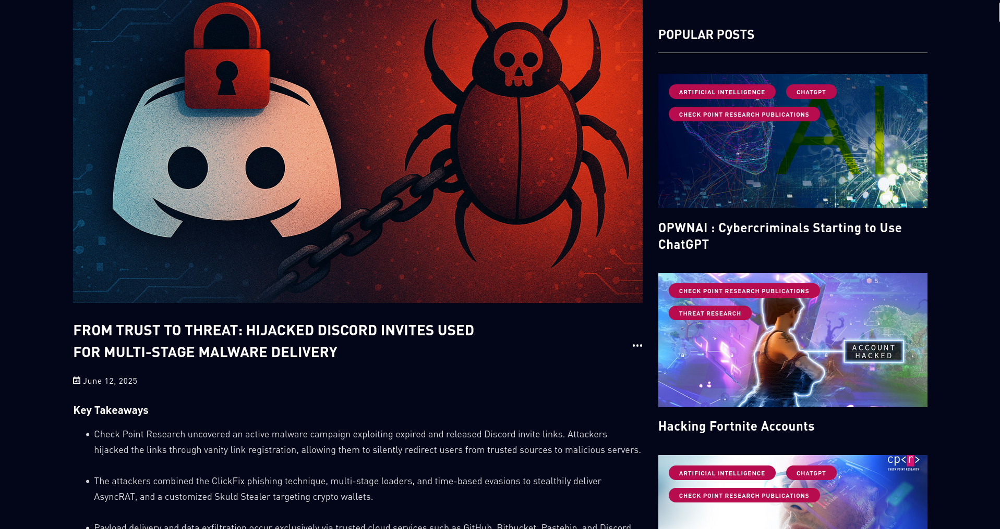
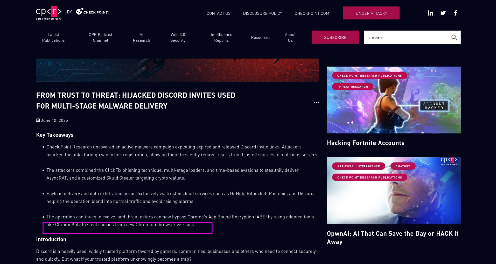
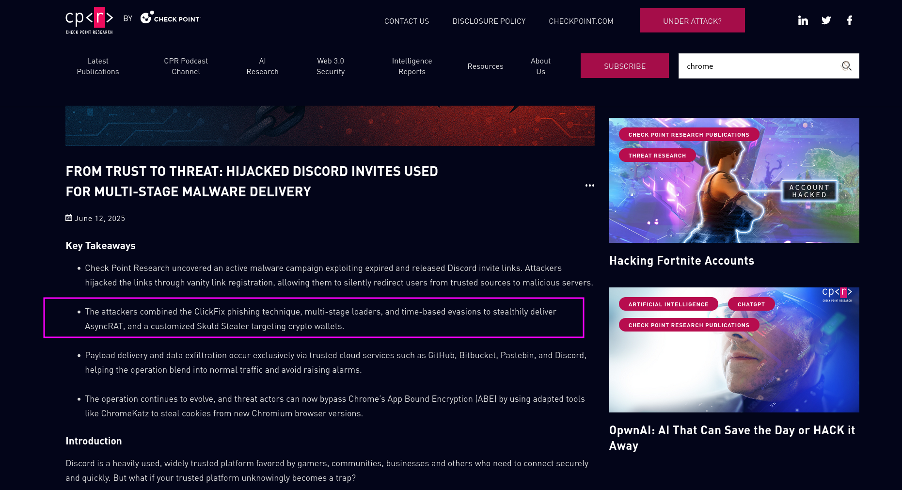

## Invite Only  

You are SOC an analyst on the SOC team at Managed Server Provider TrySecureMe. Today, you are supporting an L3 analyst in investigating flagged IPs, hashes, URLs, or domains as part of IR activities. One of the L1 analysts flagged two suspicious findings early in the morning and escalated them. Your task is to analyse these findings further and distil the information into usable threat intelligence.

Flagged IP: 101[.]99[.]76[.]120  
Flagged SHA256 hash: 5d0509f68a9b7c415a726be75a078180e3f02e59866f193b0a99eee8e39c874f

We recently purchased a new threat intelligence search application called TryDetectThis2.0. You can use this application to gather information on the indic

Q1: What is the name of the file identified with the flagged SHA256 hash?
```bash
syshelpers.exe
```
I copied the hash and past in virus total and it gave the name

Q2: What is the file type associated with the flagged SHA256 hash?
```bash
Win32 EXE
```
Went to the details tab and file type was there 

Q3: What are the execution parents of the flagged hash? List the names chronologically, using a comma as a separator. Note down the hashes for later use.
```bash
361GJX7J,installer.exe
```

Q4: What is the name of the file being dropped? Note down the hash value for later use.
```bash
Aclient.exe
```
Go to relations tab and scrol down to dropped files.


Q5: Research the second hash in question 3 and list the four malicious dropped files in the order they appear (from up to down), separated by commas.
```bash
searchhost.exe,syshelpers.exe,nat.vbs,runsys.vbs
```
For this we will search for the hash of second executed parent and will go to relation tab and first 4 files will be answer in the dropped file section.


Q6: Analyse the files related to the flagged IP. What is the malware family that links these files?
```bash
asyncrat
```
We search for the given ip in virus total and go to the relations and than in the communicating files and click on one of these files. Now we will look at the threat family of the file.

Q7:What is the title of the original report where these flagged indicators are mentioned? Use Google to find the report.
```bash
From Trust to Threat: Hijacked Discord Invites Used for Multi-Stage Malware Delivery
```
We went to community tab and there was a comment by a person with a reference to a page that was a report that was our ansswer

After visiting the page.

Q8: Which tool did the attackers use to steal cookies from the Google Chrome browser?
```bash
ChromeKatz
```
In the key take way part of the report the tool is mentioned

Q9:Which phishing technique did the attackers use? Use the report to answer the question.
```bash
ClickFix
```
It is also mentioned in Key Take away part


Q10:What is the name of the platform that was used to redirect a user to malicious servers?
```bash
Discord
```
Read the report and you'll understand that its discord.