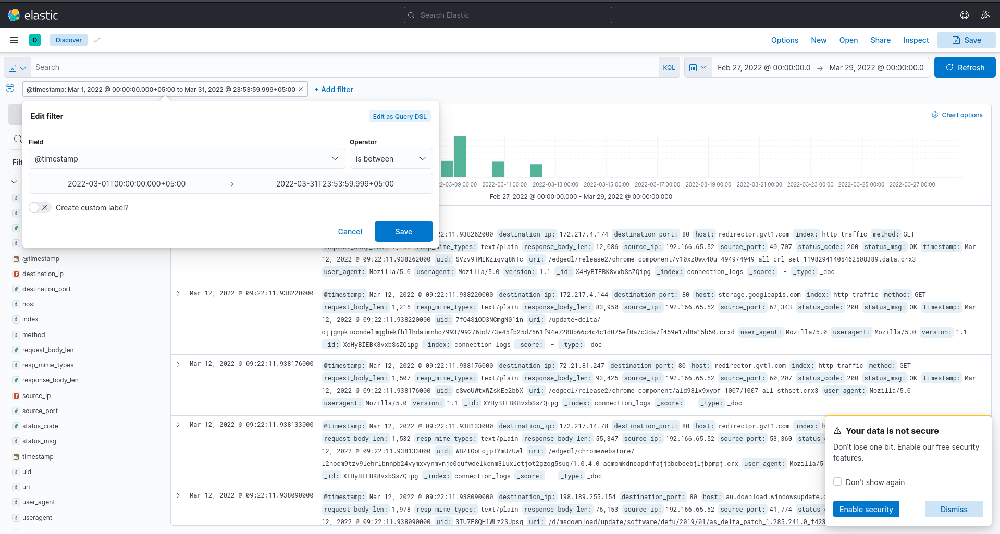
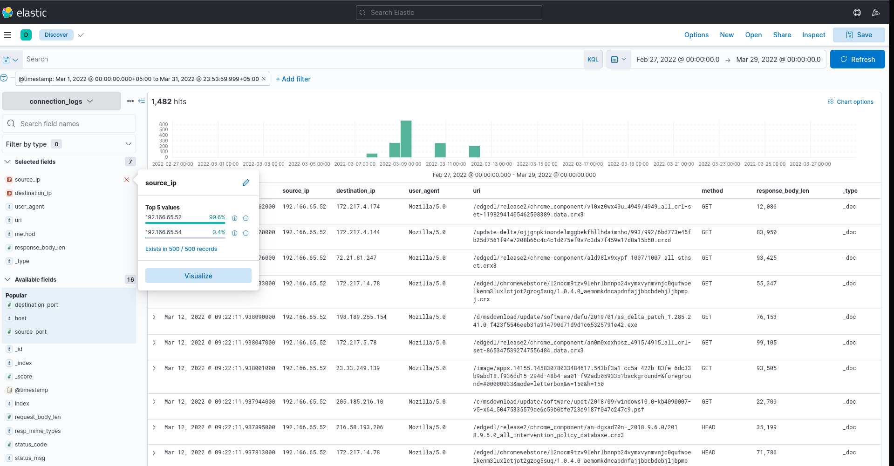
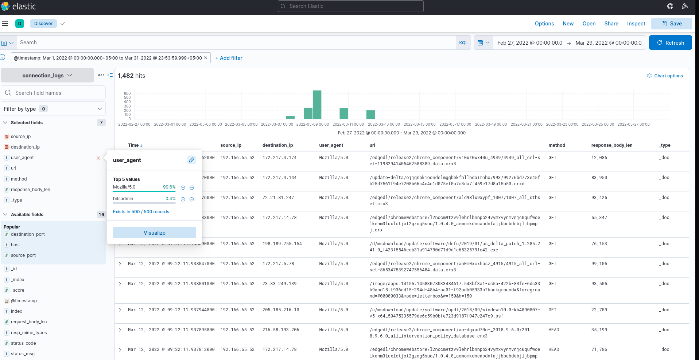
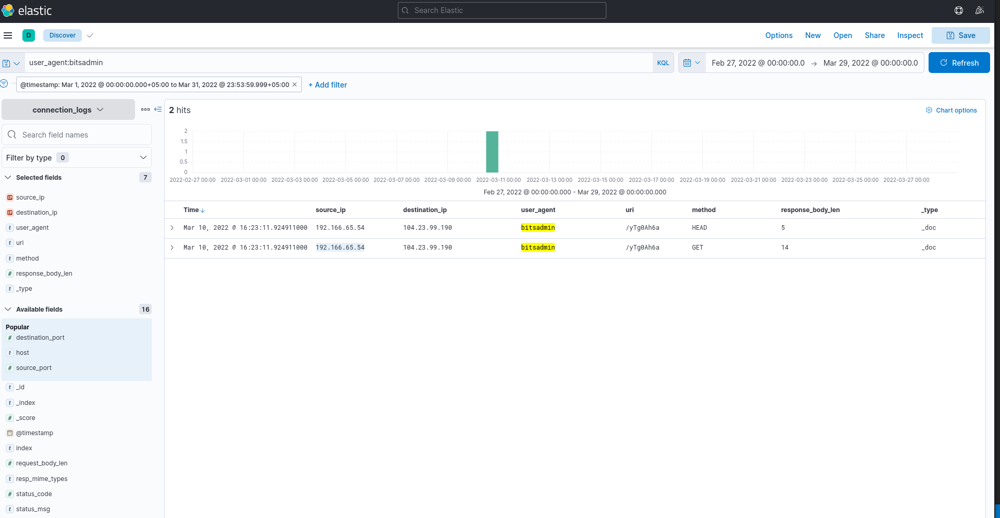
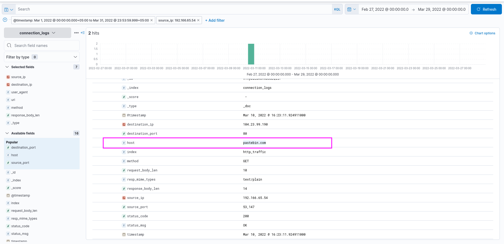
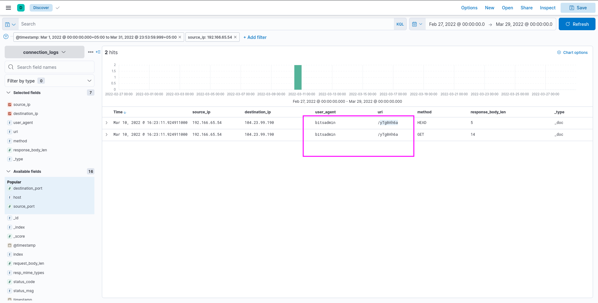
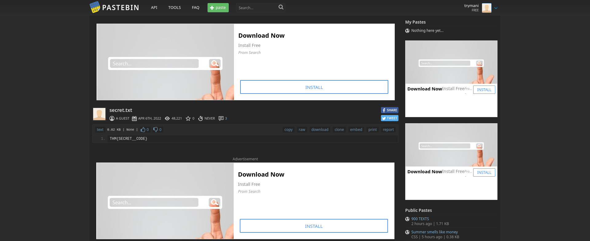
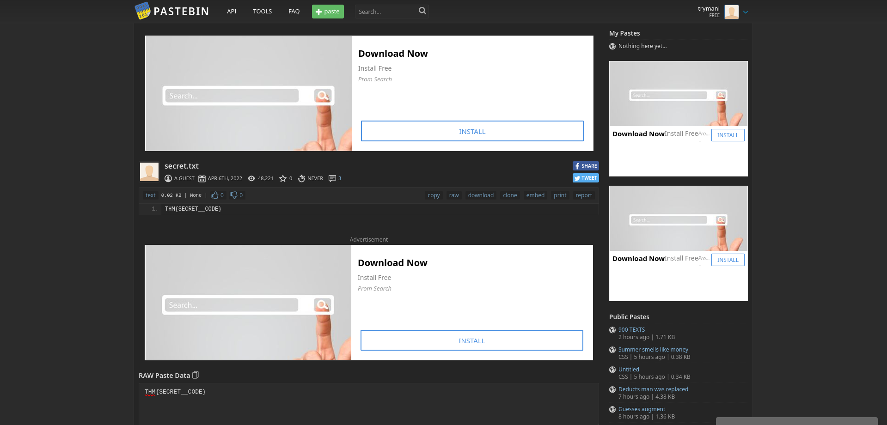

## Scenario
During normal SOC monitoring, Analyst John observed an IDS alert on an solution indicating a potential C2 communication from a user Browne from the HR department. A suspicious file was accessed containing a malicious pattern THM:{---------}. A week-long connection logs have been pulled to investigate. Due to limited resources, only the connection logs could be pulled out and are ingested into the connection_logs index in Kibana.  
Our task in this room will be to examine the network connection logs of this user, find the link and the content of the file, and answer the questions.  
Answer the questions below
Q1:How many events were returned for the month of March 2022?
```bash
1482
```
Apply this filter 

Q2: What is the IP associated with the suspected user in the logs?
```bash
192.166.65.54
```

We can see there are only 2 ips in our file.But in real world this is not the case there could be multiple ips.So instead of making a guess we will go deep investigation.

First i check the user agents.There were only 2 user agents .I never heard of bitsadmin.So i googled about it and came to know it is used by microsoft but can also be used by attackers.As there is only one ip that is using that.So this is our answer
  
Q3:The user’s machine used a legit windows binary to download a file from the C2 server. What is the name of the binary?
```bash
Bitsadmin
```
As we googled about it.Its is windows native built in library.
Q4:The infected machine connected with a famous filesharing site in this period, which also acts as a C2 server used by the malware authors to communicate. What is the name of the filesharing site?  
```bash
pastebin.com
```
If we open up one of the logs of the ip related to affected machine.We can see that host is pastebin which is famous paste website used to make links of pasted text on it to share.
  

Q5:What is the full URL of the C2 to which the infected host is connected?
```bash
pastebin.com/yTg0Ah6a
```
We just need to write hostname with the uri 
  

Q6:A file was accessed on the filesharing site. What is the name of the file accessed?
```bash
secret.txt
```
We need to go to the pastebin.com/yTg0Ah6a and we fill find the file name.
  
Q7:The file contains a secret code with the format THM{_____}.  
```bash
THM{SECRET__CODE}
```
Just scroll below we find the flag.
  