## New Hire Old Artifacts
Investigate the intrusion attack using Splunk.


__Scenario__: You are a SOC Analyst for an MSSP(managed Security Service Provider) company called TryNotHackMe.  
A newly acquired customer (Widget LLC) was recently onboarded with the managed Splunk service. The sensor is live, and all the endpoint events are now visible on TryNotHackMe's end. Widget LLC has some concerns with the endpoints in the Finance Dept, especially an endpoint for a recently hired Financial Analyst. The concern is that there was a period (December 2021) when the endpoint security product was turned off, but an official investigation was never conducted. 
Your manager has tasked you to sift through the events of Widget LLC's Splunks instance to see if there is anything that the customer needs to be alerted on.   

Happy Hunting!
### Answer the questions below
##### Q1:A Web Browser Password Viewer executed on the infected machine. What is the name of the binary? Enter the full path. 
```bash
C:\Users\FINANC~1\AppData\Local\Temp\11111.exe
```
For this i first look for ``EventId 1`` and check the count of images based on it.
So there was a binary ``11111.exe`` with most hit and its name was also very odd.So I started to analyze its activity.
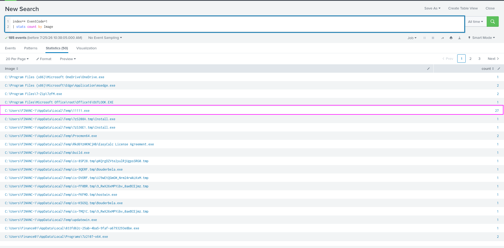
So For this we filter for Event id 1 again and look at this binary commandline ParentCommandline.
In the following image we can see this binary is steeling web cookies.
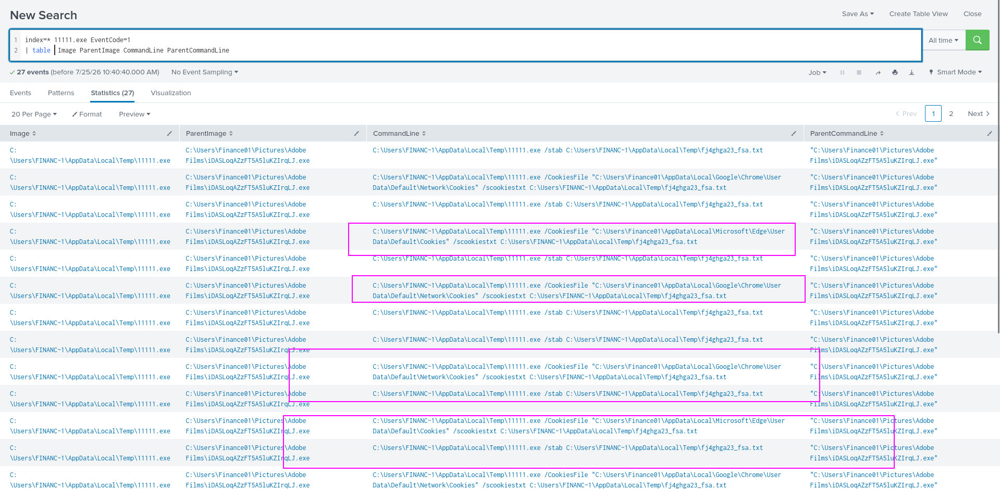
##### Q2:What is listed as the company name?
```bash
NirSoft
```
For this i look for the events with keyword ``11111.exe`` and open the the first event and found the company name.
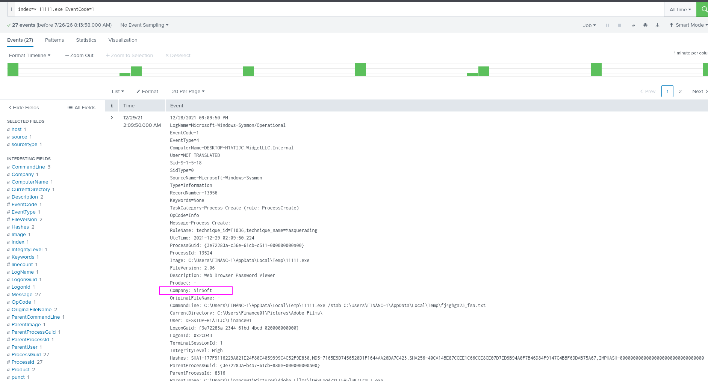
##### Q3:Another suspicious binary running from the same folder was executed on the workstation. What was the name of the binary? What is listed as its original filename? (format: file.xyz,file.xyz)
```bash
IonicLarge.exe,PalitExplorer.exe
```
For this we need to need our current directory to be ``C:\\Users\\Finance01\\AppData\\Local\\Temp\\`` and look for Images.
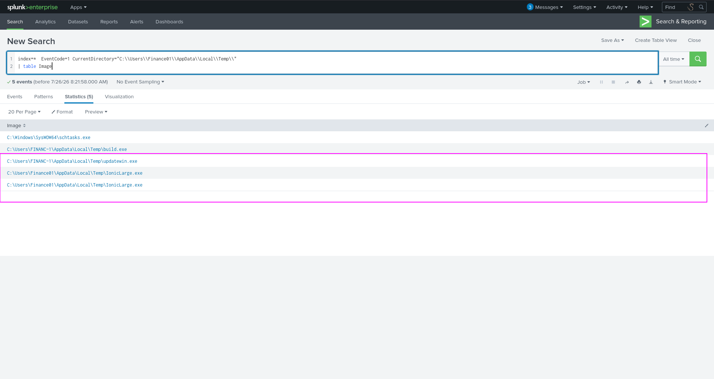
From this we can look that IonicLarge.exe is a supicious binary.
For orignal file name we go for raw events and on right side panel look for the orignal file name.
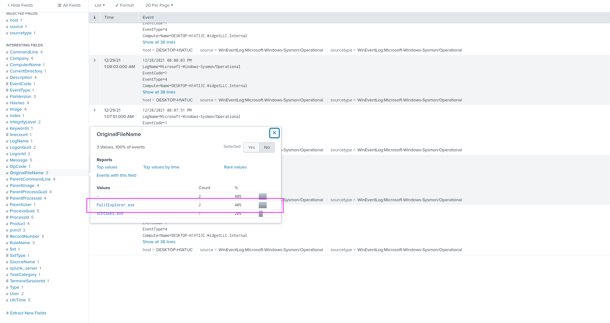
##### Q4:The binary from the previous question made two outbound connections to a malicious IP address. What was the IP address? Enter the answer in a defang format.
```bash
2[.]56[.]59[.]42
```
For this we use the following query
``index=*  EventCode=3  Image="C:\\Users\\Finance01\\AppData\\Local\\Temp\\IonicLarge.exe"``
Where EventCode 3 is for Network Connection.
and than we look at the left side panel for the destination ip
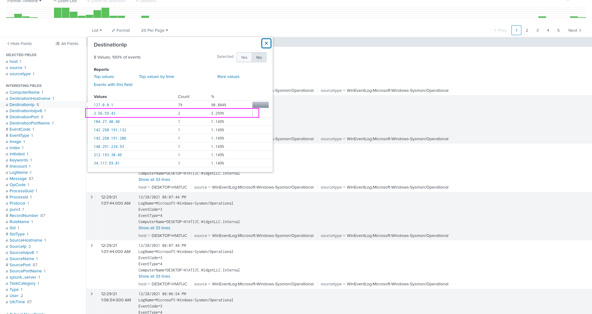
Now we can see the ip of the 2 outbound connection.
##### Q5:The same binary made some change to a registry key. What was the key path?
```bash
HKLM\SOFTWARE\Policies\Microsoft\Windows Defender
```
For this we are gonna use Event Id 13 which is for registery key updation.
and used the following query.  
``index=*  EventCode=13  Image="C:\\Users\\Finance01\\AppData\\Local\\Temp\\IonicLarge.exe"``
And then in the interseting field colomn click on ``TargetObject``
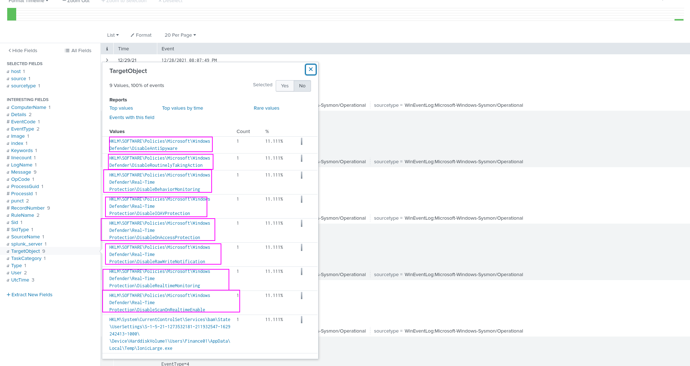
Here we can see the path of the all registry keys it updated and it mostly did to 
__HKLM\SOFTWARE\Policies\Microsoft\Windows Defender__
##### Q6:Some processes were killed and the associated binaries were deleted. What were the names of the two binaries? (format: file.xyz,file.xyz)
```bash
WvmIOrcfsuILdX6SNwIRmGOJ.exe,phcIAmLJMAIMSa9j9MpgJo1m.exe
```
For this i used this query 
``index=*  EventCode=1 taskkill``
where taskkill is a command that is used to kill a process in windows command line.
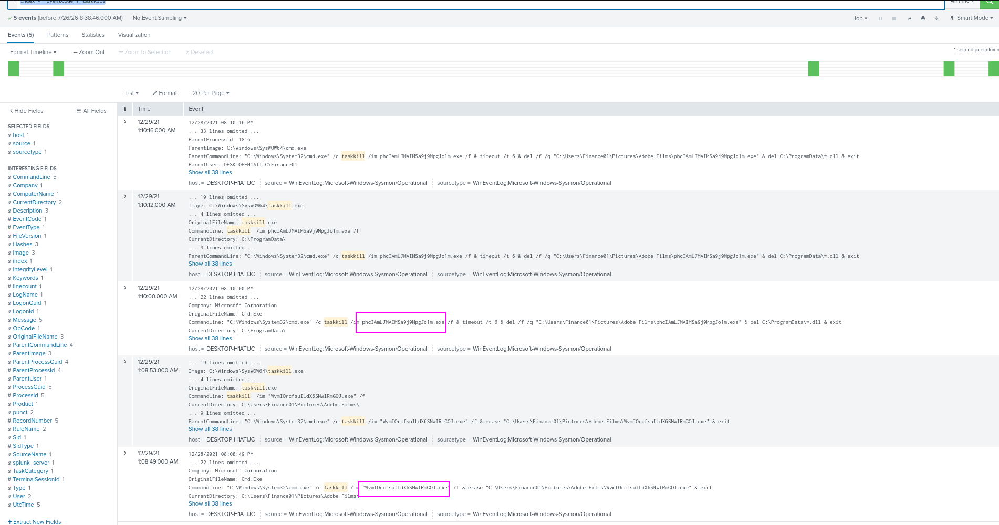
##### Q7:The attacker ran several commands within a PowerShell session to change the behaviour of Windows Defender. What was the last command executed in the series of similar commands?
```bash
powershell WMIC /NAMESPACE:\\root\Microsoft\Windows\Defender PATH MSFT_MpPreference call Add ThreatIDDefaultAction_Ids=2147737394 ThreatIDDefaultAction_Actions=6 Force=True
```
For this Again Event Code 1 and keyword we used is ``Defender`` and than we created a Table with only colomn is CommandLine.
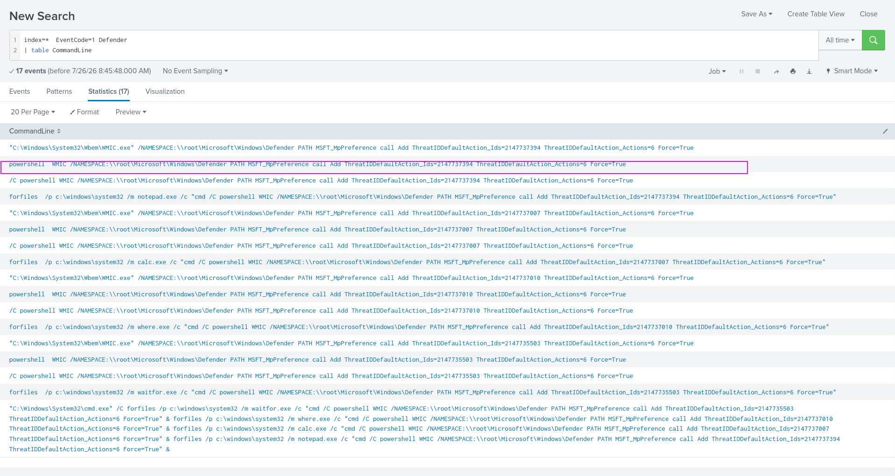
Reason we choose the command from the top is events are stored as they come meaning top events are latest and last executed.
##### Q8:Based on the previous answer, what were the four IDs set by the attacker? Enter the answer in order of execution. (format: 1st,2nd,3rd,4th)
```bash
2147735503,2147737010,2147737007,2147737394
```
For this in those same logs we can find the IDs.
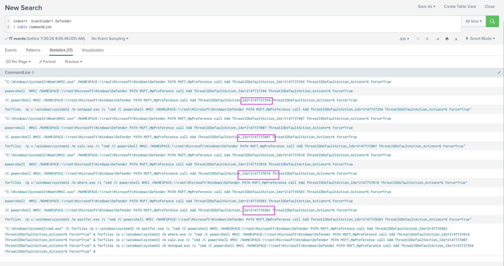
##### Q9:Another malicious binary was executed on the infected workstation from another AppData location. What was the full path to the binary?
```bash
C:\Users\Finance01\AppData\Roaming\EasyCalc\EasyCalc.exe
```
For this used the following query.
``index=*  Image="C:\\Users\\Finance01\\AppData*"
| stats count by Image``
And we found the binary.
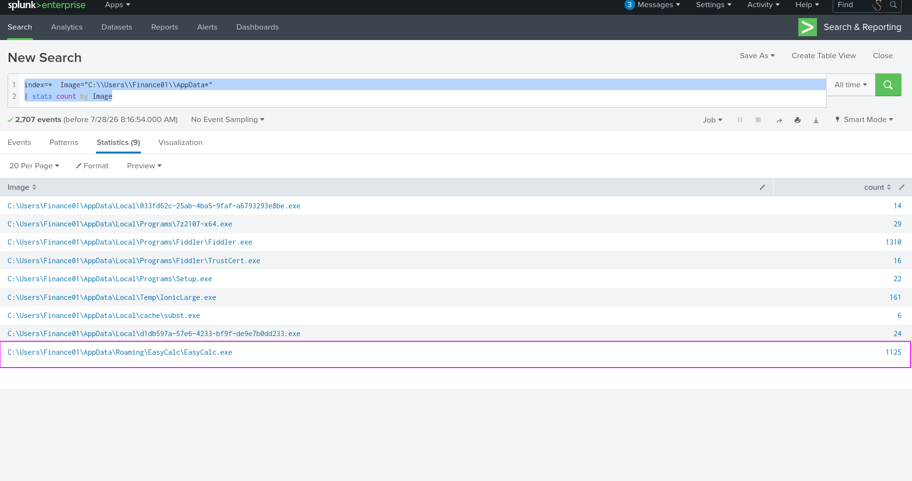
##### Q10:What were the DLLs that were loaded from the binary from the previous question? Enter the answers in alphabetical order. (format: file1.dll,file2.dll,file3.dll)
```bash
ffmpeg.dll,nw.dll,nw_elf.dll
```
For this first we filter EventCode ``7`` which is for Image loaded by a Image and we also use Image as ``C:\\Users\\Finance01\\AppData\\Roaming\\EasyCalc\\EasyCalc.exe``
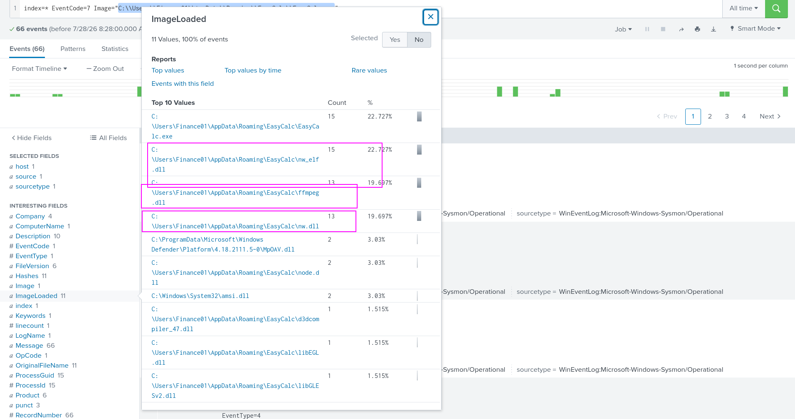