## Shadow Trace Write-up and Analysis
It’s the middle of the night shift. You’re the only analyst in the SOC

## Overview
when a manager calls in urgently: a suspicious file was found on a user's machine and needs immediate review.  
You open the file and start digging. Something doesn’t look normal for a company updater, and at the same time, the EDR throws a couple of alerts.

Your task: analyse the file, collect anything to identify it, gather any potential IOCs, correlate and analyse the alerts for potential malicious behaviour. It’s up to you to piece together what’s happening before it spreads further.  
## Learning Objectives

* Extract IOCs from suspicious binaries
* Correlate alerts with malicious activity
* Perform basic SOC triage actions

## File Analysis:

Analyse the binary located C:\Users\DFIRUser\Desktop\windows-update.exe in the attached machine, answer the questions below. 

Start the lab by clicking the Start Lab Machine button. It will take around 2 minutes to load properly. The VM will be accessible on the right side of the split screen.

You can find several tools installed in the machine that can help you with any kind of analysis under C:\Users\DFIRUser\DFIR Tools


Answer the questions below:  
Q1: What is the architecture of the binary file windows-update.exe?
```bash
64-bit
```
First open the malware file in the PE-bear tool.
After that go to the File Hdr section. In the Machine row we can see Value 8664 
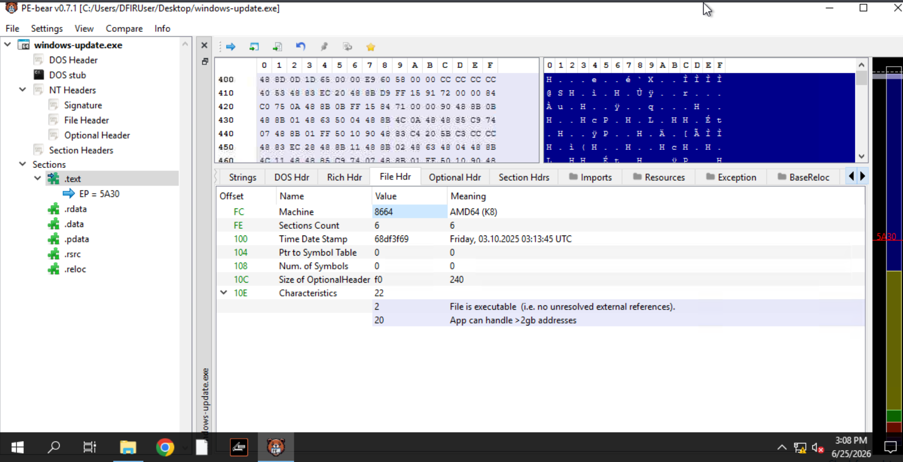
and after google it.
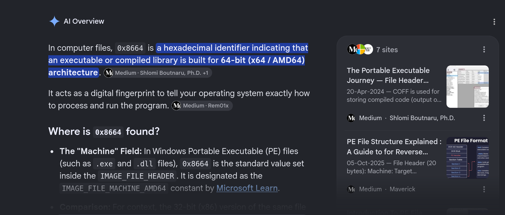

Q2: What is the hash (sha-256) of the file windows-update.exe? 
```bash
b2a88de3e3bcfae4a4b38fa36e884c586b5cb2c2c283e71fba59efdb9ea64bfc
```
I opened the Powershell i wrote
```bash 
Get-FileHash ~/Desktop/windows-update.exe
```
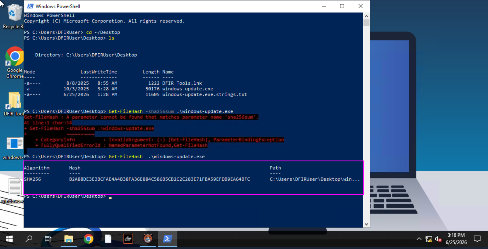

Q3: Identify the URL within the file to use it as an IOC 
```bash
http://tryhatme.com/update/security-update.exe
```
I went to PE-bear tool and open the strings tab and save the file.
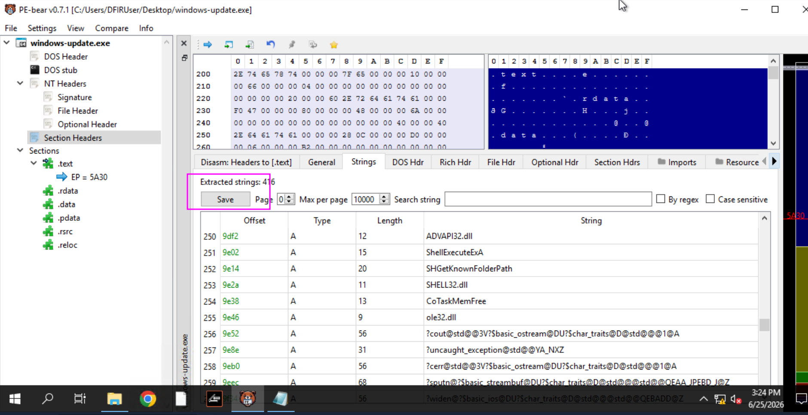
Than i opened the file and use a shortcut key to find keywords ctrl+f.After that i type http and found an url in the file.
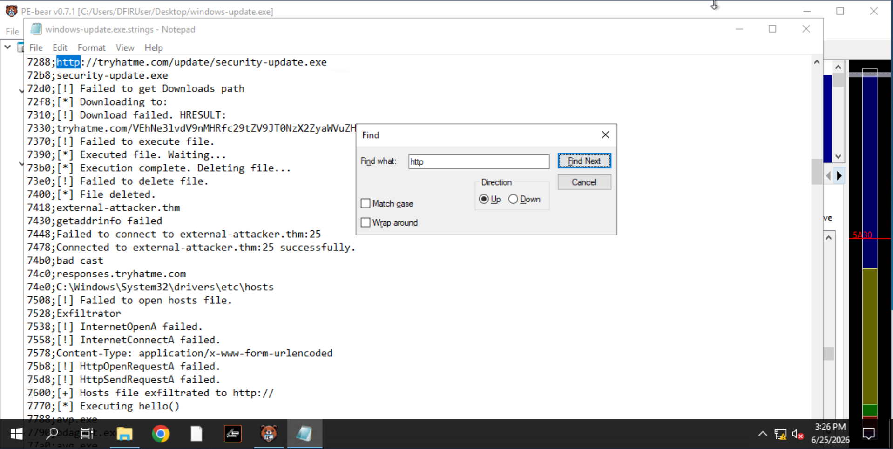

Q4: With the URL identified, can you spot a domain that can be used as an IOC?
```bash
responses.tryhatme.com
```
I ran this command in powershell 
```bash
Get-Content C:\Users\DFIRUser\Desktop\windows-updater.exe.strings.txt | findstr /R "tryhatme"
```
and got this result
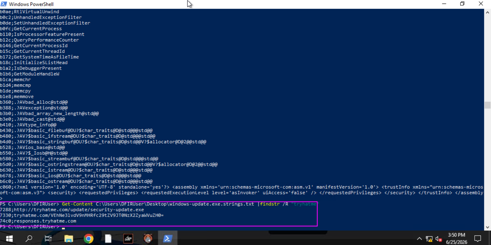

Q5: Input the decoded flag from the suspicious domain
```bash
THM{you_g0t_some_IOCs_friend}
```
I again went into the file and search for tryhatme came to uri which looked like base64 encoded
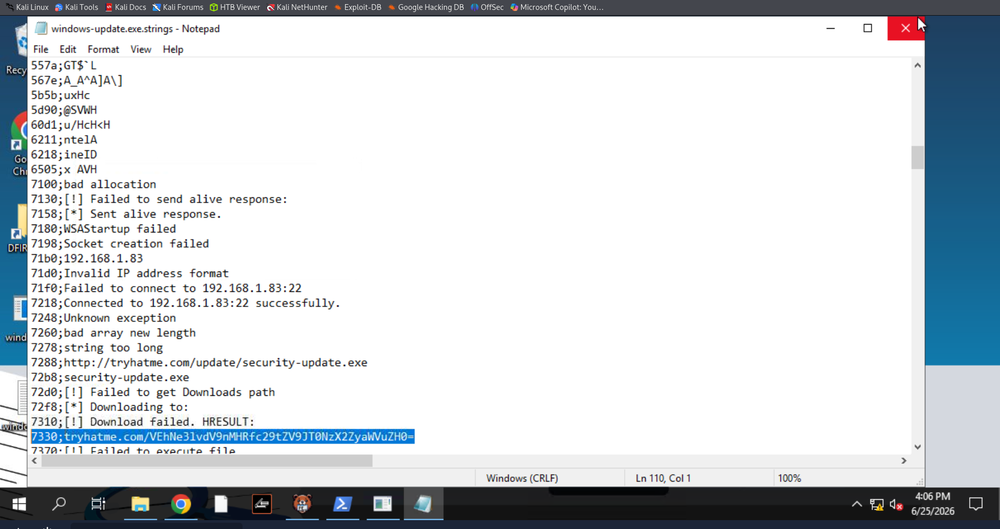
and decoded it and got the flag
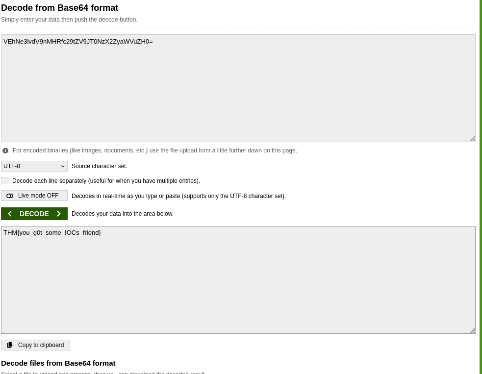


Q6: What library related to socket communication is loaded by the binary? 
```bash 
WS2_32.dll
```
First i googled which library is responsilbe for creating socket as i didnt knew.After google i came to know WS2_32.dll is the librayr 
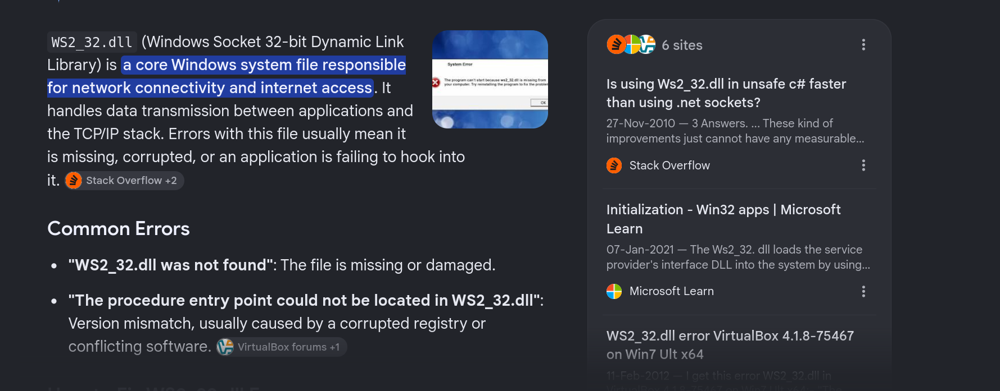
Than i went to strings like and search for the library and it was there.
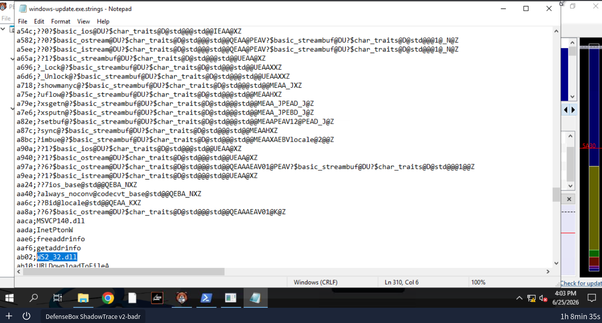


## Alert Analysis:
Q1: Can you identify the malicious URL from the trigger by the process powershell.exe?
```bash
https://tryhatme.com/dev/main.exe
```
From this image we can see the url is being encoded into base64.
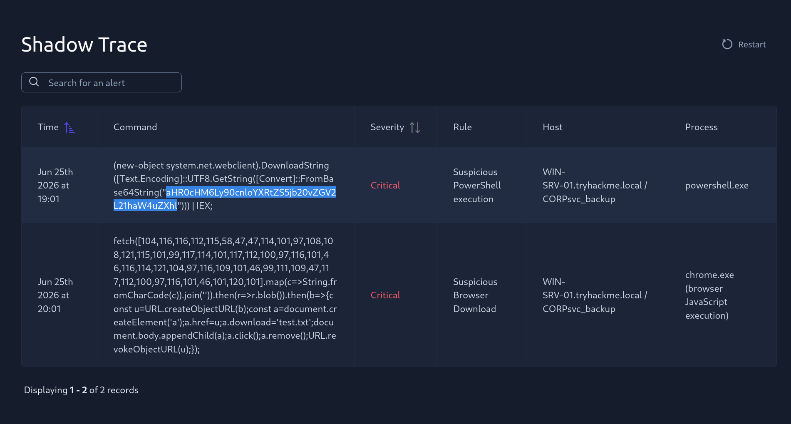
So i decoded it and got the url.
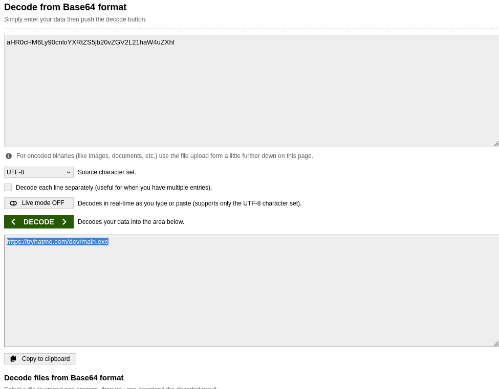

Q2: Can you identify the malicious URL from the alert triggered by chrome.exe?
```bash
https://reallysecureupdate.tryhatme.com/update.exe
```
By looking at the command theres a keyword fetch.It immediatly came to my find it would definatly be fetching a url and it is in ascii that was than parsed.So to convert it into actual text.I created a python script name as script.py
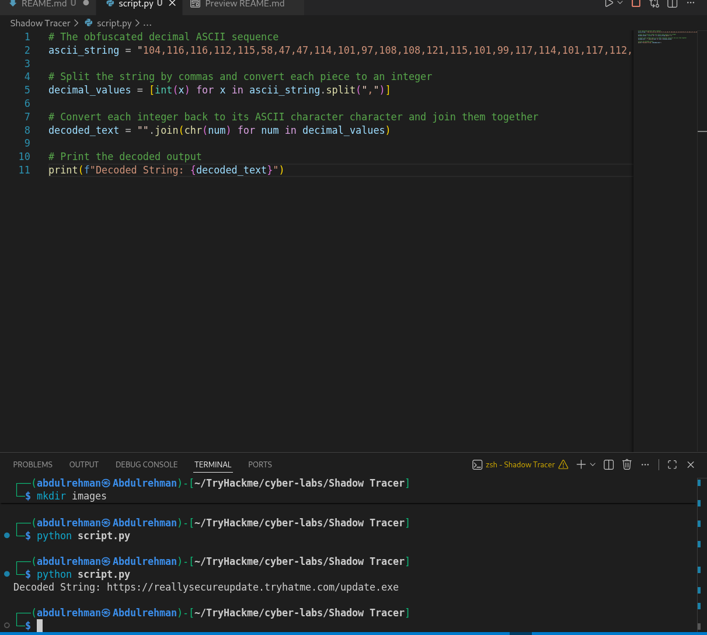

Q3: What's the name of the file saved in the alert triggered by chrome.exe?
```bash
test.txt
```
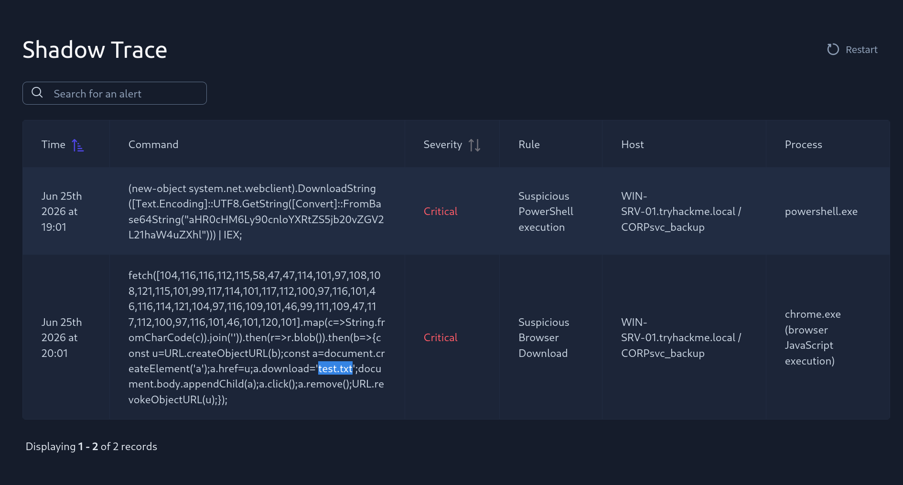
