## Slingshot
Can you retrace an attacker's steps after they enumerate and compromise a web server?
__Slingway Inc.__, a leading toy company, has recently detected suspicious activity on its e-commerce web server and potential unauthorized modifications to its database. To investigate the incident, you have been brought in to analyze the available logs and determine the scope and impact of the attack. To aid in your investigation, you've been provided with access to an Elastic Stack instance containing logs from the suspected compromise. Below are the credentials required to access Kibana the dashboard. Slingway's IT team noted that the suspicious activity began on July 26, 2023.


### Objectives
By investigating and answering the questions in the next task, you will build a timeline of events to support the incident response process and deliver clear, evidence-based findings. In your investigation, you seek to answer the following questions.

*    What reconnaissance and enumeration techniques were used?
*    What vulnerabilities were exploited on the web server?
*    How did the attacker gain administrative access?
*    What sensitive data was accessed or exfiltrated?
### Prerequisites
Some familiarity with the Elastic architecture and query creation will be useful in this challenge room. Check out the rooms below!
* Go over [Elastic Stack: The Basics](https://tryhackme.com/room/investigatingwithelk101) for an overview of Elastic architecture and queries
* Cover (Elastic: Query Languages)[https://tryhackme.com/room/elasticlanguages] to develop an understanding of advanced queries
### Lab Access
Click the Start Machine button below. Please give Elastic 5 minutes to start, then access the dashboard using the link and the following credentials.
* https://LAB_WEB_URL.p.thmlabs.com/
* username: ``elastic``
* password: ``raCK0W**BLlW66oNlKAk``
### The Slingshot Investigation.
Once you've accessed the Kibana homepage, head to Discover to begin your investigation. A premade Data view has been set up with all the log data needed to uncover potential suspicious activity. Best of luck!

1.  Ensure you're using the ``apache_logs Data`` view
2.  Set the time frame from ``Jul 26, 2023 @ 00:00:00.000 → now``
3.  Investigate the event data
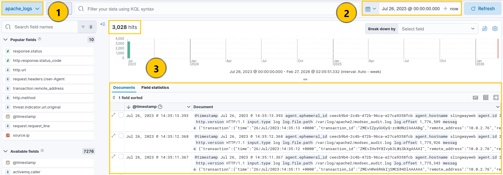
### Answer the questions below
#### Q1:What is the attacker's IP address?
```bash
10.0.2.15
```
First we looked at the ip's making requests.
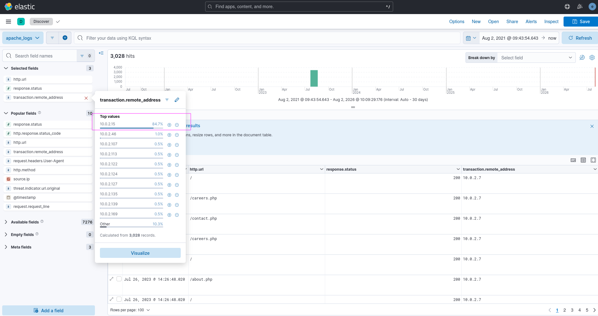
About 84% requests were made from a single address so i decided to look at its activity.
For visualizing its request i made a dashboard where i can see where it made the most requests.
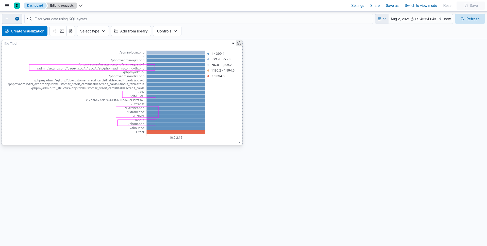
In this Image we can see that the user was making requests that was recon phase.
#### Q2:What is the first scanner that the attacker ran against the web server?
```bash
Nmap Scripting Engine
```
For this I apply filter for attackers ip and then sort the event by time stamp 
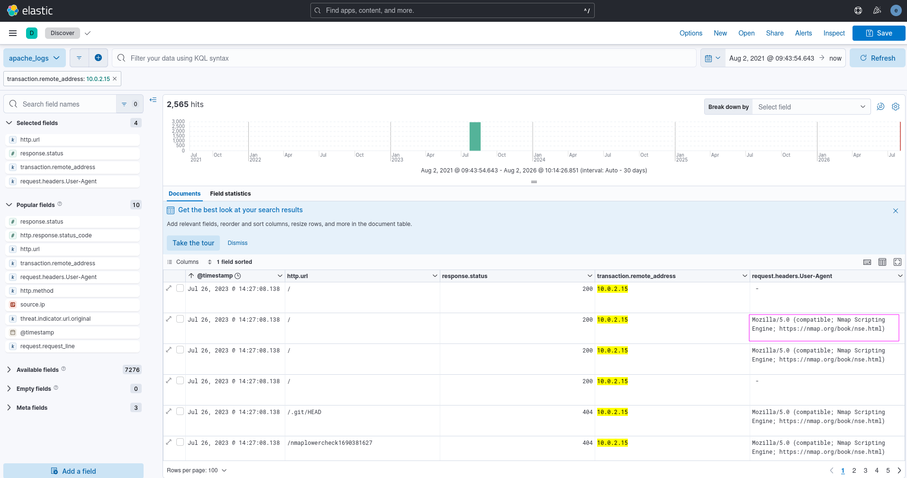
#### Q3:What is the User Agent of the directory enumeration tool that the attacker used on the web server?
```bash
Mozilla/5.0 (Gobuster)
```
I scrolled down a litte and found gobuster which is a directory enumrating tool.
#### Q4:In total, how many 404 responses did the attacker receive when enumerating the web server?
```bash
1867
```
Applied the following filter
``transaction.remote_address:10.0.2.15`` ``response.status:404``
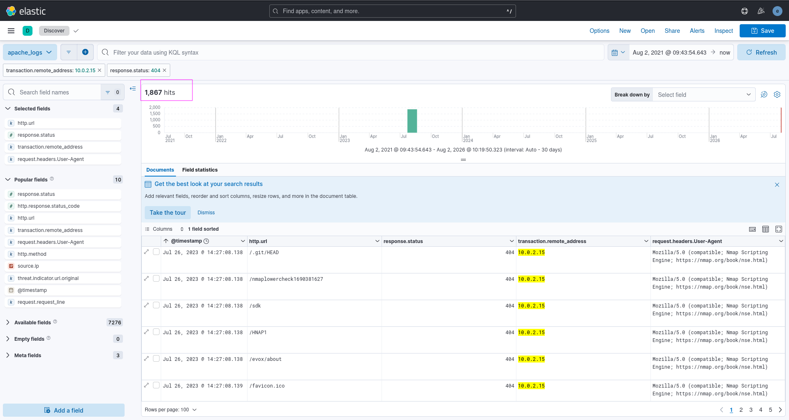
#### Q5:What flag was discovered in one of the directories identified during enumeration?
```bash
a76637b62ea99acda12f5859313f539a
```
I removed Event Code filter and search for keyword ``flag``
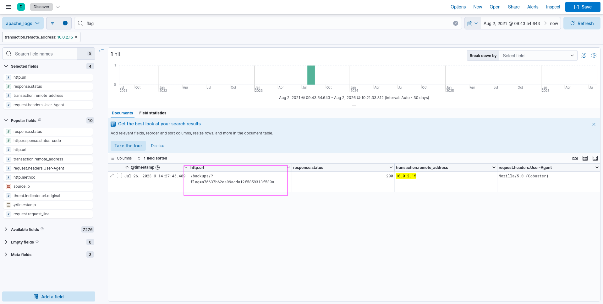
#### Q6:What login page did the attacker discover using the directory enumeration tool?
```bash
/admin-login.php
```
Applied filter for ``Event code 401`` and searched for ``Gobuster`` 
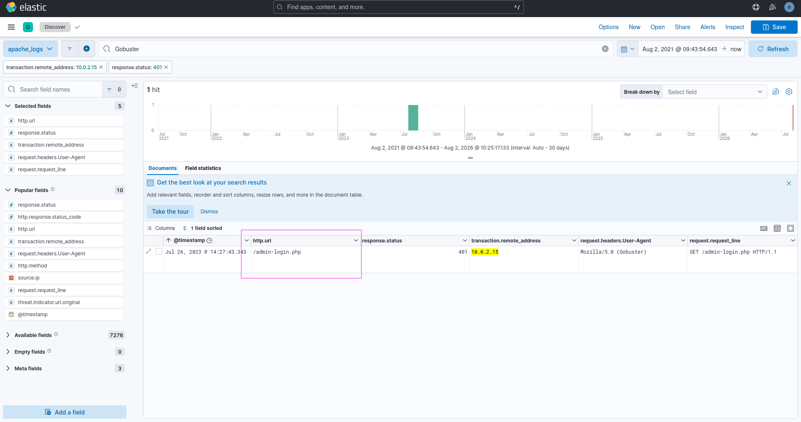
#### Q7:What is the User-Agent of the brute-force tool that the attacker used on the admin panel?
```bash
Mozilla/4.0 (Hydra)
```
I used event code ``401`` which is for authentication requried and applied filter for url ``/admin-login.php``
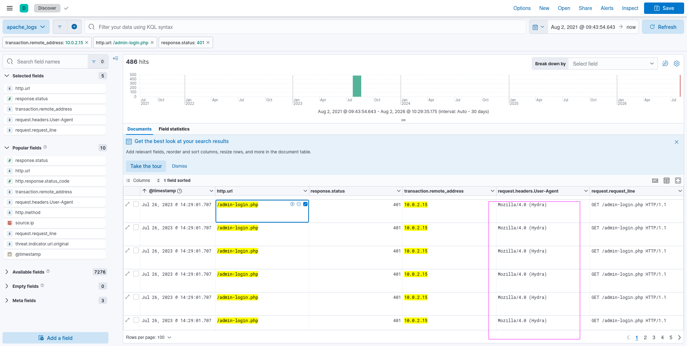
#### Q8:What username:password combination did the attacker use to gain access to the admin page?
```bash
admin:thx1138
```
Added the ``request.headers Authentication`` and response code ``200`` 
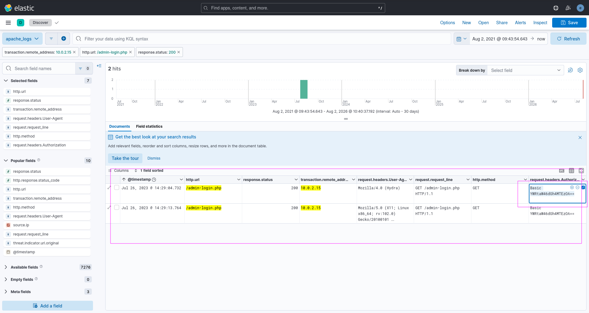
And than decoded it 
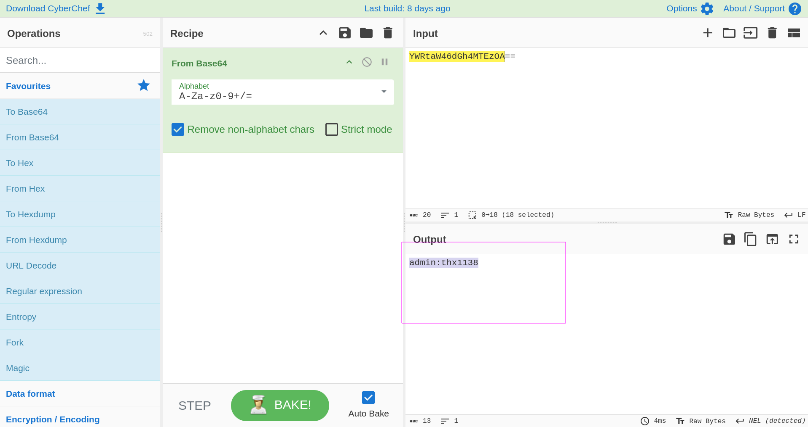
#### Q9:What flag was included in the file that the attacker uploaded to the /admin/upload.php directory?
```bash
THM{ecb012e53a58818cbd17a924769ec447}
```
For this I looked for ``POST`` requests and search for ``admin/login.php`` and there was only one request and than looked at the body content.
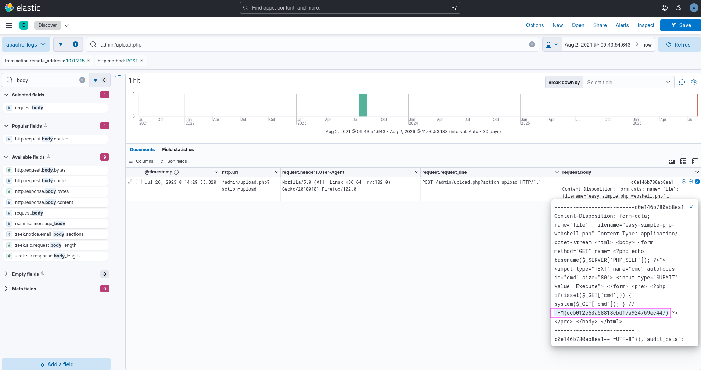
#### Q10 What was the first command the attacker ran using the web shell?
```bash
whoami
```
Well for this i search for ``GET`` requests with ``200`` response code and sort the Events with Timestamp and looked at few Event.
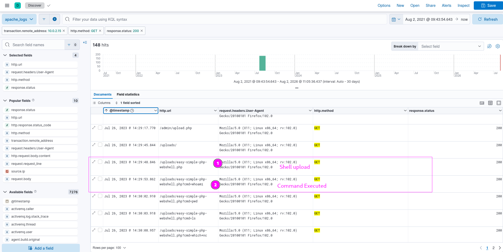
#### Q11:Which file was accessed via Local File Inclusion (LFI) to retrieve database credentials?
```bash
config-db.php
```
For LFI there must be a web shell file in machine for attacker in previous question we saw that attacker used ``easy-simple-php-webshell.php`` file for webshell so i searched for that file and
looked at the events and found the database file.
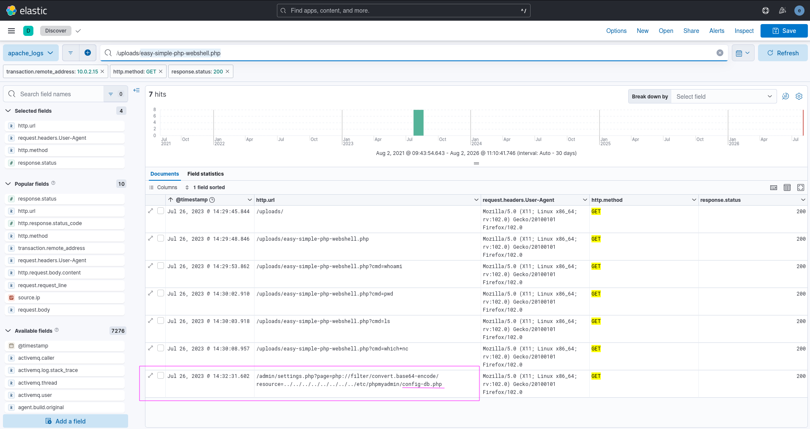
#### Q12:What is the name of the database the attacker exported via /phpmyadmin?
```bash
customer_credit_cards
```
I used this query ``http.url:*phpmyadmin*db*`` to look for the url with phpadmin path and file that has db in it.
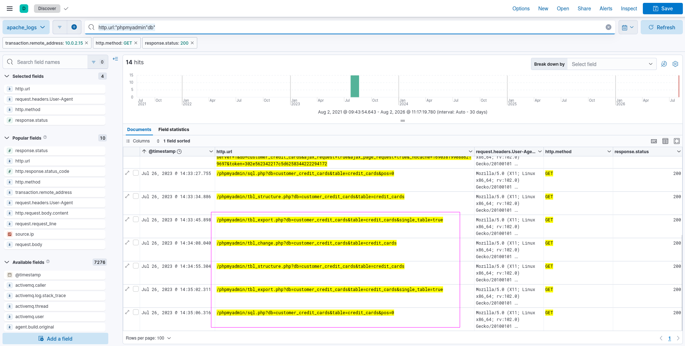
#### Q13:What flag does the attacker insert into the database using import.php?
```bash
c6aa3215a7d519eeb40a660f3b76e64c
```
Used this query ``http.url:*import.php*`` and Filter for ``POST`` request looked into the request body and got the flag.
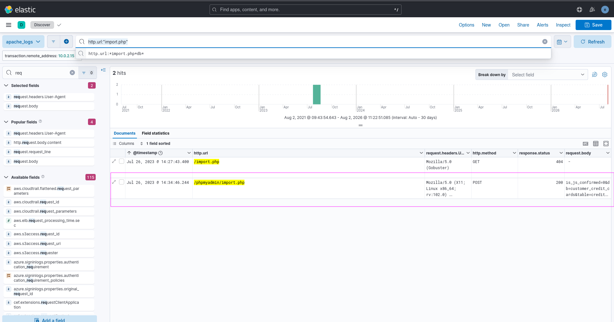
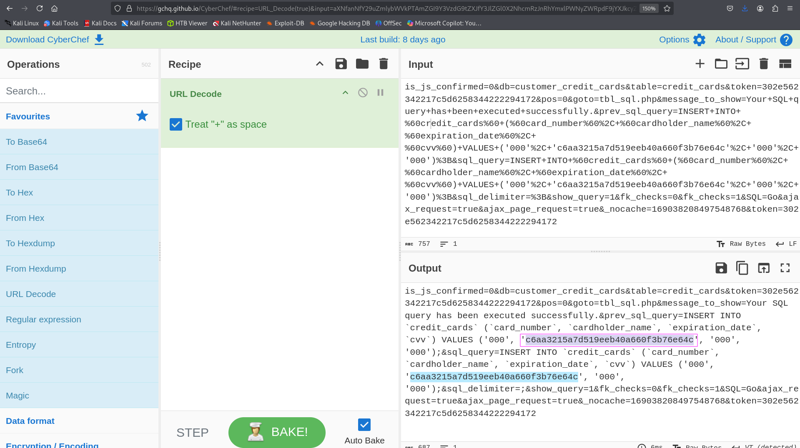