 In this lab, we'll work with a Linux environment to install and configure Splunk , integrate key log sources, and forward data from system files and a web server. By the end, you'll have a working setup for centralized log monitoring using Splunk.
 ## Splunk Deployment and Architecture.
 Before setting up your environment, it is important to understand how Splunks's deployment architecture works. Let's take a look at an overview of the main components that make up the Splunk environment and how they interact in a Splunk setting.
 
 ### Architecture Components
 #### Forwarders

forwarders are lightweight agents that are installed on endpoints or servers to collect and send data to your instance. They are essential in both small and large-scale environments where events are spread across multiple systems. 's universal forwarder forwards raw data, while the heavy forwarder  can parse or filter data before sending it.
#### Indexers

Splunk indexers are responsible for processing incoming data from Splunk forwarders. In a SOC environment, indexers make log data searchable and available for analysis. When data reaches an indexer, it is parsed, transformed, and stored in a structure called an index. This allows us to efficiently view and correlate events across different source
#### Search Head

The search head in Splunk is what analysts interact with to run searches and investigate log data. It sends search requests to indexers and displays the results through dashboards, reports, and alerts. It also allows analysts to create visualizations and correlations that help identify trends or suspicious activity. Beyond being just a user interface, the search head is a core component of Splunk's architecture. It performs search-time parsing, dynamically extracting fields, and transforming raw data into meaningful information during a search.

In this room, the indexer and search head roles will be performed by the same Splunk instance. However, in larger or distributed environments, organizations often use separate hosts for each role, for example, a cluster of indexers to handle large data volumes and one or more search heads dedicated to search and visualization tasks.Splunk primarily performs search-time parsing in which raw events are stored as-is, and fields are extracted during search. This provides flexibility to reinterpret data with reindexing but increases CPU load on the search head. In contrast, Elastic relies on partial index-time parsing but can be configured to parse completely at index-time, reducing query times during searches at the cost of processing on the index side. 
#### Deployment Server
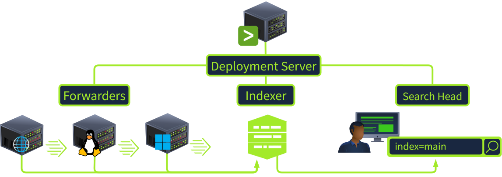
Managing a few forwarders is relatively simple, but managing hundreds or thousands of them manually becomes challenging. A Splunk deployment server (opens in new tab) is an optional central management point for multiple instances. Imagine you have servers or hosts scattered across different offices throughout your country, and you need to forward events from all those locations to Splunk. The deployment server acts as the manager, allowing you to remotely configure, update, and manage forwarders without having to log in to each system individually.

In a SOC environment, this simplifies large-scale log collection, especially when dealing with hundreds of endpoints, ensuring all forwarders stay synchronized with the latest configurations, inputs, and outputs.
### Linux Deployment.
 Splunk supports all major OS versions, has straightforward installation steps, and can be up and running in under 10 minutes on any platform. Typically, you would create a Splunk account and [download](https://www.splunk.com/en_us/download/splunk-enterprise.html?locale=en_us) the latest installation package.
 #### Splunk Install.
 Let's begin by navigating to the splunk directory, switching over to the root user, and using the tar command below to install Splunk in the /opt directory.
```bash           
ubuntu@coffely:~$ cd Downloads/splunk
ubuntu@coffely:~/Downloads/splunk$ ls
splunk_installer.tgz splunkforwarder.tgz
ubuntu@coffely:~/Downloads/splunk/$ sudo su
root@coffely:~/Downloads/splunk/#
root@coffely:~/Downloads/splunk/# tar xvzf splunk_installer.tgz 
splunk/splunk-9.0.3-dd0128b1f8cd-linux-2.6-x86_64-manifest
...
```
#### Starting Splunk.
The above step unzips the Splunk installer and installs all the necessary binaries and files on the system. Let's now navigate to /opt/splunk/bin and start Splunk with ./splunk start --accept-license. Create a new user account and password.
```bash          
root@coffely:~/Downloads/splunk/# cd /splunk/splunk/bin
root@coffely:/opt/splunk/bin# ./splunk start --accept-license
This appears to be your first time running this version of Splunk.

Splunk software must create an administrator account during startup. Otherwise, you cannot log in.
Create credentials for the administrator account.
Characters do not appear on the screen when you type in credentials.

Please enter an administrator username: admin
Password must contain at least:
  * 8 total printable ASCII character(s).
Please enter a new password: 
Please confirm new password:
...
Waiting for web server at http://127.0.0.1:8000 to be available............... Done

If you get stuck, we're here to help.  
Look for answers here: http://docs.splunk.com

The Splunk web interface is at http://coffely:8000
```
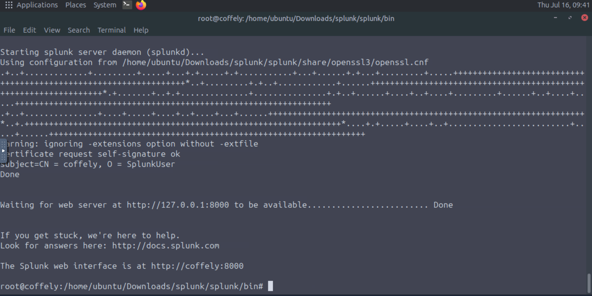
By default, Splunk Web is accessible over port 8000. Use the credentials you created during the installation process to access the dashboard.
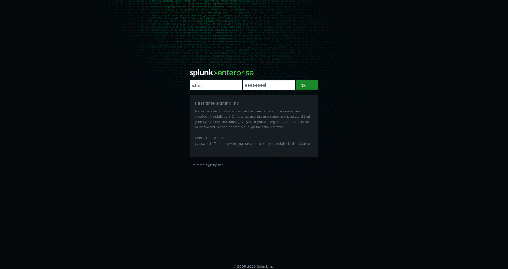       
Add your credentials.
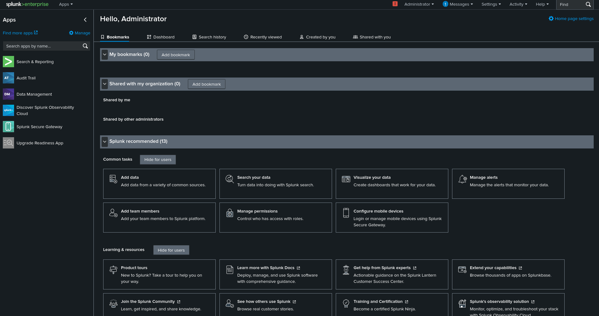   
### Managing Splunk From CLI
Now that you have installed Splunk , it's essential to learn some key commands when interacting with Splunk instances through the CLI . These commands are run from the Installed directory.

The `splunk start` command is used to start the server. This command starts all the necessary Splunk processes, enabling the server to accept incoming data. If the server is already running, this command will have no effect.Splunk can be stopped with `splunk stop`.

Restarting Splunk  is as easy as running `splunk restart` and is useful when changes have been made to Splunk's configuration
```bash
          
root@coffely:/Downloads/splunk/splunk/bin# ./splunk start
Splunk> Finding your faults, just like mom.
…
Checking prerequisites...
    Checking http port [8000]: open
    Checking mgmt port [8089]: open
    Checking appserver port [127.0.0.1:8065]: open
    Checking kvstore port [8191]: open
    Checking configuration... Done.
...
...
The Splunk web interface is at http://coffely:8000
```
#### Further Useful Commands
Use the `splunk enable boot-start` command to configure Splunk to automatically start as a service whenever the system boots.    
The `splunk status command` is used to check the status of the server. This command will display information about the current state of the server, including whether it is running or not, and any errors that may be occurring.
```bash         
root@coffely:/Downloads/splunk/splunk/bin# ./splunk status
splunkd is running (PID: 45852).
splunk helpers are running (PIDs: 45853 46296 46305 46414 46511 46786).
```
The `splunk add oneshot` command is used to add a single event to the Splunk index. This is useful for testing purposes or for adding individual events that may not be part of a larger data stream.
```bash
root@coffely:/Downloads/splunk/splunk/bin# ./splunk add oneshot /path/to/logfile -index yourindex
....
``` 
The `splunk search` command is used to search for data in the Splunk index. This command can be used to search for specific events, as well as to perform more complex searches using Splunk's search processing language.
```bash
root@coffely:/opt/splunk/bin# ./splunk search coffely 
WARNING: Server Certificate Hostname Validation is disabled. Please see server.conf/[sslConfig]/cliVerifyServerName for details.
Feb 18 21:09:04 coffley ubuntu: coffely-has-the-best-coffee-in-town
Feb 18 13:48:17 coffely ubuntu: COFFELY
Feb 18 13:48:17 coffely ubuntu: COFFELY
...
```
Try out `splunk help` to view all available CLI commands, their descriptions, and usage syntax.
```bash
          
root@coffely:/opt/splunk/bin# ./splunk help
Welcome to Splunk's Command Line Interface (CLI).

   Type these commands for more help:

       help [command]             type a command name to access its help page
       help [object]              type an object name to access its help page
       help [topic]               type a topic keyword to get help on a topic
       help commands              display a full list of CLI commands
       help clustering            commands that can be used to configure the clustering setup
       help shclustering          commands that can be used to configure the Search Head Cluster setup
       help control, controls     tools to start, stop, manage Splunk processes
       help datastore             manage Splunk's local filesystem use
    ...
```
These are just a few of the many CLI [commands](https://help.splunk.com/en/splunk-enterprise/administer/admin-manual/10.0/administer-splunk-enterprise-with-the-command-line-interface-cli/administrative-cli-commands) available in Splunk. Administrators can leverage the command-line interface to efficiently manage, configure, and troubleshoot their environments.
### Splunk Universal Forwarders.
Configuring data ingestion is a crucial step in setting up Splunk . It ensures that incoming data is properly indexed and made searchable for analysts.
Splunk can receive data from a wide range of log sources from operating systems, web applications, intrusion detection systems, and more.
In real-world environments, forwarders are installed on remote machines, such as endpoints, servers, or network devices, and send their data to a central Splunk server for and analysis. In this room, however,we will be installing it on the same machine as our instance.
#### Installing the Universal Forwarder
You check out the Splunksite to [download](https://www.splunk.com/en_us/download/universal-forwarder.html?locale=en_us) the universal forwarder, which is available for all major OS versions. For this exercise, the 64-bit version for has been placed in the ~/Downloads/splunk directory.


Go ahead and navigate back to the `/home/ubuntu/Downloads/splunk` directory. Ensure you're running as root, and run the `tar` command to install the forwarder and move it into the `/opt` directory.
```bash
ubuntu@coffely:~/Downloads/splunk/$ ls
splunk_installer.tgz splunkforwarder.tgz
ubuntu@coffely:~/Downloads/splunk/$ sudo su
root@coffely:~/Downloads/splunk/#
root@coffely:~/Downloads/splunk/# tar xvzf splunkforwarder.tgz -C /opt
splunkforwarder/
splunkforwarder/swidtag/
...
```
#### Starting the Forwarder
Navigate to `/opt/splunkforwarder/bin` and use `./splunk start --accept-license` to start the forwarder and enter your new credentials. By default, both Splunk Enterprise and the Universal Forwarder use port `8089` for management traffic (splunkd). Since both are running on the same machine, this creates a port conflict. When prompted, change the forwarder management port to `8090` so both services can run simultaneously.

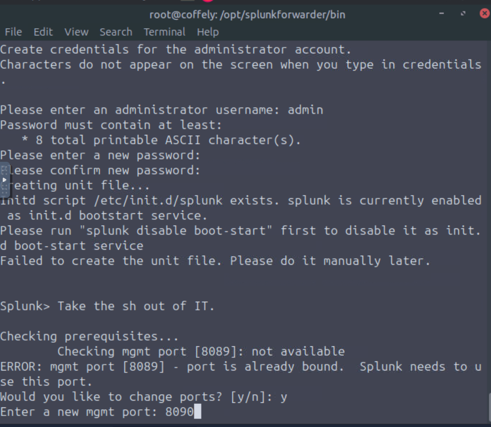

Now that we have and the Splunk forwarder up and running, we can configure what log data we want sent over. We will cover this in the next task.
### Configuring The Forworder.
Now that we have installed the forwarder, it needs to know where to send the data. So we will configure it on the host end to send the data and configure Splunk so that it knows from where it is receiving the data from.
#### Splunk  Configuration.
Log in to Splunk , head to `Settings`, and click `Forwarding and receiving`.

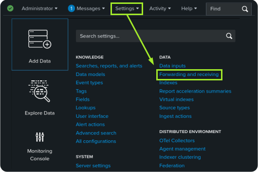

You will see multiple options to configure both forwarding and receiving. We want to receive data from the Linux endpoint, so click` + Add new` in the Receive data section.

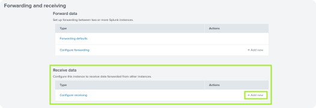

By default, the Splunk instance receives data from the forwarder on port `9997`. It's up to us whether we want to use this port or change it. For now, we will configure our Splunk to start listening on port `9997` and Save, as shown below.
Our listening port `9997` is now enabled and waiting for data. At any time, you can return to this page and disable or delete this configuration. Let's keep it for now and proceed to the next step.

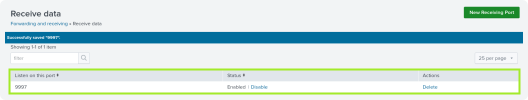

#### Creating an Index
Head back to `Settings`and click on the `Indexes` option. We will create a new index to store the data we want to receive. If no index is created and specified,Splunk will store received data in the default index `main`.

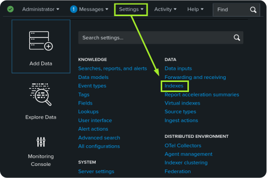

The indexes tab contains all the indexes created by the user or by default. By default, Splunk contains internal logs used to monitor its own operations and performance.  It shows important metadata about the indexes, like size, event count, and home path. Go ahead and click the `New Index` button.

The Splunk Indexes menu with the Splunk default internal indexes and New Index button highlighted.

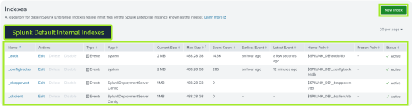

Add the index name `linux_host` and keep the default settings for the rest. Go ahead and save your new index.

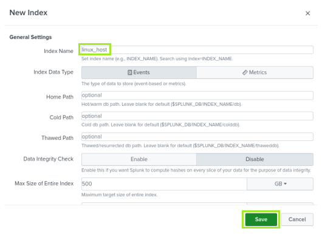

#### Configuring the Forwarder
It's time to configure the forwarder to ensure it sends the data to the right destination. On the Linux host terminal, add the forward server using the command below
```bash          
root@coffely:/opt/splunkforwarder/bin# ./splunk add forward-server <server_ip>:9997
Splunk username: admin
Password: 
Added forwarding to: <server_ip>:9997.
```
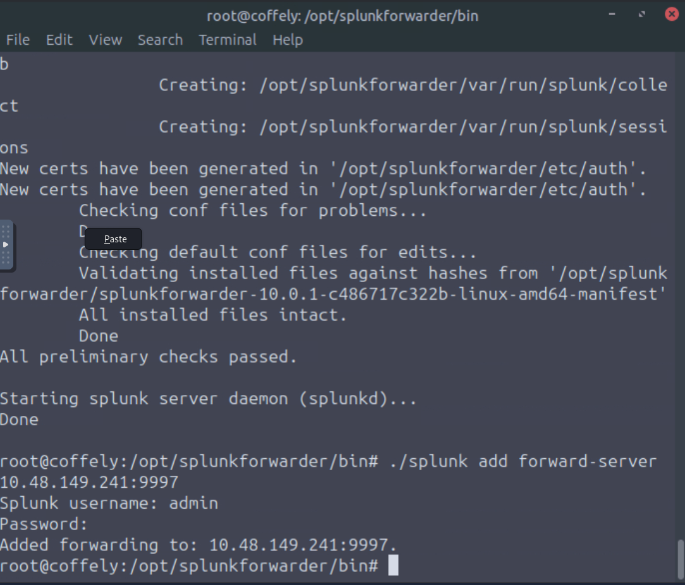

#### Linux Log Sources.
Linux stores all of its important logs into the `/var/log` directory, as shown below. In our case, we will ingest the `syslog` file into Splunk. All other logs can be ingested using the same method.
```bash
          
root@coffely:/opt/splunkforwarder/bin# ls /var/log
README              btmp.1                  gpu-manager.log      speech-dispatcher
Xorg.0.log          cloud-init-output.log   hp                   sssd
Xorg.0.log.old      cloud-init.log          journal              syslog
alternatives.log    cloud-init.log.1        kern.log             syslog.1
alternatives.log.1  cups                    kern.log.1           sysstat
amazon              cups-browsed            landscape            ubuntu-advantage.log
apache2             dist-upgrade            lastlog              ubuntu-advantage.log.1
apport.log          dmesg                   lightdm              unattended-upgrades
apport.log.1        dmesg.0                 openvpn              upgrade
apt                 dpkg.log                prime-offload.log    wtmp
auth.log            dpkg.log.1              prime-supported.log
auth.log.1          fontconfig.log          private
btmp                gpu-manager-switch.log  samba
```
Next, use the `./splunk add monitor` command below to add the syslog file to our newly created index.
```bash         
root@coffely:/opt/splunkforwarder/bin# ./splunk add monitor /var/log/syslog -index linux_host
Added monitor of '/var/log/syslog'.
```
#### Inputs
We can now look at the inputs.conf file to check our configuration. Splunk inputs define what data Splunk should collect. You can manually edit inputs.conf to specify new data sources or modify existing input settings.
```bash        
root@coffely:/opt/splunkforwarder/bin# cat /opt/splunkforwarder/etc/apps/search/local/inputs.conf
[monitor:///var/log/syslog]
disabled = false
index = linux_host
```
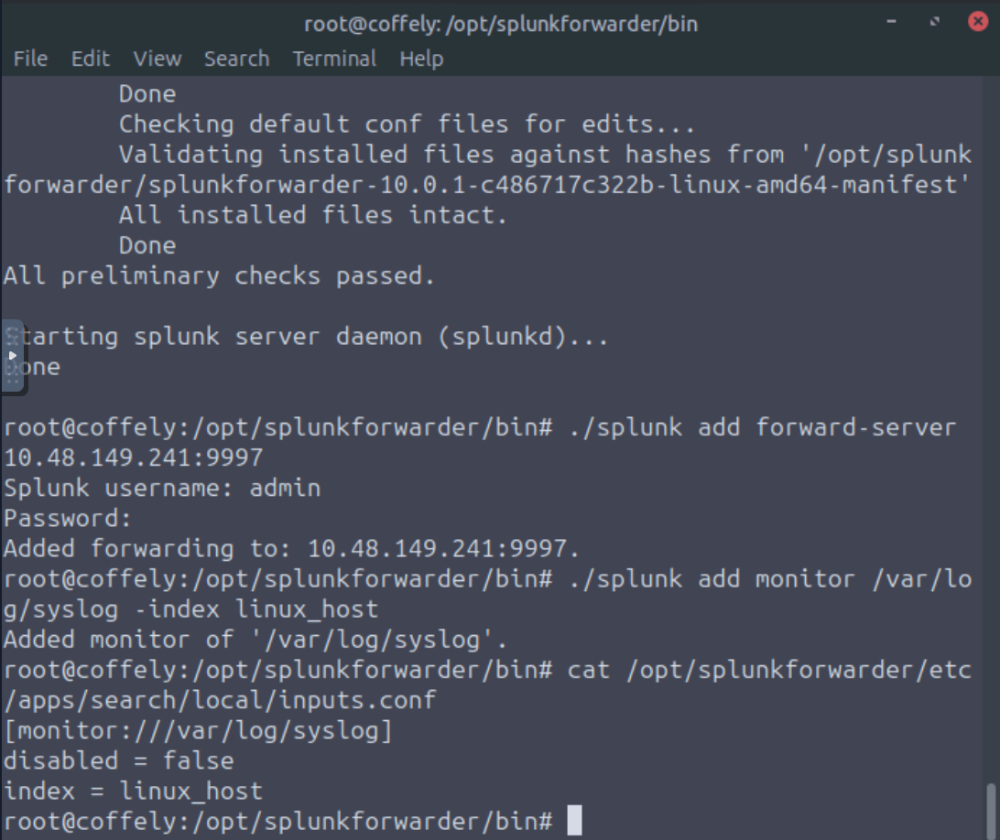
       
#### Using the Logger Utility
Logger is a built-in command-line tool to add test logs to the `syslog` file. We are already monitoring the `syslog` file and sending all logs to Splunk, so the log generated with the command below will be searchable in our Splunk instance.
```bash          
root@coffely:/opt/splunkforwarder/bin# logger "coffely-has-the-best-coffee-in-town"
root@coffely:/opt/splunkforwarder/bin# tail -1 /var/log/syslog
2025-11-06T05:37:11.415531+00:00 coffely root: coffely-has-the-best-coffee-in-town
```
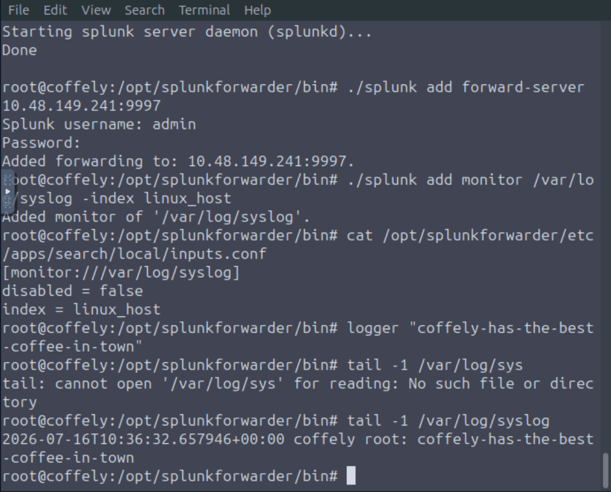

To confirm that Splunk is indeed receiving your logs, head to the Search & Reporting app in your Splunk instance and search for your test log with the following query:  
`index = linux_host "coffely-has-the-best-coffee-in-town"`              
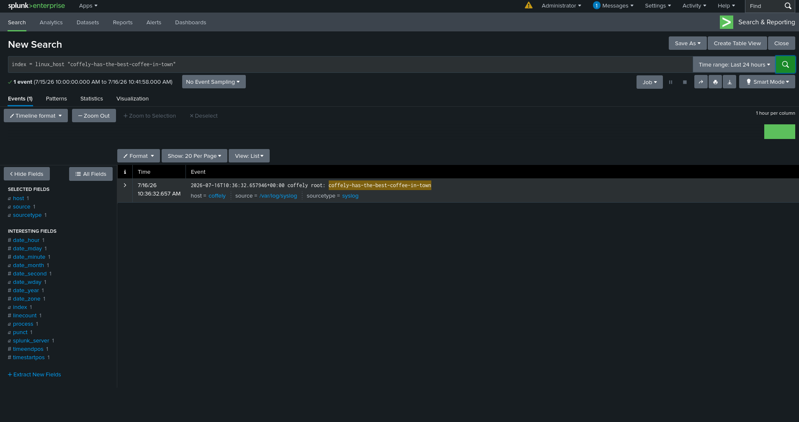

### Windows Forwarding
So far, we've successfully ingested native Linux logs from our host machine. In a real-world environment, you may want to scale your monitoring setup to include events from additional sources such as Windows servers, email servers, or firewalls. Log aggregation, the centralized collection, normalization, and indexing of log data from multiple sources, allows analysts to correlate activity across systems and gain a clearer view of potential incidents. Since our current lab environment runs Linux, the following section provides a read-along example of how logs can be forwarded from a Windows system.

Let's say you want to send over logs from a Windows host. You can install the universal forwarder on the Windows machine and specify the IP address of your Linux instance to act as the indexer during the installation process.
Like on Linux, we can utilize the command line to specify which logs we want sent over. Using Powershell, we can head to the forwarder directory and add a new monitor. In the example below, we will monitor for Windows Security logs.
```bash          
PS C:\> cd "Program Files\SplunkUniversalForwarder\bin"
PS C:\Program Files\SplunkUniversalForwarder\bin> .\splunk.exe add monitor C:\Windows\System32\winevt\Logs\Security.evtx
Added monitor of 'C:\Windows\System32\winevt\Logs\Security.evtx'.
```
In Search & Reporting, we can now see our newly forwarded Windows Security logs.

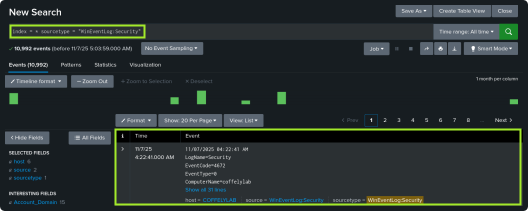

#### Deployment Server
Alternatively, you can turn your Splunk instance into a deployment server, allowing you to manage other Splunk instances and forwarders remotely. This will give us access to manage our Windows forwarder via the ui. 
```bash         
root@coffely:/opt/splunk/bin# ./splunk enable deploy-server
Deployment Server is enabled.
root@coffely:/opt/splunk/bin# ./splunk restart
```
Heading back to Settings and Data Inputs, scroll down to Forwarded inputs and choose` + Add new` next to Windows Event Logs.

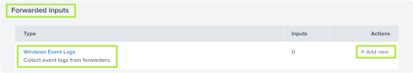

We now see the Windows machine in the Available hosts column. Select it, and give it a new server class name. Server classes are used to define a single instance or group of Splunk deployment clients (Splunk instance, forwarder, indexer, or search head).

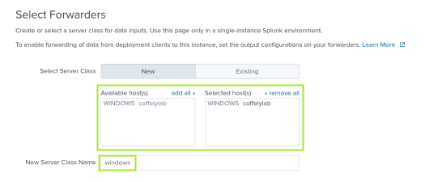

Next, you must choose which log types you want forwarded to Splunk. In this case, Application, Security, Setup, and System have been chosen.

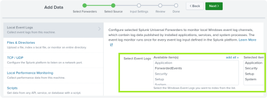

Finally, we can create a new index named windows, review our data input, and submit just as we did in the previous steps.

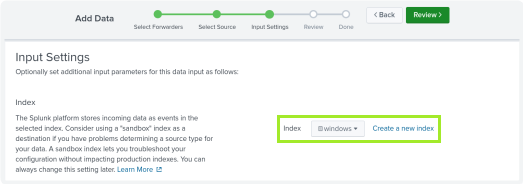

Checking out the newly created windows index in the Search & Reporting app.

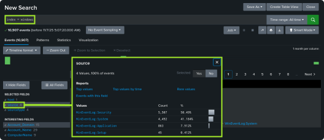

### Ingesting Web Logs
The Linux machine where we have running Splunk also hosts a local copy of their website, which is under development. It can be accessed via http://coffely.thm:8080 . You are asked to configure Splunk to receive the web logs from this website to trace the orders and improve coffee sales

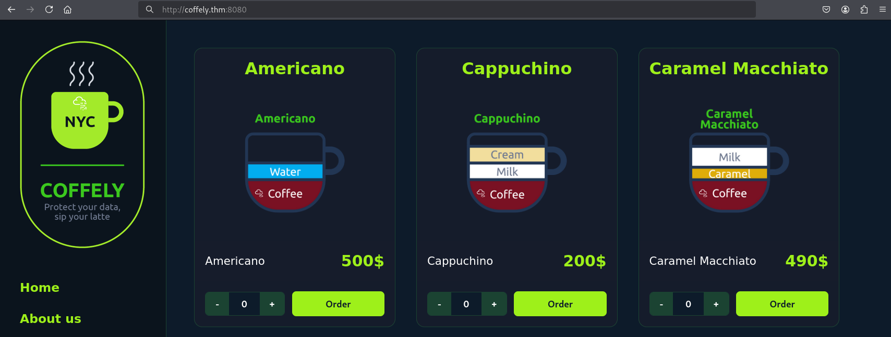

The site will eventually allow users to order coffee online. In the backend, it will track all requests, responses, and orders placed. Let's get started ingesting the web logs into Splunk.

This site is currently run on Apache, and we can find the access logs we want to ingest at `/var/log/apache2/access.log`. There are several methods for transferring these logs to Splunk
. You can use the command line as we did in the previous tasks, but let's use the interface to monitor the `access.log` file
#### Adding Data
In your Splunk instance, head back to `Settings` and click `Add Data`.
Scroll down and choose the Monitor option.

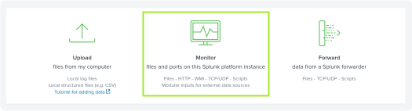

Next, choose `File & Directories` and enter the path of the file we want to monitor: `/var/log/apache2/access.log`. For reference, you can choose to index the file once, but we want to continuously monitor it so that all logs are ingested as they arrive.

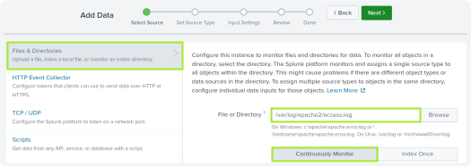

Next, we must select our source type. Click the Select Source Type dropdown, select Web, and then choose `access_combined`

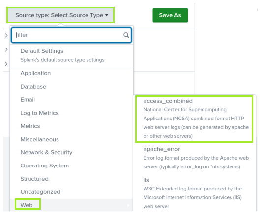

Next, we need to assign a name to the host field value. Let's change it to `coffelyweb`, then create a new index named `web`, just like we did for the previous logs.

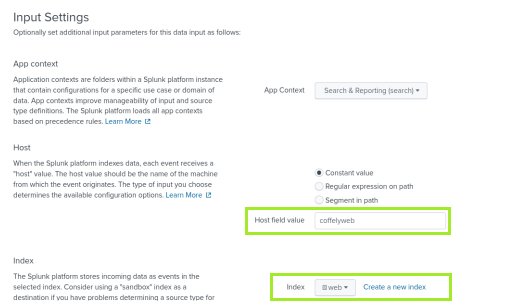

Finally, we can review, submit, and start searching through our newly monitored file. You probably won't see any logs at first, so let's head to `http://coffely.thm:8080` and browse around to generate some logs.


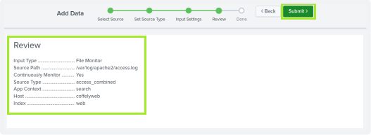

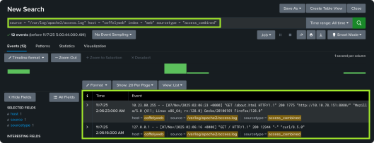
