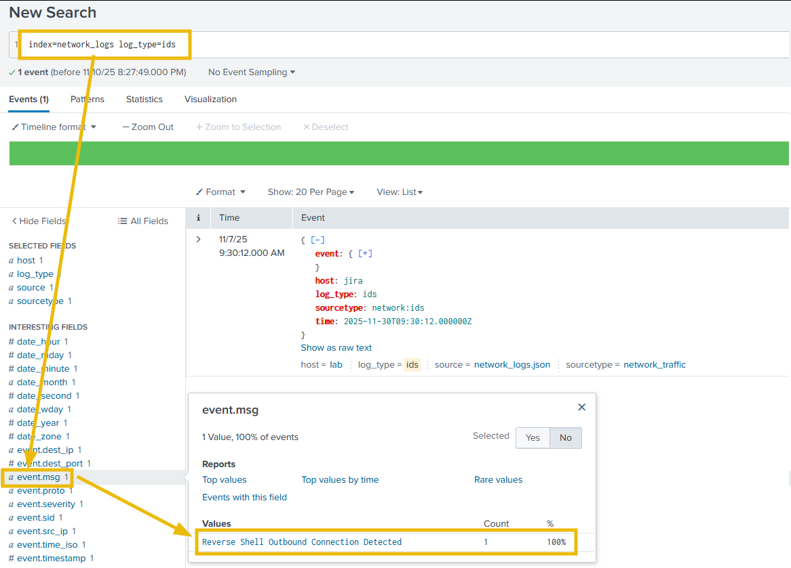
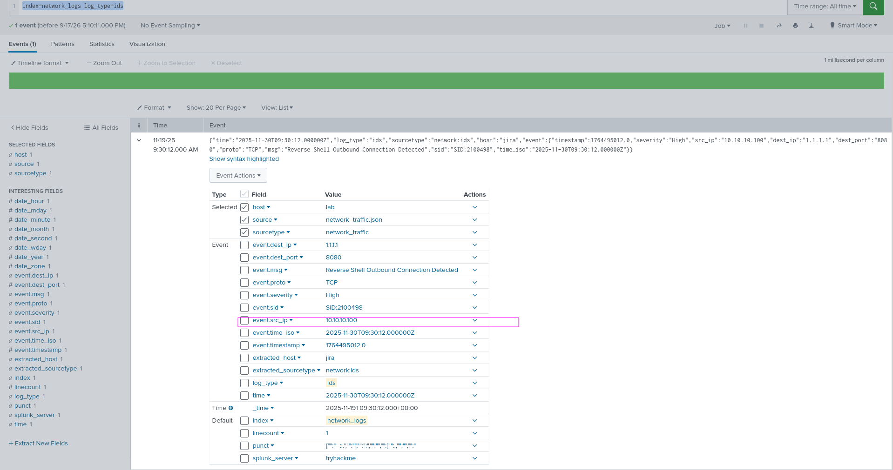
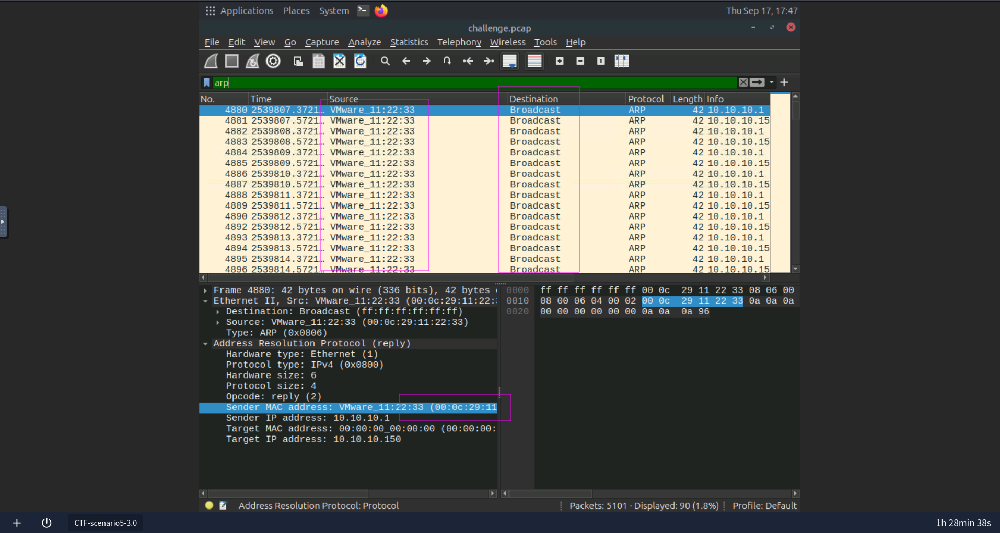
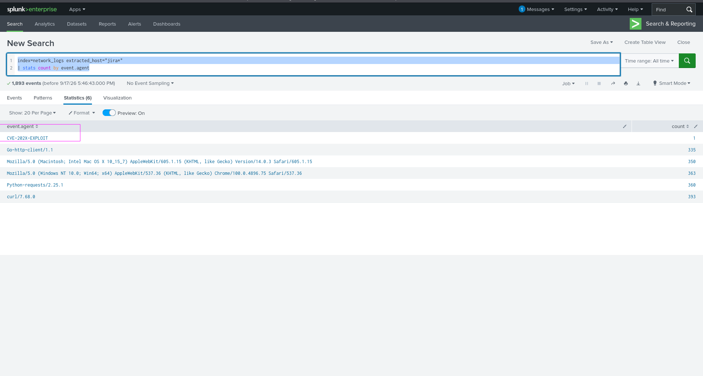
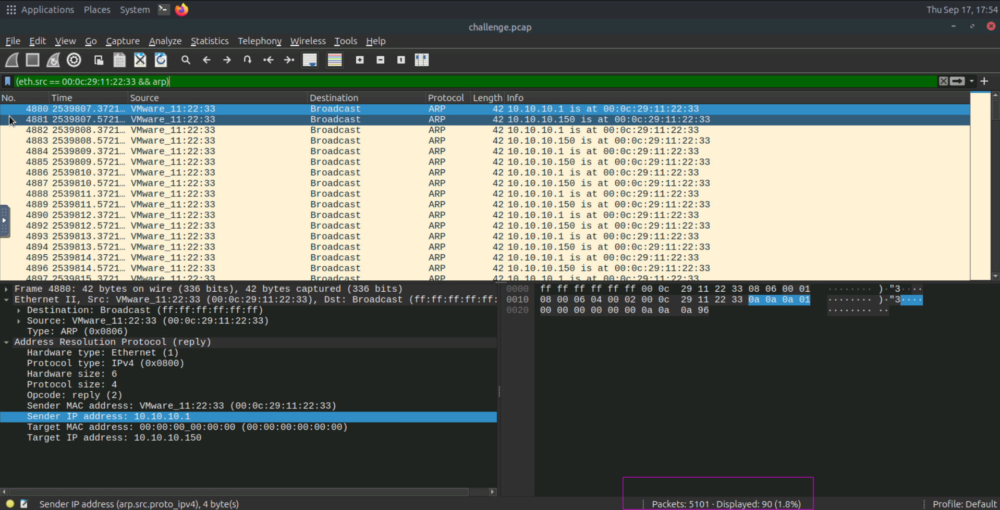
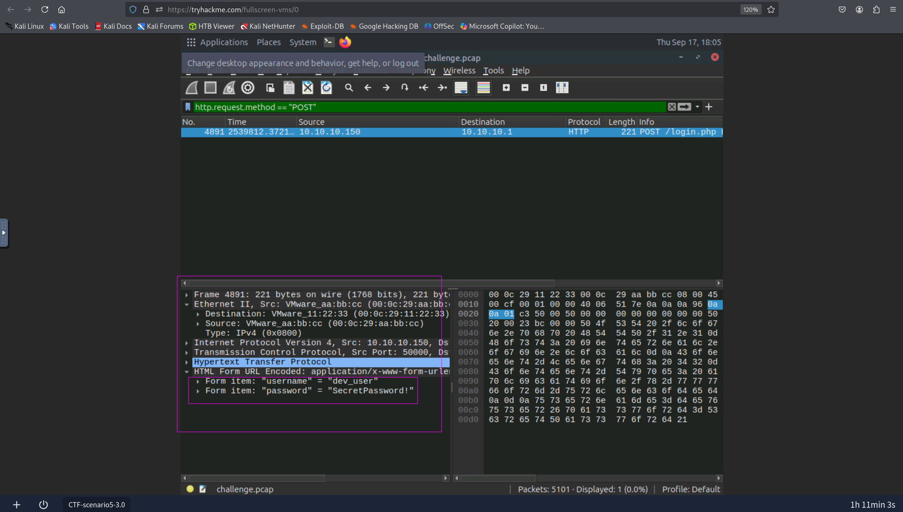
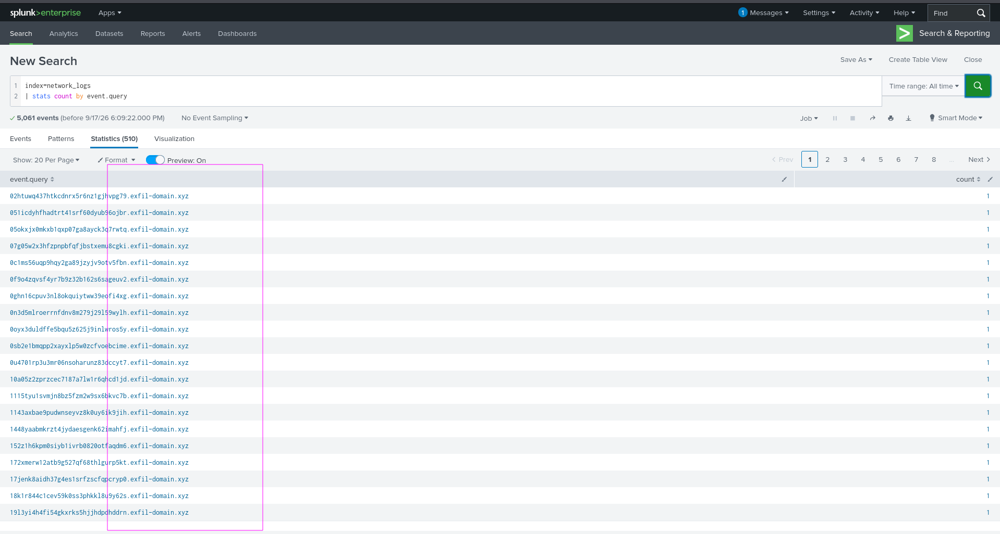

## The Crown Jewel
Triage a critical alert using Wireshark and Splunk to trace the network intrusion attempt.  

You are on a shift, looking at the new alert coming from Imperium Labs - a company under (MSSP)monitoring long before you joined the team. It's hard to say what the company's primary focus is, but it has a global presence and undoubtedly has secrets to protect, especially those on heavily secured GitLab and Jira servers which store proprietary source code and project data.
### The Alert
The alert you are looking at is called ``Reverse Shell Outbound Connection Detected``, not something you see every day. Fortunately, you were able to obtain the raw PCAPs and Splunk logs for this event. Can you analyze the network traffic and logs to reconstruct and stop a sophisticated attack aimed at stealing the "Crown Jewel" data?


### Answer the questions below
#### From which internal IP did the suspicious connection originate?
```bash
10.10.10.100
```
For this we first Opened the ids log by writing this ``index=network_logs log_type=ids`` and there was only one event and we opened it.

#### What outbound connection was detected as a C2 channel? (Answer example: 1.2.3.4:9996)
```bash
1.1.1.1:8080
```
I went to wireshark to analyze the packet file and applied filter for source ip 10.10.10.1.It only showed a single tcp handshake connection packets.
#### Which MAC address is impersonating the gateway 10.10.10.1?
```bash
00:0c:29:11:22:33
```
I went to wireshark and filter for ``arp`` protocol and analyzed the packets. I saw there were large number of gratuitous replies coming for the 2 ips (10.10.10.1 , 10.10.10.150)and was from the same mac address and that how we came to know that was mac address who were trying to impersonate the gateway 10.10.10.1 

#### What is the non-standard User-Agent hitting the Jira instance?
```bash
CVE-202X-EXPLOIT
```
we wanna look for agents in the jira instance So we use the query ``index=network_logs extracted_host="jira*" | stats count by event.agent`` 

we can see that user agent looks like that might be exploiting a vulnerbility.
#### How many ARP spoofing attacks were observed in the PCAP?
```bash
90
```
In wirehshark we filter for sender(attacker mac address) and filter for arp protocol.

#### What domain, owned by the attacker, was used for data exfiltration?
```bash
username=dev_user&password=SecretPassword!
```
We filter for ``POST`` request and there was only one packet with POST request.The creds were in plain text.

#### What domain, owned by the attacker, was used for data exfiltration?
```bash
exfil-domain.xyz
```
I went to splunk and wanted to see the query counts and could see the domain that was using to see exfil using ``dns`` protocol.

#### After examining the logs, which protocol was used for data exfiltration?
```bash
dns
```
Again in the previous question we could see that dns was used for exfiltration.
