## The Silent Transfer 
THM Security Services has been engaged for a Threat Hunting activity for Helios Software Group.
__A quiet transfer. A widening breach.__
You have been brought on at THM Security Services (TSS). Click the card below to reveal your role on this case.

A forensic workstation is available for this investigation. It includes Wireshark, TShark, Zui,Zeek command-line tools such as zeek-cut, and standard terminal utilities.

All evidence is stored in ``/home/ubuntu/capstone/:``

``snort_alerts.log:`` Snort detection output
``zeek_logs/:`` Zeek connection, DNS, TLS, HTTP, file, and notice logs
``investigation.pcap:`` Packet capture for packet-level validation
``fortigate_traffic.log:`` Firewall traffic covering internal and cross-subnet activity
``references/:`` Local threat intelligence and MITRE ATT&CK reference material

Use the questions below to guide your analysis of the available evidence.
### Answer the questions below
#### Review the detection evidence around 03:47 UTC and correlate it with the repeated C2 traffic. Which internal IP address originated that traffic?
```bash
10.14.30.88
```
For this we opened the snort logs and checked the alert with that time stamp.
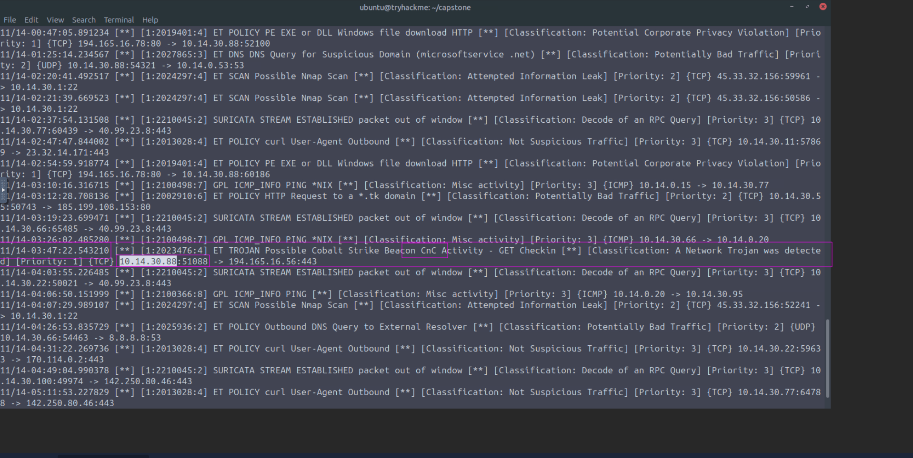
#### Working backwards from the C2 activity, which domain was used to deliver the initial dropper to the compromised workstation?
```bash
cdn-updates.microsoftservice.net
```
For this first i checked the zeeks ``dns.logs`` and filter for the domains that fall in the same range as the C2 center.
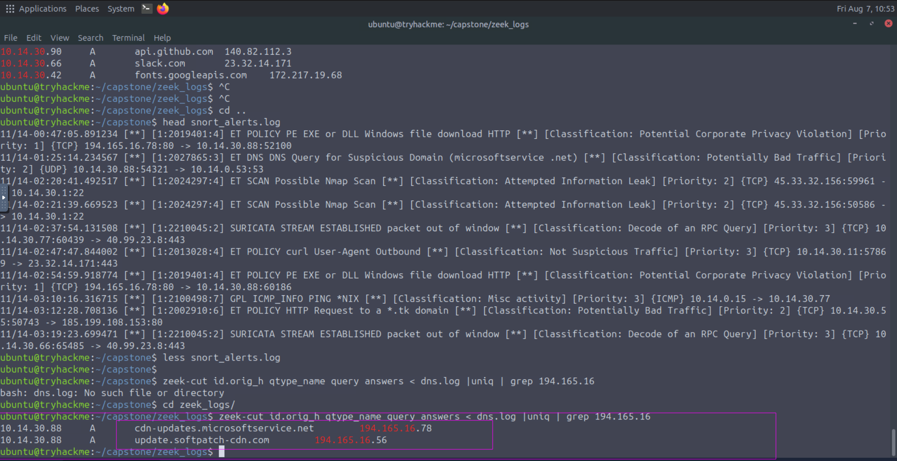
We can see we got 2 results.So i checked the first domain and went to wireshark and filter for first ip address.
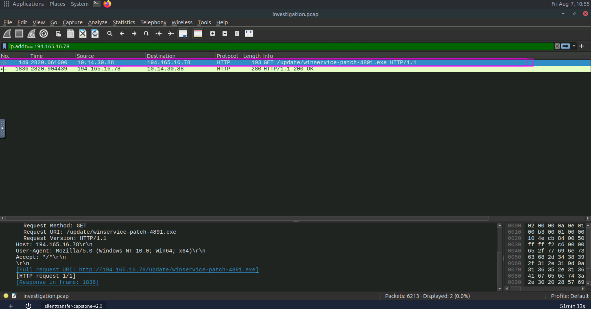
There are only 1 http request that was going outside and that was also to download an ``exe`` that shows a supicious behaviour.
#### Identify the file downloaded from the delivery domain. What is its SHA256 hash?
```bash
7f3b2e1a9c8d4f5e6b7c8d9e0f1a2b3c4d5e6f7a8b9c0d1e2f3a4b5c6d7e8f90
```
For this we just needed to look for the file name in zeek ``files.log`` file
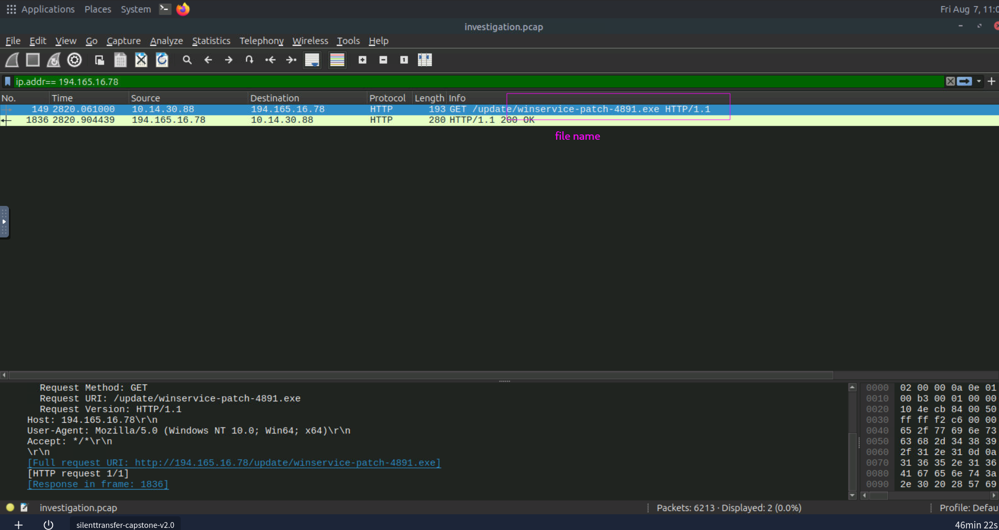
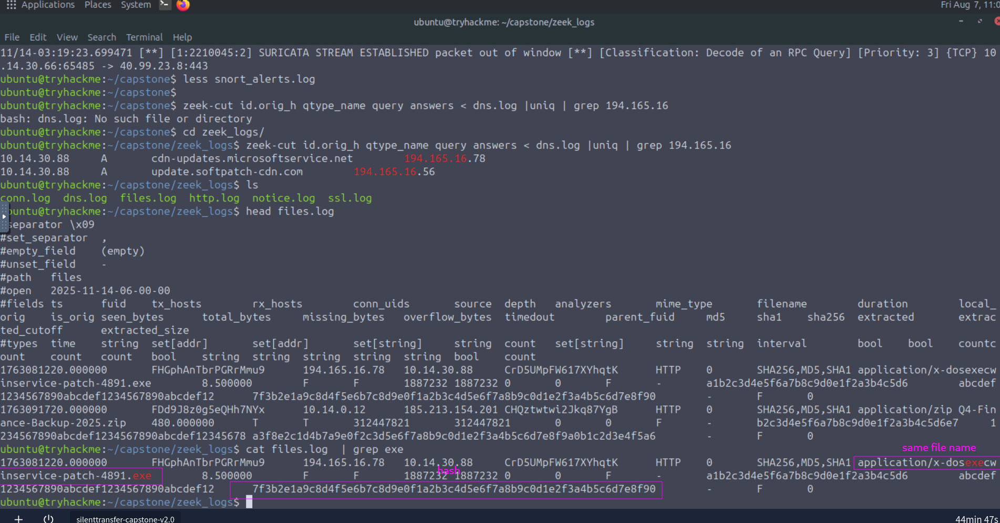
#### Which source port did the compromised workstation use for its first connection to the C2 server?
```bash
51000
```
All was need to check the zeek ``conns.log`` file and filter for the ip address ``194.165.16.56``
and first log showed the port number.
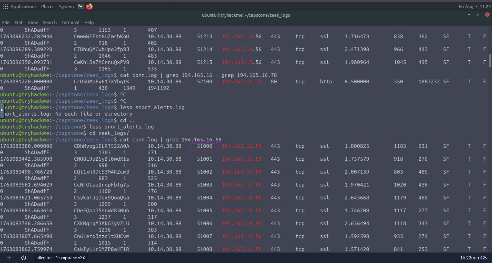
#### Review the TLS activity between the compromised workstation and the C2 server. What JA4 fingerprint identifies the C2 client?
```bash
t13d190900_9dc949149365_97f8aa674fd9
```
We just need to filter for ip address in the ``ssl.logs`` files to get the JA4 fingerprint.I used the following command 
``zeek-cut id.orig_h id.resp_h server_name ja4 < ssl.log | grep "10.14.30.88"``
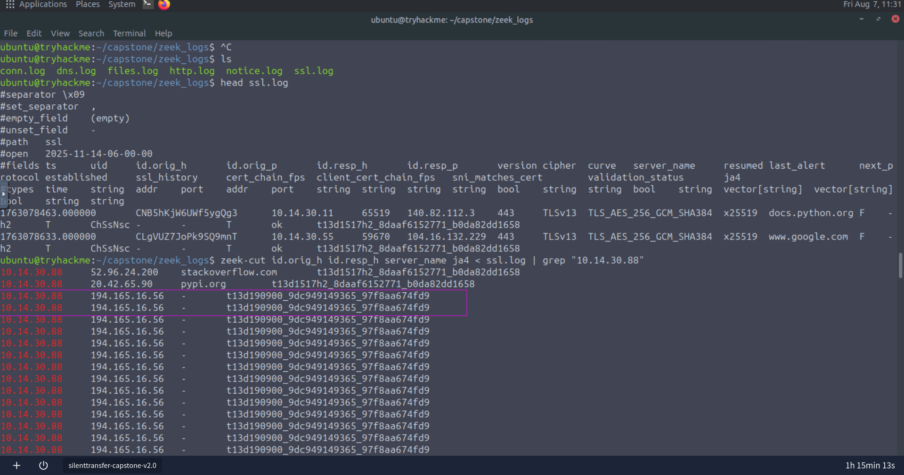
#### After C2 was established, how many unique internal destination IP addresses did the compromised workstation contact during its SMB discovery activity?
```bash
23
```
For this i used again ``conn.log`` and filter for source ip that is ``10.14.30.88`` and source port ``445`` that is for ``SMB`` protocol and for the portocol ``tcp`` as SMB use tcp .
I used this command (It is not efficient )   
``zeek-cut id.orig_h id.orig_p id.resp_h id.resp_p proto service < conn.log | grep 445 | uniq | cut -d " " -f3 | uniq | grep 10.14.30.88 | grep tcp | wc -l
``
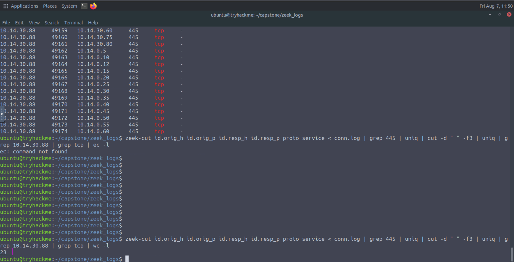
#### Following the SMB activity, the attacker established an RDP connection to an internal server. What is the destination IP address?
```bash
10.14.0.12
```
Filter for the port ``3389`` that is used for ``RDP`` 
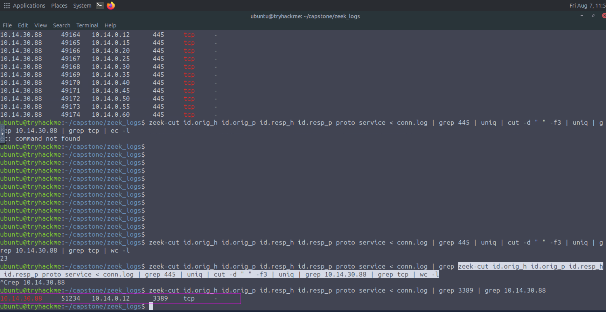
#### Review the DNS activity originating from the RDP destination. Which domain did the server resolve immediately before the large outbound transfer?
```bash
backup.corpfiles-sync.com
```
First i filter the dns responses of the requests that is made by ``10.14.0.12`` there was domain with ip ``185.213.154.201`` caught my attention.If we go to reference directory and looked inside the ``as44477_threat_intel.txt`` we get to know that ip's belonging to this range ``185.213.154.0/24`` are  malicious.
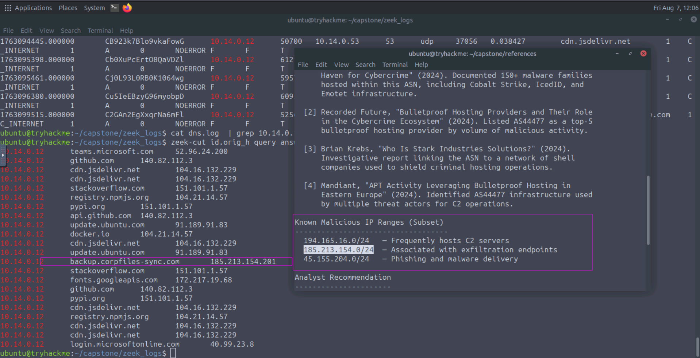
 #### Identify the archive transferred from the internal server to the external endpoint. What is its SHA256 hash?
 ```bash
 a3f8e2c1d4b7a9e0f2c3d5e6f7a8b9c0d1e2f3a4b5c6d7e8f9a0b1c2d3e4f5a6
 ```
 If we opened the ``files.log``.There is only one archived file.
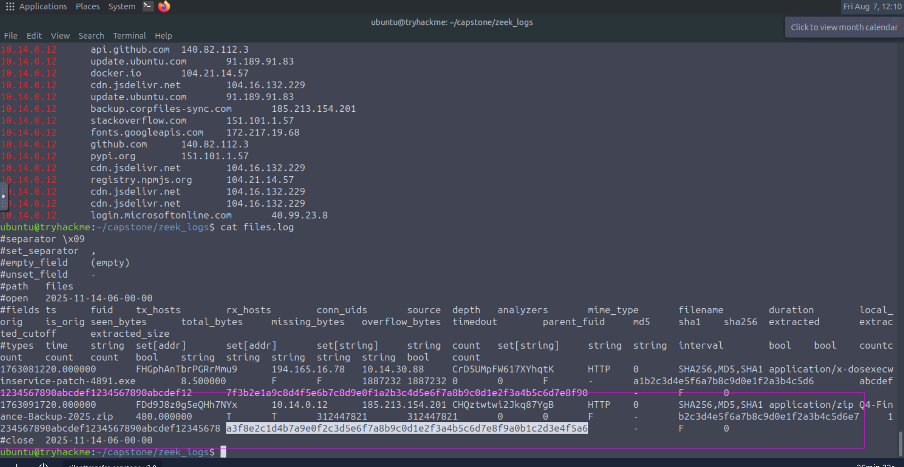
#### Inspect the application-layer contents of the C2 traffic. What command did the attacker issue to the compromised workstation?
```bash
whoami
```
This is was little confusing.I was filtering C2 traffic and all i see was GET request to the ``/api/v2/check`` and then i read the MITRE file.In the file it was saying that large amount GET request to the above uri is malicious and way of communicating to C2 Center.
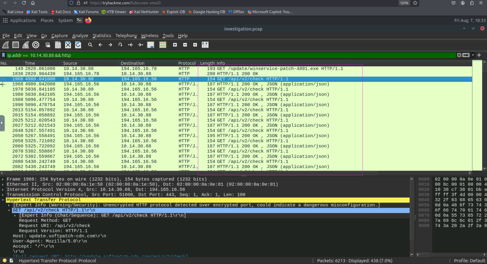
SO than I followed a stream to see what is going on.
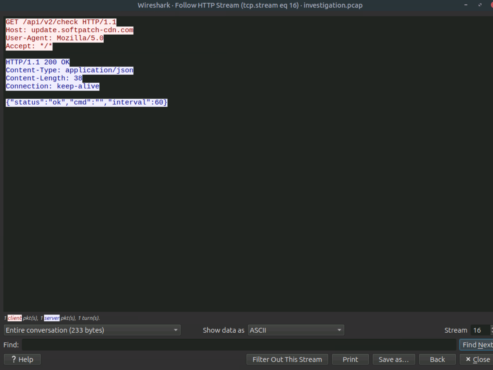
In it we can see that there is a shell.So i applied a filter where ``cmd:`` is not empty   
``http.file_data contains "cmd" && !(http.file_data contains "\"cmd\":\"\"")``
So after applying that filter i follwed the first packet.
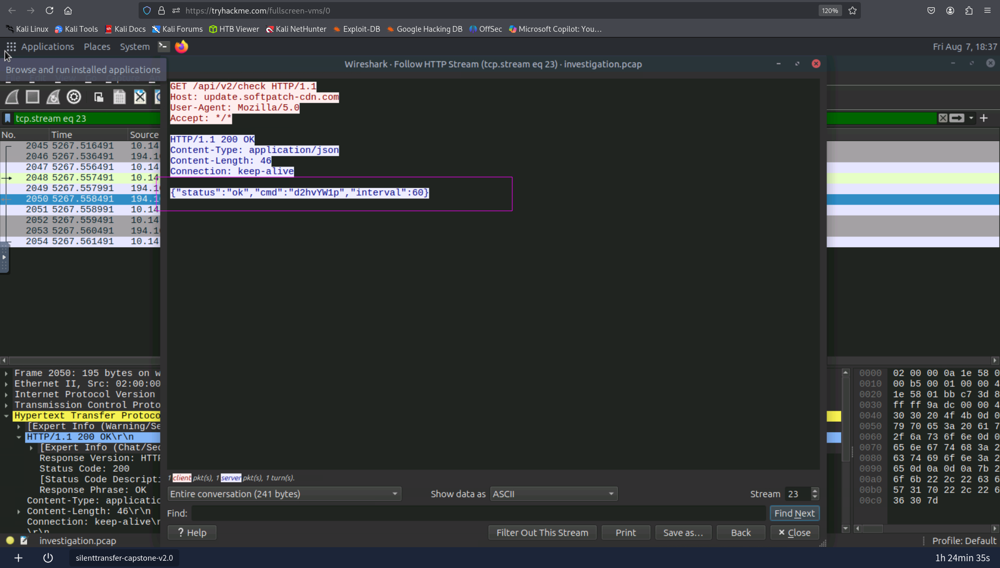
By looking at the command i believed that it was encoded.So i went to ``cybercheif`` and decoded it.
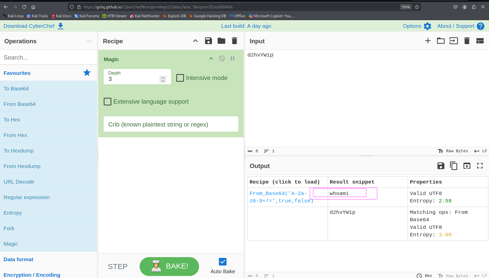